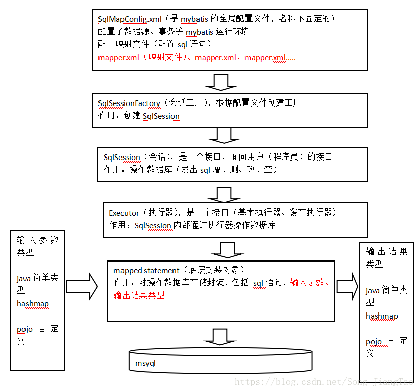
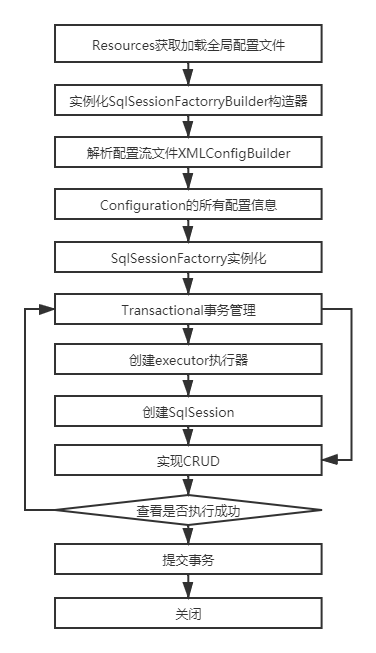
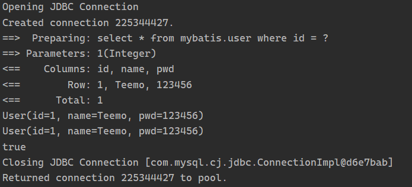
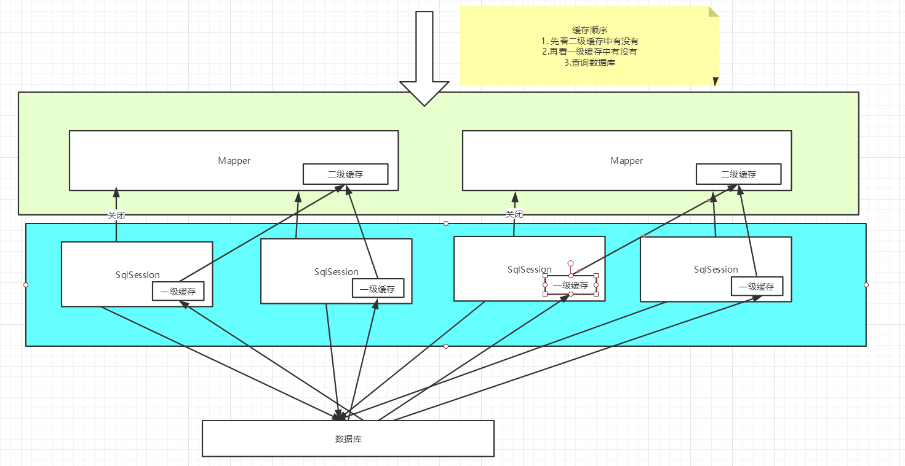

# 一、JDBC回顾

## 1.1 JDBC编程步骤

1. 加载数据库驱动
2. 创建并获取数据库连接（connection）
3. 创建JDBC statement对象
4. 设置SQL语句
5. 设置SQL语句参数（通过preparedStatement）
6. 通过statement执行SQL并获取结果（使用resultSet接收）
7. 对SQL执行结果进行解析操作
8. 释放资源（preparedStatement、resultSet、connection）

## 1.2 问题总结

1. 数据库连接使用时创建，不用时释放，频繁操作浪费资源，影响性能。
   - 优化：使用数据库连接池管理连接。
2. SQL语句硬编码在Java代码中，修改SQL语句后需要重新编译Java代码，不利于系统维护。
   - 优化：将SQL语句放置在xml配置文件中。
3. preparedStatement设置参数，对占位符位置和参数值硬编码在Java代码中，不易维护。
   - 优化：SQL语句、占位符及参数全部配置在xml中。
4. 从resultSet中遍历结果集数据时，存在硬编码，将获取表的字段进行硬编码，不易维护。
   - 优化：查询结果集自动映射为Java对象。

## 1.3 JDBC代码

```java
package com.shinrin.mybatis.jdbc;

//import java.sql.*;
import java.sql.Connection;
import java.sql.DriverManager;
import java.sql.PreparedStatement;
import java.sql.ResultSet;
import java.sql.SQLException;

public class JdbcTest {
    public static void main(String[] args) {
        //数据库连接
        Connection connection = null;
        //预编译的Statement（防止SQL注入攻击，提高数据库性能）
        PreparedStatement preparedStatement = null;
        //查询结果集
        ResultSet resultSet = null;
        try {
            //加载数据库驱动
            Class.forName("com.mysql.jdbc.Driver");
            //通过驱动管理类获取数据库连接
            connection =  DriverManager.getConnection("jdbc:mysql://localhost:3306/mybatis001?characterEncoding=utf-8", "root", "123");
            //定义sql语句（?表示占位符）
            String sql = "select * from user where username = ?";
            //获取预处理statement
            preparedStatement = connection.prepareStatement(sql);
            //设置参数，参数1为sql语句中参数的序号（从1开始），参数2为设置的参数值
            preparedStatement.setString(1, "王五");
            //向数据库发出sql执行查询（返回结果集）
            resultSet =  preparedStatement.executeQuery();
            //遍历查询结果集
            while(resultSet.next()){
                System.out.println(resultSet.getString("id")+"  "+resultSet.getString("username"));
            }
        } catch (Exception e) {
            e.printStackTrace();
        }finally{
            //释放资源
            if(resultSet!=null){
                try {
                    resultSet.close();
                } catch (SQLException e) {
                    // TODO Auto-generated catch block
                    e.printStackTrace();
                }
            }
            if(preparedStatement!=null){
                try {
                    preparedStatement.close();
                } catch (SQLException e) {
                    // TODO Auto-generated catch block
                    e.printStackTrace();
                }
            }
            if(connection!=null){
                try {
                    connection.close();
                } catch (SQLException e) {
                    // TODO Auto-generated catch block
                    e.printStackTrace();
                }
            }
        }
    }
}
```

# 二、MyBatis概述

## 2.1 MyBatis介绍

- mybatis是一个持久层的框架（封装JDBC），是apache下的顶级项目（开源）。

- mybatis托管到goolecode下，再后来托管到[github](https://github.com/mybatis/mybatis-3/releases)下。
- mybatis提供映射，可自由灵活生成（半自动化）满足需要sql语句。
  - **输入映射**：对preparedStatement中的输入参数自动进行映射。
  - **输出映射**：将查询结果集灵活映射成java对象。
- **MyBatis使用手册**：https://mybatis.org/mybatis-3/zh/getting-started.html

## 2.2 MyBatis原理（重点）



相关文件：

- 数据库表user的映射类：字段的get、set方法以及getString方法。

- 映射类User的Mapper（Dao）接口：声明操作User的方法。

- 映射文件：为指定Mapper的方法配置SQL语句。	

- MyBatis全局配置文件：MyBatis环境：配置数据源、事务。

# 三、MyBatis测试

**项目结构预览：**


## 3.1 搭建环境

### 3.1.1 数据库

```mysql
CREATE DATABASE `mybatis`;

USE `mybatis`;

CREATE TABLE `user`(
  `id` INT(20) NOT NULL PRIMARY KEY,
  `name` VARCHAR(30) DEFAULT NULL,
  `pwd` VARCHAR(30) DEFAULT NULL
)ENGINE=INNODB DEFAULT CHARSET=utf8;

INSERT INTO `user`(`id`,`name`,`pwd`) VALUES 
(1,'Teemo','123456'),
(2,'YaSuo','123456'),
(3,'Lux','123890')
```

### 3.1.2 新建项目

项目名称：MyBatis

导入Maven依赖：

```xml
    <!--导入Maven依赖-->
    <dependencies>
        <!--mysql-->
        <dependency>
            <groupId>mysql</groupId>
            <artifactId>mysql-connector-java</artifactId>
            <version>8.0.21</version>
        </dependency>
        <!--mybatis-->
        <dependency>
            <groupId>org.mybatis</groupId>
            <artifactId>mybatis</artifactId>
            <version>3.5.2</version>
        </dependency>
        <!--junit-->
        <dependency>
            <groupId>junit</groupId>
            <artifactId>junit</artifactId>
            <version>4.12</version>
            <scope>test</scope>
        </dependency>
    </dependencies>
```

## 3.2 创建子模块

### 3.2.1 MyBatis核心配置文件

- mybatis-config.xml

  ```xml
  <?xml version="1.0" encoding="UTF-8" ?>
  <!DOCTYPE configuration
          PUBLIC "-//mybatis.org//DTD Config 3.0//EN"
          "http://mybatis.org/dtd/mybatis-3-config.dtd">
  <configuration>
      <!-- 全局变量 -->
      <properties>
          <property name="driver" value="com.mysql.jdbc.Driver"/>
          <property name="url" value="jdbc:mysql://localhost:3306/mybatis"/>
          <property name="username" value="root"/>
          <property name="password" value="1704"/>
      </properties>
      <!--配置环境-->
      <environments default="development">
          <environment id="development">
              <transactionManager type="JDBC"/>
              <dataSource type="POOLED">
                  <property name="driver" value="${driver}"/>
                  <property name="url" value="${url}"/>
                  <property name="username" value="${username}"/>
                  <property name="password" value="${password}"/>
              </dataSource>
          </environment>
      </environments>
      <mappers>
          <!--注册Mapper配置文件-->
          <mapper resource="com/shinrin/mapper/BlogMapper.xml"/>
      </mappers>
  </configuration>
  ```

### 3.2.2 MyBatis工具类

- MybatisUtils.java

  ```java
  package com.shinrin.utils;
  
  import org.apache.ibatis.io.Resources;
  import org.apache.ibatis.session.SqlSession;
  import org.apache.ibatis.session.SqlSessionFactory;
  import org.apache.ibatis.session.SqlSessionFactoryBuilder;
  
  import java.io.IOException;
  import java.io.InputStream;
  
  public class MybatisUtils {
      private static SqlSessionFactory sqlSessionFactory;
      static{
          try {
              String resource = "mybatis-config.xml";
              InputStream is = Resources.getResourceAsStream(resource);
              sqlSessionFactory = new SqlSessionFactoryBuilder().build(is);
          } catch (IOException e) {
              e.printStackTrace();
          }
      }
  
      public static SqlSession getSqlSession(){
          return sqlSessionFactory.openSession();
      }
  }
  ```

### 3.2.3 User实体类

- User.java

  ```java
  package com.shinrin.pojo;
  
  //实体类
  public class User {
      private int id;
      private String name;
      private String pwd;
  
      public User() {
      }
  
      public User(int id, String name, String pwd) {
          this.id = id;
          this.name = name;
          this.pwd = pwd;
      }
  
      public int getId() {
          return id;
      }
  
      public void setId(int id) {
          this.id = id;
      }
  
      public String getName() {
          return name;
      }
  
      public void setName(String name) {
          this.name = name;
      }
  
      public String getPwd() {
          return pwd;
      }
  
      public void setPwd(String pwd) {
          this.pwd = pwd;
      }
  
      @Override
      public String toString() {
          return "User{" +
                  "id=" + id +
                  ", name='" + name + '\'' +
                  ", pwd='" + pwd + '\'' +
                  '}';
      }
  }
  ```

### 3.2.4 Dao接口

- UserDao.java

  ```java
  package com.shinrin.dao;
  
  import com.shinrin.pojo.User;
  
  import java.util.List;
  
  public interface UserDao {
      List<User> getUserList();
  }
  ```

### 3.2.5 接口实现类（Mapper配置文件）

- UserMapper.xml

- 注：接口实现类由原来的UserDaoImpl转变为Mapper配置文件

  ```xml
  <?xml version="1.0" encoding="UTF-8" ?>
  <!DOCTYPE mapper
          PUBLIC "-//mybatis.org//DTD Mapper 3.0//EN"
          "http://mybatis.org/dtd/mybatis-3-mapper.dtd">
  <mapper namespace="com.shinrin.dao.UserDao">
      <select id="getUserList" resultType="com.shinrin.pojo.User">
      select * from mybatis.user
    </select>
  </mapper>
  ```

### 3.2.6 注册Mapper配置文件

- mybatis-config.xml

  ```xml
      <mappers>
          <mapper resource="com/shinrin/dao/UserMapper.xml"/>
      </mappers>
  ```

## 3.3 测试

### 3.3.1 测试代码

UserDaoTest.java

```java
package com.shinrin.dao;

import com.shinrin.pojo.User;
import com.shinrin.utils.MybatisUtils;
import org.apache.ibatis.session.SqlSession;
import org.junit.Test;

import java.util.List;

public class UserTest {
    @Test
    public void Test(){
        //获取sqlSession
        SqlSession sqlSession = MybatisUtils.getSqlSession();
        //执行操作
        UserDao userDao = sqlSession.getMapper(UserDao.class);
        List<User> userList = userDao.getUserList();
        for (User user : userList) {
            System.out.println(user);
        }
        //关闭sqlSession
        sqlSession.close();
    }
}
```

### 3.3.2 可能出现的问题

- xml配置文件不存在：修改模块配置文件pom.xml

  ```xml
  
      <!--Maven默认生成项目时会过滤除java文件外的其他文件（配置文件）-->
      <!--此处设置保留xml配置文件-->
      <build>
          <resources>
              <resource>
                  <directory>src/main/java</directory>
                  <includes>
                      <include>**/*.properties</include>
                      <include>**/*.xml</include>
                  </includes>
                  <filtering>true</filtering>
              </resource>
              <resource>
                  <directory>src/main/resources</directory>
                  <includes>
                      <include>**/*.properties</include>
                      <include>**/*.xml</include>
                  </includes>
                  <filtering>true</filtering>
              </resource>
          </resources>
      </build>
  ```

- Mysql时区设置：mybatis-config.xml

  ```xml
          <property name="url" value="jdbc:mysql://localhost:3306/mybatis?serverTimezone=UTC"/>
  ```

- Mysql驱动升级：mybatis-config.xml

  ```xml
          <property name="driver" value="com.mysql.cj.jdbc.Driver"/>
  ```

### 3.3.3 测试结果


# 四、CRUD

## 4.1 namespace

- 确保namespace中的包名和Dao/Mapper接口的包名一致。（UserMapper.xml）

  ```xml
  <mapper namespace="com.shinrin.dao.UserDao">
  ```

## 4.2 select

选择，查询语句（UserMapper.xml）：

- id：对应namespace（接口）中的方法名。
- resultType：SQL语句执行的返回值类型。
- parameterType：参数类型。

### 4.2.1 编写接口

```java
    //通过ID获取用户信息
    User getUserById(int id);
```

### 4.2.2 编写Mapper中的SQL

```xml
    <select id="getUserById" parameterType="int" resultType="com.shinrin.pojo.User">
        select * from mybatis.user where id = #{id}
    </select>
```

### 4.2.3 测试

```java
    @Test
    public void getUserById(){
        SqlSession sqlSession = MybatisUtils.getSqlSession();
        UserDao mapper = sqlSession.getMapper(UserDao.class);
        User user = mapper.getUserById(1);
        System.out.println(user);
        sqlSession.close();
    }
```


## 4.3 insert

### 4.3.1 编写接口

```java
    //插入一条用户信息
    int addUser(User user);
```

### 4.3.2 编写Mapper中的SQL

```xml
    <insert id="addUser" parameterType="com.shinrin.pojo.User">
        insert into mybatis.user (id, name, pwd) values (#{id}, #{name}, #{pwd});
    </insert>
```

### 4.3.3 测试

**注：增删改，事务必须提交，才能生效！**

```java
    //增删改需要提交事务
    @Test
    public void addUser(){
        SqlSession sqlSession = MybatisUtils.getSqlSession();
        UserDao mapper = sqlSession.getMapper(UserDao.class);
        int res = mapper.addUser(new User(4, "LiQing", "654321"));
        if (res > 0) {
            System.out.println("插入数据成功！");
        }
        sqlSession.commit();
        sqlSession.close();
    }
```

## 4.4 update

### 4.4.1 编写接口

```java
    //修改用户
    int updateUser(User user);
```

### 4.4.2 编写Mapper中的SQL

```xml
    <update id="updateUser" parameterType="com.shinrin.pojo.User" >
        update mybatis.user set name = #{name},pwd = #{pwd} where id = #{id};
    </update>
```

### 4.4.3 测试

```java
    @Test
    public void updateUser(){
        SqlSession sqlSession = MybatisUtils.getSqlSession();
        UserDao mapper = sqlSession.getMapper(UserDao.class);
        int res = mapper.updateUser(new User(4,"Jinx","987654"));
        if (res > 0) {
            System.out.println("修改数据成功！");
        }
        sqlSession.commit();
        sqlSession.close();
    }
```

## 4.5 delete

### 4.5.1 编写接口

```java
    //删除用户
    int deleteUser(int id);
```

### 4.5.2 编写Mapper中的SQL

```xml
    <delete id="deleteUser" parameterType="int">
        delete from mybatis.user where id = #{id};
    </delete>
```

### 4.5.3 测试

```java
    @Test
    public void deleteUser(){
        SqlSession sqlSession = MybatisUtils.getSqlSession();
        UserDao mapper = sqlSession.getMapper(UserDao.class);
        int res = mapper.deleteUser(4);
        if (res > 0) {
            System.out.println("删除数据成功！");
        }
        sqlSession.commit();
        sqlSession.close();
    }
```

# 五、Map和模糊查询

## 5.1 Map

**使用情景：实体类、数据库表的字段或参数过多时使用Map。**

- ***Map传递参数：sql中取key。***【parameterType="map"】

- ***对象传递参数：sql中取属性。***【parameterType="Object"】
- 仅一个基本数据类型参数时，可在sql中直接取到。

### 5.1.1 接口

```java
    //Map
    int addUser2(Map<String,Object> map);
```

### 5.1.2 Mapper

```xml
    <insert id="addUser2" parameterType="map">
        insert into mybatis.user (id, pwd) values (#{userid}, #{password});
    </insert>
```

### 5.1.3 测试

```java
    @Test
    public void addUser2(){
        SqlSession sqlSession = MybatisUtils.getSqlSession();
        UserDao mapper = sqlSession.getMapper(UserDao.class);
        HashMap<String, Object> map = new HashMap<String, Object>();
        map.put("userid", 4);
        map.put("password", 142857);
        int res = mapper.addUser2(map);
        if (res > 0) {
            System.out.println("插入数据成功！");
        }
        sqlSession.commit();
        sqlSession.close();
    }
```

## 5.2 模糊查询

### 5.2.1 接口

```java
    //模糊查询
    List<User> getUserLike(String value);
```

### 5.2.2 Mapper

```xml
    <select id="getUserLike" parameterType="String" resultType="com.shinrin.pojo.User">
        select * from mybatis.user where name like #{values}
    </select>
```

### 5.2.3 测试

```java
    //模糊查询
    @Test
    public void getUserLike(){
        SqlSession sqlSession = MybatisUtils.getSqlSession();
        UserDao mapper = sqlSession.getMapper(UserDao.class);

        List<User> userList = mapper.getUserLike("%e%");
        for (User user : userList) {
            System.out.println(user);
        }
        //关闭sqlSession
        sqlSession.close();
    }
```

### 5.2.4 总结

- java代码中使用通配符（安全）
  - sql：```select * from mybatis.user where name like #{values}```
  - Java代码：```List<User> userList = mapper.getUserLike("%e%");```

- sql中使用通配符（存在SQL注入风险）
  - sql：```select * from mybatis.user where name like "%"#{value}"%"```
  - Java代码：```List<User> userList = mapper.getUserLike("e");```

# 六、配置解析


## 6.1 核心配置文件

- mybatis-config.xml

| 标签               | 属性           |
| :----------------- | -------------- |
| configuration      | 配置           |
| properties         | 属性           |
| settings           | 设置           |
| typeAliases        | 类型别名       |
| typeHandlers       | 类型处理器     |
| objectFactory      | 对象工厂       |
| plugins            | 插件           |
| environments       | 环境配置       |
| environment        | 环境变量       |
| transactionManager | 事务管理器     |
| dataSource         | 数据源         |
| databaseIdProvider | 数据库厂商标识 |
| mappers            | 映射器         |

## 6.2 环境配置（environments）

- **Mybatis可配置多种环境，但每个SqlSessionFactory实例只能选择一种环境。**
- Mybatis默认的事务管理器是JDBC，连接池是POOLED

## 6.3 属性（properties）

- 可通过properties属性来实现引用配置文件。
- 属性可以外部配置也可以动态替换（Java属性文件中配置或由properties元素的子元素传递）

【例】

- 编写配置文件：db.properties

```properties
driver=com.mysql.jc.jdbc.Driver
url=jdbc:mysql://localhost::3306/mybatis?serverTimezone=UTC
username=root
password=1704
```

- 核心配置文件

```xml
	<!--引入外部配置文件-->
	<properties resource="db.properties">
		<property name="username" value="root"/>
		<property name="pwd" value="123456"/>
	</properties>
```

注：

1. 可直接引入外部文件。
2. 可在其中增加一些属性配置。
3. **如果核心配置文件与配置文件存在同一个字段，优先使用外部配置文件。**

## 6.4 类型别名（typeAliases）

作用：为Java类型设置短名字，减少类完全限定名的冗余。

第一种：指定单个类（适用于实体类较少的情形）

```xml
    <!--为实体类起别名-->
    <typeAliases>
        <typeAliases type="com.shinrin.pojo.User" alias="User">
    <typeAliases>
```

第二种：指定包名（默认别名为类的类名，首字母小写，实体类较多时使用）

```xml
    <!--为实体类起别名-->
    <typeAliases>
        <package name="com.shinrin.pojo">
    <typeAliases>
```

注：第二种指定包名方式可通过注解实现自定义类的别名。

```java
@Alias("User")
public class User(){}
```

## 6.5 设置


例：

```xml
<settings>
  <setting name="cacheEnabled" value="true"/>
  <setting name="lazyLoadingEnabled" value="true"/>
  <setting name="multipleResultSetsEnabled" value="true"/>
  <setting name="useColumnLabel" value="true"/>
  <setting name="useGeneratedKeys" value="false"/>
  <setting name="autoMappingBehavior" value="PARTIAL"/>
  <setting name="autoMappingUnknownColumnBehavior" value="WARNING"/>
  <setting name="defaultExecutorType" value="SIMPLE"/>
  <setting name="defaultStatementTimeout" value="25"/>
  <setting name="defaultFetchSize" value="100"/>
  <setting name="safeRowBoundsEnabled" value="false"/>
  <setting name="mapUnderscoreToCamelCase" value="false"/>
  <setting name="localCacheScope" value="SESSION"/>
  <setting name="jdbcTypeForNull" value="OTHER"/>
  <setting name="lazyLoadTriggerMethods" value="equals,clone,hashCode,toString"/>
</settings>
```

## 6.6 其他配置

- [typeHandlers（类型处理器）](https://mybatis.org/mybatis-3/zh/configuration.html#typeHandlers)
- [objectFactory（对象工厂）](https://mybatis.org/mybatis-3/zh/configuration.html#objectFactory)
- plugins插件
  - mybatis-generator-core
  - mybatis-plus
  - 通用mapper

## 6.7 映射器（Mappers）

MapperRegistry：注册绑定Mapper文件。

- 方式一：使用资源文件绑定

  ```xml
  <mappers>
      <mapper resource="com/shinrin/dao/UserMapper.xml"/>
  </mappers>
  ```

- 方式二：使用class文件绑定

  ```xml
  <mappers>
      <mapper class="com.shinrin.dao.UserMapper"/>
  </mappers>
  ```

  - 接口与Mapper配置文件必须同名。
  - 接口与配置文件必须在同一文件夹下。

- 方式三：扫描包进行注入绑定

  ```xml
  <mappers>
      <package name="com.shinrin.dao"/>
  </mappers>
  ```

## 6.8 生命周期与作用域


**SqlSessionFactoryBuilder：**

- 创建后丢弃，局部变量

**SqlSessionFactory：**

- 类似与数据库连接池。
- 一旦创建，在应用运行期间一直存在。
- 最佳作用域：应用作用域。
- 单例模式或静态单例模式。

**SqlSession：**

- 接入连接池的请求。
- SqlSession的实例非线程安全，不能被共享。
- 最佳作用域：请求或方法作用域。
- 使用完毕即刻关闭，避免资源占用。


每一个SQL Mapper对应一个业务。

# 七、resultMap

## 7.1 存在的问题

属性与字段名不一致，导致查询结果无法封装进实体类。

数据表：


实体类：


解决方法：别名。

```xml
<select id="getUserById" resultType="com.kuang.pojo.User">
    select id,name,pwd as password from mybatis.user where id = #{id}
</select>
```

## 7.2 resultMap

结果集映射：

```
id name pwd
id name password
```

```xml
<!--结果集映射-->
<resultMap id="UserMap" type="User">
    <!--column数据库中的字段，property实体类中的属性-->
    <result column="id" property="id"/>
    <result column="name" property="name"/>
    <result column="pwd" property="password"/>
</resultMap>

<select id="getUserById" resultMap="UserMap">
    select * from mybatis.user where id = #{id}
</select>
```

- ResultMap的设计思想：对于简单语句不需要配置显式的结果映射，对于复杂语句只需要描述其关系即可。

# 八、日志

## 8.1 日志工厂

- 数据库操作异常时，使用日志进行排错。

- 代替sout、debug


重点：

1. LOG4J
2. STDOUT_LOGGING

日志的配置：mybatis核心配置文件。

```xml
    <!--日志-->
    <settings>
        <setting name="logImpl" value="STDOUT_LOGGING"/>
    </settings>
```


## 8.2 Log4j

什么是Log4j？

- Log4j是Apache的一个开源项目，通过使用Log4j，可控制日志信息的输出目的地：控制台、文件、GUI组件。
- 自定义每一条日志的输出格式。
- 自定义每一条日志信息的级别，控制日志生成过程。
- 通过配置文件灵活配置，无需修改应用代码。

步骤：

1. 导包（pom.xml）

   ```xml
   <!-- https://mvnrepository.com/artifact/log4j/log4j -->
   <dependency>
       <groupId>log4j</groupId>
       <artifactId>log4j</artifactId>
       <version>1.2.17</version>
   </dependency>
   ```

2. log4j.properties

   ```properties
   #将等级为DEBUG的日志信息输出到console和file这两个目的地，console和file的定义在下面的代码
   log4j.rootLogger=DEBUG,console,file
   
   #控制台输出的相关设置
   log4j.appender.console = org.apache.log4j.ConsoleAppender
   log4j.appender.console.Target = System.out
   log4j.appender.console.Threshold=DEBUG
   log4j.appender.console.layout = org.apache.log4j.PatternLayout
   log4j.appender.console.layout.ConversionPattern=[%c]-%m%n
   
   #文件输出的相关设置
   log4j.appender.file = org.apache.log4j.RollingFileAppender
   log4j.appender.file.File=./log/kuang.log
   log4j.appender.file.MaxFileSize=10mb
   log4j.appender.file.Threshold=DEBUG
   log4j.appender.file.layout=org.apache.log4j.PatternLayout
   log4j.appender.file.layout.ConversionPattern=[%p][%d{yy-MM-dd}][%c]%m%n
   
   #日志输出级别
   log4j.logger.org.mybatis=DEBUG
   log4j.logger.java.sql=DEBUG
   log4j.logger.java.sql.Statement=DEBUG
   log4j.logger.java.sql.ResultSet=DEBUG
   log4j.logger.java.sql.PreparedStatement=DEBUG
   ```

# 九、分页

减少数据的处理量。

## 9.1 使用Limit分页

```mysql
语法：SELECT * from user limit startIndex,pageSize;
SELECT * from user limit 3;  #[0,n]
```

1. 接口

   ```mysql
   //分页
   List<User> getUserByLimit(Map<String,Integer> map);
   ```

2. Mapper.xml

   ```mysql
   <!--//分页-->
   <select id="getUserByLimit" parameterType="map" resultMap="UserMap">
       select * from  mybatis.user limit #{startIndex},#{pageSize}
   </select>
   ```

3. 测试

   ```java
       @Test
       public void getUserByLimitTest(){
           SqlSession sqlSession = MybatisUtils.getSqlSession();
           UserMapper mapper = sqlSession.getMapper(UserMapper.class);
           HashMap<String, Integer> map = new HashMap<String, Integer>();
           map.put("startIndex",1);
           map.put("pageSize",2);
           List<User> userList =  mapper.getUserByLimit(map);
           for (User user : userList) {
               System.out.println(user);
           }
           sqlSession.close();
       }
   ```

## 9.2 RowBounds分页（了解）

1. 接口

   ```java
       //分页2
       List<User> getUserByRowBounds();
   ```

2. Mapper.xml

   ```java
       <!--分页2-->
       <select id="getUserByRowBounds" resultMap="UserMap">
           select * from  mybatis.user
       </select>
   ```

3. 测试

   ```java
       @Test
       public void getUserByRowBounds(){
           SqlSession sqlSession = MybatisUtils.getSqlSession();
           //RowBounds实现
           RowBounds rowBounds = new RowBounds(1, 2);
           //通过Java代码层面实现分页
           List<User> userList = sqlSession.selectList("com.shinrin.dao.UserMapper.getUserByRowBounds",null,rowBounds);
   
           for (User user : userList) {
               System.out.println(user);
           }
           sqlSession.close();
       }
   ```

## 9.3 MyBatis分页插件PageHelper

https://pagehelper.github.io/docs/

# 十、使用注解开发

## 10.1 面向接口编程

**优势： ==解耦== , 可拓展 , 提高复用 , 分层开发中 , 上层不用管具体的实现 , 大家都遵守共同的标准 , 使得开发变得容易 , 规范性更好**

**接口的理解**

1. 定义（规范、约束）与实现（名实分离）的分离。

2. 反应了系统设计人员对系统的抽象理解。
3. 接口分类：（1）个体的抽象（抽象体）。（2）个体某方面的抽象（抽象面）。

面向对象：考虑问题时，以对象为单位，考虑它的属性及方法 。

面向过程：考虑问题时，以一个具体的流程（事务过程）为单位，考虑它的实现 。

面向接口：接口与非接口设计针对复用技术而言，体现系统架构，与面向对象非同类问题。

## 10.2 使用注解开发

1. 注解在接口上实现

   ```java
   @Select("select * from user")
   List<User> getUsers();
   ```

2. 核心配置文件中绑定接口

   ```java
   <!--绑定接口-->
   <mappers>
       <mapper class="com.kuang.dao.UserMapper"/>
   </mappers>
   ```

3. 测试

   ```java
       @Test
       public void test(){
           SqlSession sqlSession = MybatisUtils.getSqlSession();
           UserMapper mapper = sqlSession.getMapper(UserMapper.class);
           List<User> users = mapper.getUsers();
           for (User user : users) {
               System.out.println(user);
           }
           sqlSession.close();
   ```

本质：通过反射实现。

底层：动态代理。

MyBatis的执行原理：



## 10.3 CRUD

创建工具类时实现自动提交：

```java
    public static SqlSession getSqlSession(){
        return sqlSessionFactory.openSession(true);//自动提交事务
    }
```

增删改查：

```java
    //查
    @Select("select * from mybatis.user")
    List<User> getUsers();
    //查
    //方法存在多个参数时，参数前面加上@Param("id")注解，仅基本类型
    @Select("select * from mybatis.user where id = #{id}")
    User getUserById(@Param("id") int id);
    //增
    @Insert("insert into mybatis.user(id,name,pwd) values(#{id}, #{name}, #{pwd})")
    int addUser(User user);
    //改
    @Update("update mybatis.user set name=#{name}, pwd=#{pwd} where id = #{id}")
    int updateUser(User user);
    //删
    @Delete("delete from mybatis.user where id = #{id}")
    int deleteUser(@Param("id") int id);
```

**关于@Param()注解**

- 基本类型的参数或String（非引用类型）
- SQL中引用的是@Param()中设定的属性名

**#{}与${}的区别：**

- #{}防止注入，避免风险。

# 十一、Lombok

- java库
- 插件
- 构建工具（简化POJO模型对象）

**安装与使用：**

1. IDEA插件：IDEA-Setting-Plugins-搜索Lombok插件。

2. Maven仓库导入。

   ```xml
           <!-- https://mvnrepository.com/artifact/org.projectlombok/lombok -->
           <dependency>
               <groupId>org.projectlombok</groupId>
               <artifactId>lombok</artifactId>
               <version>1.18.16</version>
           </dependency>
   ```

3. 实体类上加注解

*可用的注解：*

```
@Getter and @Setter
@FieldNameConstants
@ToString
@EqualsAndHashCode
@AllArgsConstructor, @RequiredArgsConstructor and @NoArgsConstructor
@Log, @Log4j, @Log4j2, @Slf4j, @XSlf4j, @CommonsLog, @JBossLog, @Flogger, @CustomLog
@Data
@Builder
@SuperBuilder
@Singular
@Delegate
@Value
@Accessors
@Wither
@With
@SneakyThrows
@val
@var
experimental @var
@UtilityClass
```

@Data：无参构造，get、set、toString、hashCode、equals。

@AllArgsConstructor：有参构造

@NoArgsConstructor：无参构造

# 十二、多对一处理

多个学生对应一个老师

- 于学生而言：关联，多个学生关联一个老师（多对一）
- 于老师而言：集合，一个老师教多个学生（一对多）

建表：学生的字段tid关联老师的字段id

SQL（分步建表）：

```mysql
CREATE TABLE `teacher` (
  `id` INT(10) NOT NULL,
  `name` VARCHAR(30) DEFAULT NULL,
  PRIMARY KEY (`id`)
) ENGINE=INNODB DEFAULT CHARSET=utf8

INSERT INTO teacher(`id`, `name`) VALUES (1, '关老师'); 

CREATE TABLE `student` (
  `id` INT(10) NOT NULL,
  `name` VARCHAR(30) DEFAULT NULL,
  `tid` INT(10) DEFAULT NULL,
  PRIMARY KEY (`id`),
  KEY `fktid` (`tid`),
  CONSTRAINT `fktid` FOREIGN KEY (`tid`) REFERENCES `teacher` (`id`)
) ENGINE=INNODB DEFAULT CHARSET=utf8


INSERT INTO `student` (`id`, `name`, `tid`) VALUES ('1', '小栗', '1'); 
INSERT INTO `student` (`id`, `name`, `tid`) VALUES ('2', '小猫', '1'); 
INSERT INTO `student` (`id`, `name`, `tid`) VALUES ('3', '小汪', '1'); 
INSERT INTO `student` (`id`, `name`, `tid`) VALUES ('4', '小余', '1'); 
INSERT INTO `student` (`id`, `name`, `tid`) VALUES ('5', '小贾', '1');
```

**测试环境搭建：**

1. 导入lombok
2. 新建实体类Teacher、Student
3. 建立Mapper接口
4. 建立Mapper.xml
5. 核心配置文件中注册Mapper接口或文件（xml不能使用通配符）
6. 测试查询

### 按照查询嵌套处理：

```xml
    <!--按照查询嵌套处理
    思路：
        1.查询所有的学生信息。
        2.依据查询得到的学生tid，寻找对应的老师。
    -->
    <select id="getStudent" resultMap="StudentTeacherMap">
        select * from student
    </select>

    <resultMap id="StudentTeacherMap" type="Student">
        <result property="id" column="id"/>
        <result property="name" column="name"/>
        <association property="teacher" column="tid" javaType="Teacher" select="getTeacher"/>
    </resultMap>

    <select id="getTeacher" resultType="Teacher">
        select * from teacher where id = #{tid}
    </select>
```

### 按照结果嵌套处理：

```xml
    <!--按照结果嵌套处理
        取别名以区分字段（学生name与老师name），可省略 as
    -->
    <select id="getStudent2" resultMap="StudentTeacher2">
        select s.id sid,s.name sname,t.id tid, t.name tname
        from student s,teacher t
        where s.tid = t.id;
    </select>

    <resultMap id="StudentTeacher2" type="Student">
        <result property="id" column="sid"/>
        <result property="name" column="sname"/>
        <association property="teacher" javaType="Teacher">
            <result property="name" column="tname"/>
            <result property="id" column="tid"/>
        </association>
    </resultMap>
```

多对一查询方式：

- 子查询
- 连表查询

# 十三、一对多处理

于老师而言。

环境搭建，同上。

**实体类**

老师：

```java
@Data
public class Teacher {
    private int id;
    private String name;
	//一个老师教多个学生
    private List<Student> students;
}
```

学生：

```java
@Data
public class Student {
    private int id;
    private String name;
}
```

### 按结果嵌套查询：

```xml
    <!--按照结果嵌套查询-->
    <select id="getTeacher" resultMap="TeacherStudent">
        select s.id sid, s.name sname, t.name tname,t.id tid
        from student s,teacher t
        where s.tid = t.id and t.id = #{tid}
    </select>

    <resultMap id="TeacherStudent" type="Teacher">
        <result property="id" column="tid"/>
        <result property="name" column="tname"/>
        <!--复杂的属性，我们需要单独处理 对象： association 集合： collection
        javaType="" 指定属性的类型！
        集合中的泛型信息，我们使用ofType获取
        -->
        <collection property="students" ofType="Student">
            <result property="id" column="sid"/>
            <result property="name" column="sname"/>
            <result property="tid" column="tid"/>
        </collection>
    </resultMap>
```

### 按照查询嵌套处理：

```xml
    <!--按照查询嵌套处理-->
    <select id="getTeacher2" resultMap="TeacherStudent2">
        select * from mybatis.taecher where id = #{tid}
    </select>
    <resultMap id="TeacherStudent2" type="Teacher">
        <collection property="students" javaType="ArrayList" ofType="Student" select="getStudentByTeacherId" column="id"/>
    </resultMap>
    
    <select id="getStudentByTeacherId" resultType="Student">
        select * from mybatis.student where tid = #{tid};
    </select>
```

**总结：**

1. 关联（association）多对一
2. 集合（collection）一对多
3. javaType & ofType
   1. JavaType：用来指定实体类中属性的类型
   2. ofType：指定映射到List或集合中的pojo类型，泛型中的约束类型。

面试高频：

- mysql引擎
- InnoDB底层原理
- 索引
- 索引优化

# 十四、动态SQL

**动态SQL：根据不同的条件生成不同的sql语句。**

```
动态 SQL 元素和 JSTL 或基于类似 XML 的文本处理器相似。在 MyBatis 之前的版本中，有很多元素需要花时间了解。MyBatis 3 大大精简了元素种类，现在只需学习原来一半的元素便可。MyBatis 采用功能强大的基于 OGNL 的表达式来淘汰其它大部分元素。

if
choose (when, otherwise)
trim (where, set)
foreach
```

搭建环境：

```mysql
CREATE TABLE `blog` (
  `id` varchar(50) NOT NULL COMMENT '博客id',
  `title` varchar(100) NOT NULL COMMENT '博客标题',
  `author` varchar(30) NOT NULL COMMENT '博客作者',
  `create_time` datetime NOT NULL COMMENT '创建时间',
  `views` int(30) NOT NULL COMMENT '浏览量'
) ENGINE=InnoDB DEFAULT CHARSET=utf8
```

创建基础工程：

- 导包

- 编写配置文件

  ```xml
      <settings>
          <!-- 驼峰命名转换（数据库字段名与实体类属性名） -->
          <setting name="mapUnderscoreToCamelCase" value="true"/>
      </settings>
  ```

- 编写实体类

  ```java
  @Data
  public class Blog {
      private int id;
      private String title;
      private String author;
      private Date creatTime;
      private int views;
  }
  ```

- 编写实体类对应的Mapper接口和Mapper.xml文件

### IF

```xml
    <select id="queryBlogIF" parameterType="map" resultType="blog">
        select * from mybatis.blog where 1=1
        <if test="title != null">
            and title = #{title}
        </if>
        <if test="author != null">
            and author = #{author}
        </if>
    </select>
```

### choose(when, otherwise)

```xml
    <!--只执行第一个满足when的-->
    <select id="queryBlogChoose" parameterType="map" resultType="blog">
        select * from mybatis.blog
        <where>
            <choose>
                <when test="title != null">
                    title = #{title}
                </when>
                <when test="author != null">
                    and author = #{author}
                </when>
                <otherwise>
                    and views = #{views}
                </otherwise>
            </choose>
        </where>
    </select>
```

### trim(where,set)

```xml
    <select id="queryBlogIF" parameterType="map" resultType="blog">
        select * from mybatis.blog
        <where>
            <if test="title != null">
                title = #{title}
            </if>
            <if test="author != null">
                and author = #{author}
            </if>
        </where>
    </select>
```

```xml
    <update id="updateBlog" parameterType="map">
        update mybatis.blog
        <set>
            <if test="title != null">
                title = #{title},
            </if>
            <if test="author != null">
                author = #{author},
            </if>
        </set>
        where id = #{id}
    </update>
```

### SQL片段

抽取部分功能以复用！

1. 抽取

   ```xml
   <sql id="if-title-author">
       <if test="title != null">
           title = #{title}
       </if>
       <if test="author != null">
           and author = #{author}
       </if>
   </sql>
   ```

2. 复用

   ```xml
   <select id="queryBlogIF" parameterType="map" resultType="blog">
       select * from mybatis.blog
       <where>
           <include refid="if-title-author"></include>
       </where>
   </select>
   ```

### Fareach

```mysql
select * from user where 1=1 and (id=1, or id=2, or id=3)
```

```xml
    <select id="queryBlogForeach" parameterType="map" resultType="blog">
        select * from mybatis.blog
        <where>
            <foreach collection="ids" item="id" open="and (" close=")" separator="or">
                id = #{id}
            </foreach>
        </where>
    </select>
```

测试程序：

```java
    @Test
    public void queryBlogForeachTest() {
        SqlSession sqlSession = MybatisUtils.getSqlSession();
        BlogMapper mapper = sqlSession.getMapper(BlogMapper.class);

        ArrayList<Integer> ids = new ArrayList<Integer>();
        ids.add(1);
        ids.add(2);
        HashMap hashMap = new HashMap();
        hashMap.put("ids", ids);

        List<Blog> blogs = mapper.queryBlogForeach(hashMap);
        for (Blog blog : blogs) {
            System.out.println(blog);
        }
        sqlSession.close();
    }
```

动态SQL的实质：拼接SQL语句。

现在mysql中写出完整的SQL，再对应的修改成为动态SQL实现通用。

# 十五、缓存

## 15.1 缓存简介

> 查询数据时，频繁连接数据库，耗费资源
>
> 一次查询的结果暂存在内存中，再次查询时从缓存读取（不走数据库）。

1. 什么是缓存（Cache）？
   - 存储在内存中的临时数据。
   - 将用户经常查询的数据放在缓存（内存）中，用户查询数据时不从磁盘（关系型数据库文件）查询，而是从缓存中查询，从而提高查询效率，解决高并发系统的性能问题。
2. 为什么使用缓存？
   - 减少和数据库的交互次数，减少系统开销，提高系统效率。
3. 什么样的数据可以使用缓存？
   - 经常查询且不经常改变的数据。

## 15.2 MyBatis缓存

- MyBatis的查询缓存特性，非常方便地定制和配置缓存。极大提升查询效率。
- MyBatis系统中定义了两级缓存：一级缓存和二级缓存。
  - 默认情况下，只有一级缓存开启（SqlSession级别的缓存，本地查询）。
  - 二级缓存需要手动开启和配置，基于namespace级别的缓存。
  - 为提高扩展性，MyBatis定义了缓存接口Cache，可通过Cache接口实现自定义缓存。

## 15.3 一级缓存

一级缓存又称本地缓存：SqlSession

- 与数据库同一次会话期间查询到的数据会放在本地缓存中。
- 此后获取相同数据，直接从缓存中获取，没必要再次查询数据库。

**测试步骤：**

1. 开启日志
2. 同一个Session中查询两次相同记录
3. 查看输出（日志）

Mapper.xml

```xml
    <select id="queryUserById" resultType="user" useCache="true">
        select * from mybatis.user where id = #{id}
    </select>
```

测试程序：

```java
        SqlSession sqlSession = MybatisUtils.getSqlSession();
        UsersMapper mapper = sqlSession.getMapper(UsersMapper.class);
        User user1 = mapper.queryUserById(1);
        System.out.println(user1);

        User user2 = mapper.queryUserById(1);
        System.out.println(user2);

        System.out.println(user1 == user2);

        sqlSession.close();
```



缓存失效的情况：

1. 查询不同的数据（记录）

2. 增删改操作（改变原有数据会刷新缓存）

3. 查询不同的Mapper.xml

4. 手动清理缓存

   ```java
   sqlSession.clearCache();
   ```

总结：一级缓存默认开启，只在一次SqlSession中有效。

一级缓存是一个Map。

## 15.4 二级缓存

- 二级缓存有称全局缓存（解决了一级缓存作用域太低的局限性）
- 基于namespace级别的缓存，一个名称空间，对应一个二级缓存。
- 工作机制：
  - 一次会话查询一个数据，此数据存放在一级缓存中。
  - 会话结束后一级缓存保存在二级缓存中。
  - 新建会话从二级缓存中查询信息。
  - 不同的mapper查得的数据放在自己对应的缓存（map）中。

使用步骤：

1. 开启全局缓存

   ```xml
       <settings>
           <!--显式开启全局缓冲-->
           <setting name="cacheEnabled" value="true"/>
       </settings>
   ```

2. 在要使用的Mapper中开启

   ```xml
       <!--在当前Mapper中使用（开启）二级缓存-->
       <cache/>
   ```

   或可自定义参数

   ```xml
   <!--在当前Mapper.xml中使用二级缓存-->
   <cache  eviction="FIFO"
          flushInterval="60000"
          size="512"
          readOnly="true"/>
   ```

3. 指定Mapper中的某些方法不使用二级缓存

   ```xml
       <select id="queryUserById" resultType="users" useCache="false">
           select * from mybatis.user where id = #{id}
       </select>
   ```

4. 测试

   实体类先序列化，否则报错

   ```
   Caused by: java.io.NotSerializableException: com.kuang.pojo.User
   ```

**总结：**

- 二级缓存，在同一个Mapper下有效。
- 所有数据先放在一级缓存中。
- 会话提交或关闭后，才提交到二级缓存中。

## 15.5 缓存原理



## 15.6 自定义缓存-ehcache

Ehcache是一种广泛使用的开源Java分布式缓存，主要面向通用缓存。

1. 导包

   ```xml
   <!-- https://mvnrepository.com/artifact/org.mybatis.caches/mybatis-ehcache -->
   <dependency>
       <groupId>org.mybatis.caches</groupId>
       <artifactId>mybatis-ehcache</artifactId>
       <version>1.1.0</version>
   </dependency>
   ```

2. 配置Mapper.xml

   ```xml
       <cache type="org.mybatis.caches.ehcache.EhcacheCache"/>
   ```

3. ehcache.xml

   ```xml
   <?xml version="1.0" encoding="UTF-8"?>
   <ehcache xmlns:xsi="http://www.w3.org/2001/XMLSchema-instance"
            xsi:noNamespaceSchemaLocation="http://ehcache.org/ehcache.xsd"
            updateCheck="false">
       <!--
          diskStore：为缓存路径，ehcache分为内存和磁盘两级，此属性定义磁盘的缓存位置。参数解释如下：
          user.home – 用户主目录
          user.dir  – 用户当前工作目录
          java.io.tmpdir – 默认临时文件路径
        -->
       <diskStore path="./tmpdir/Tmp_EhCache"/>
   
       <defaultCache
               eternal="false"
               maxElementsInMemory="10000"
               overflowToDisk="false"
               diskPersistent="false"
               timeToIdleSeconds="1800"
               timeToLiveSeconds="259200"
               memoryStoreEvictionPolicy="LRU"/>
   
       <cache
               name="cloud_user"
               eternal="false"
               maxElementsInMemory="5000"
               overflowToDisk="false"
               diskPersistent="false"
               timeToIdleSeconds="1800"
               timeToLiveSeconds="1800"
               memoryStoreEvictionPolicy="LRU"/>
       <!--
          defaultCache：默认缓存策略，当ehcache找不到定义的缓存时，则使用这个缓存策略。只能定义一个。
        -->
       <!--
         name:缓存名称。
         maxElementsInMemory:缓存最大数目
         maxElementsOnDisk：硬盘最大缓存个数。
         eternal:对象是否永久有效，一但设置了，timeout将不起作用。
         overflowToDisk:是否保存到磁盘，当系统当机时
         timeToIdleSeconds:设置对象在失效前的允许闲置时间（单位：秒）。仅当eternal=false对象不是永久有效时使用，可选属性，默认值是0，也就是可闲置时间无穷大。
         timeToLiveSeconds:设置对象在失效前允许存活时间（单位：秒）。最大时间介于创建时间和失效时间之间。仅当eternal=false对象不是永久有效时使用，默认是0.，也就是对象存活时间无穷大。
         diskPersistent：是否缓存虚拟机重启期数据 Whether the disk store persists between restarts of the Virtual Machine. The default value is false.
         diskSpoolBufferSizeMB：这个参数设置DiskStore（磁盘缓存）的缓存区大小。默认是30MB。每个Cache都应该有自己的一个缓冲区。
         diskExpiryThreadIntervalSeconds：磁盘失效线程运行时间间隔，默认是120秒。
         memoryStoreEvictionPolicy：当达到maxElementsInMemory限制时，Ehcache将会根据指定的策略去清理内存。默认策略是LRU（最近最少使用）。你可以设置为FIFO（先进先出）或是LFU（较少使用）。
         clearOnFlush：内存数量最大时是否清除。
         memoryStoreEvictionPolicy:可选策略有：LRU（最近最少使用，默认策略）、FIFO（先进先出）、LFU（最少访问次数）。
         FIFO，first in first out，这个是大家最熟的，先进先出。
         LFU， Less Frequently Used，就是上面例子中使用的策略，直白一点就是讲一直以来最少被使用的。如上面所讲，缓存的元素有一个hit属性，hit值最小的将会被清出缓存。
         LRU，Least Recently Used，最近最少使用的，缓存的元素有一个时间戳，当缓存容量满了，而又需要腾出地方来缓存新的元素的时候，那么现有缓存元素中时间戳离当前时间最远的元素将被清出缓存。
      -->
   
   </ehcache>
   ```

   