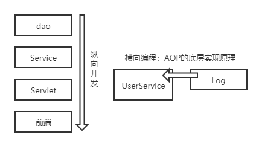
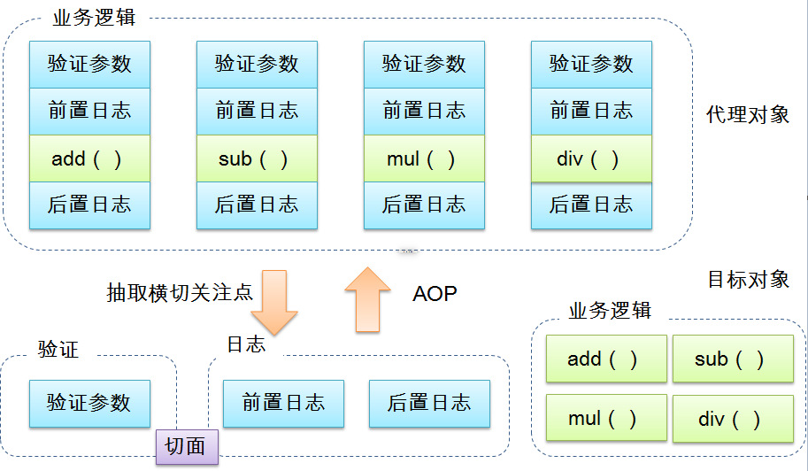
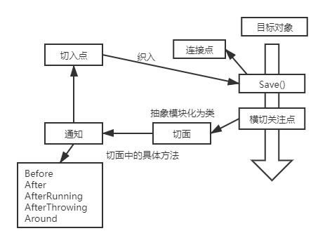

# 一、Spring简介

Spring理念：使现有技术更加容易使用，本身是一个大杂烩。

- SSH：Struct2+Spring+Hibernate
- SSM：SpringMVC+Spring+MyBatis

官网： https://spring.io/projects/spring-framework#overview

官网下载：https://repo.spring.io/release/org/springframework/spring/

Github：https://github.com/spring-projects/spring-framework

[Spring Web MVC](https://mvnrepository.com/artifact/org.springframework/spring-webmvc) **»** [5.2.5.RELEASE](https://mvnrepository.com/artifact/org.springframework/spring-webmvc/5.2.5.RELEASE)

```xml
<!-- https://mvnrepository.com/artifact/org.springframework/spring-webmvc -->
<dependency>
    <groupId>org.springframework</groupId>
    <artifactId>spring-webmvc</artifactId>
    <version>5.2.5.RELEASE</version>
</dependency>

<!-- https://mvnrepository.com/artifact/org.springframework/spring-jdbc -->
<dependency>
    <groupId>org.springframework</groupId>
    <artifactId>spring-jdbc</artifactId>
    <version>5.2.3.RELEASE</version>
</dependency>
```

- Spring是开源的免费的容器。
- Spring是轻量级的，非入侵式的。
- 控制反转（IOC），面向切面编程（AOP）。
- 支持事务处理，对框架整合的支持。

**总结：Spring是一个轻量级的控制反转（IOC）和面向切面编程（AOP）的的框架。**

# 二、IOC理论推导

1. UserDao接口

   ```java
   public interface UserDao {
       void getUser();
   }
   ```

2. UserDaoImp实现类

   ```java
   public class UserDaoImpl implements UserDao{
       public void getUser() {
           System.out.println("默认获取用户的数据！");
       }
   }
   ```

3. UserService业务接口

   ```java
   public interface UserService {
       void getUser();
   }
   ```

4. UserServiceImp业务接口实现类

   ```java
   public class UserServiceImpl implements UserService{
   
       private UserDao userDao;
   
       //以往方式：需求改变，需要在此修改源码
       //private UserDao userDao = new UserDaoImpl();
       //private UserDao userDao = new UserDaoMysqlImpl();
       //private UserDao userDao = new UserDaoOracleImpl();
   
       //注入方式：通过set接口实现
       public void setUserDao(UserDao userDao){
           this.userDao = userDao;
       }
   
       public void getUser() {
           userDao.getUser();
       }
   }
   ```

**存在的问题：用户需求可能影响原来的代码！**

**解决方案：使用一个set接口实现**

```java
    private UserDao userDao;

    //以往方式：需求改变，需要在此修改源码
    //private UserDao userDao = new UserDaoImpl();
    //private UserDao userDao = new UserDaoMysqlImpl();
    //private UserDao userDao = new UserDaoOracleImpl();

    //注入方式：利用set进行动摇实现值得注入
    public void setUserDao(UserDao userDao){
        this.userDao = userDao;
    }
```

- 以往由程序主动创建对象，控制权在程序员手中。
- 使用set后，程序不再有主动性，变成了被动接收对象。

从本质上解决了问题，程序员不再管理对象的创建，系统的耦合度大幅降低，以更加专注于业务的实现，此即IOC原型！


IOC的本质：

控制反转IoC（Inversion of Control）是一种设计思想，DI（依赖注入）是现在IoC的一种方法，。对象的创建由程序控制，在控制反转后将对象的创建转移给第三方（获得依赖对象的方式反转了）

采用XML方式配置Bean的时候，Bean的定义与实现分离；而采用注解方式时二者合为一体，Bean的定义信息以注解形式定义在实现类中，从而达到零配置的目的。

**控制反转是一种通过描述（XML或注解）并通过第三方生产或获取特定对象的方式。在Spring中实现控制反转的是IoC容器，其实现方式是依赖注入（Dependency Injection，DI）。**

# 三、HelloSpring

1. 新建模块HelloSpring

2. 编写实体类Hello（pojo）

   ```java
   package com.shinrin.pojo;
   
   public class Hello {
       private String str;
       public String getStr(){
           return str;
       }
   
       public void setStr(String str){
           this.str = str;
       }
   
       @Override
       public String toString() {
           return "Hello{" +
                   "str='" + str + '\'' +
                   '}';
       }
   }
   ```

3. 配置文件bean.xml

   ```xml
   <?xml version="1.0" encoding="UTF-8"?>
   <beans xmlns="http://www.springframework.org/schema/beans"
          xmlns:xsi="http://www.w3.org/2001/XMLSchema-instance"
          xsi:schemaLocation="http://www.springframework.org/schema/beans
           https://www.springframework.org/schema/beans/spring-beans.xsd">
   
       <!--使用Spring来创建对象（Bean）-->
       <!--
       类型 变量名 = new 类型();
       Hello hello = new Hello();
       id = 变量名
       class = 实体类
       property 设置对象的属性值
       -->
       <bean id="hello" class="com.shinrin.pojo.Hello">
           <property name="str" value="Spring"/>
       </bean>
   </beans>
   ```

4. 测试程序

   ```java
       @Test
       public void test(){
           //获取Spring的上下文对象context
           ApplicationContext context = new ClassPathXmlApplicationContext("beans.xml");
           //对象由Spring管理，使用时通过context.getBean()获取
           Hello hello = (Hello) context.getBean("hello");
           System.out.println(hello.toString());
       }
   ```

***补充：第二章中的问题，使用IOC解决***

配置文件bean.xml

```xml
<?xml version="1.0" encoding="UTF-8"?>
<beans xmlns="http://www.springframework.org/schema/beans"
       xmlns:xsi="http://www.w3.org/2001/XMLSchema-instance"
       xsi:schemaLocation="http://www.springframework.org/schema/beans
        https://www.springframework.org/schema/beans/spring-beans.xsd">

    <bean id="mysqlImpl" class="com.shinrin.dao.UserDaoMysqlImpl"/>
    <bean id="oracleImpl" class="com.shinrin.dao.UserDaoOracleImpl"/>
    <bean id="UserServiceImpl" class="com.shinrin.service.UserServiceImpl">
    <!--
        ref：引用Spring容器中创建好的对象
        value：具体的值，基本数据类型。
    -->
        <property name="userDao" ref="mysqlImpl"/>
    </bean>
</beans>
```

测试程序：

```java
    @Test
    public void test1(){
        //获取ApplicationContext，拿到Spring的容器
        ApplicationContext context = new ClassPathXmlApplicationContext("bean.xml");
        //get
        UserServiceImpl userServiceImpl = (UserServiceImpl) context.getBean("UserServiceImpl");
        userServiceImpl.getUser();
    }
```

# 四、IOC创建对象的方式

1. 使用无参构造（默认）创建对象。

   ```xml
       <bean id="user" class="com.shinrin.pojo.User">
           <!--默认使用无参构造-->
           <property name="name" value="Teemo"/>
       </bean>
   ```

2. 使用有参构造创建对象。

   1. 下标赋值

      ```xml
          <bean id="user" class="com.shinrin.pojo.User">
              <constructor-arg index="0" value="Yasuo"/>
          </bean>
      ```

   2. 类型赋值（不建议使用，）

      ```xml
          <bean id="user" class="com.shinrin.pojo.User">
              <constructor-arg type="java.lang.String" value="Yasuo"/>
          </bean>
      ```

   3. 直接通过参数名赋值

      ```xml
          <bean id="user" class="com.shinrin.pojo.User">
              <constructor-arg name="name" value="Yasuo"/>
          </bean>
      ```

**bean.xml被加载后即实例化对象并保存。**

# 五、Spring设置

别名

```xml
    <!--设置别名，亦可使用别名获取对象-->
    <alias name="user" alias="U_s_e_r"/>
```

bean的配置

```xml
    <!--
    id = 对象名
    class = 类名
    name = 对象别名（可多个，逗号、空格、分号分隔）
    -->
    <bean id="userT" class="com.shinrin.pojo.User" name="user2, u2"/>
```

import

```xml
 	<!--当前文件：applicationContext.xml，应用程序中加载该文件即可-->   
	<!--合并配置文件：用于团队合作开发-->
    <import resource="bean1.xml"/>
    <import resource="bean2.xml"/>
    <import resource="bean3.xml"/>
```

# 六、DI依赖注入

1. 构造器注入

2. set方式注入（重点）
   - 依赖：bean对象的创建依赖于容器。
   - 注入：bean对象中的所有属性，由容器来注入。

**环境搭建（复杂类型）**

Student类

```java
package com.shinrin.pojo;

import java.util.*;

public class Student {
    private String name;
    private Address address;

    private String[] books;
    private List<String> hobbies;

    private Map<String, String> card;
    private Set<String> game;

    private Properties infor;
    private String wife;

    public String getName() {
        return name;
    }

    public Address getAddress() {
        return address;
    }

    public String[] getBooks() {
        return books;
    }

    public List<String> getHobbies() {
        return hobbies;
    }

    public Map<String, String> getCard() {
        return card;
    }

    public Set<String> getGame() {
        return game;
    }

    public Properties getInfor() {
        return infor;
    }

    public String getWife() {
        return wife;
    }

    public void setName(String name) {
        this.name = name;
    }

    public void setAddress(Address address) {
        this.address = address;
    }

    public void setBooks(String[] books) {
        this.books = books;
    }

    public void setHobbies(List<String> hobbies) {
        this.hobbies = hobbies;
    }

    public void setCard(Map<String, String> card) {
        this.card = card;
    }

    public void setGame(Set<String> game) {
        this.game = game;
    }

    public void setInfor(Properties infor) {
        this.infor = infor;
    }

    public void setWife(String wife) {
        this.wife = wife;
    }

    @Override
    public String toString() {
        return "Student{" +
                "name='" + name + '\'' +
                ", address=" + address +
                ", books=" + Arrays.toString(books) +
                ", hobbies=" + hobbies +
                ", card=" + card +
                ", game=" + game +
                ", infor=" + infor +
                ", wife='" + wife + '\'' +
                '}';
    }
}
```

Address类

```java
package com.shinrin.pojo;

public class Address {
    private String address;

    public String getAddress() {
        return address;
    }

    public void setAddress(String address) {
        this.address = address;
    }

    @Override
    public String toString() {
        return "Address{" +
                "address='" + address + '\'' +
                '}';
    }
}
```

User类

```java
package com.shinrin.pojo;

public class User {
    private String name;
    private int age;
    private Address address;

    public User() {
    }

    public User(String name, int age, Address address) {
        this.name = name;
        this.age = age;
        this.address = address;
    }

    public String getName() {
        return name;
    }

    public void setName(String name) {
        this.name = name;
    }

    public int getAge() {
        return age;
    }

    public void setAge(int age) {
        this.age = age;
    }

    public Address getAddress() {
        return address;
    }

    public void setAddress(Address address) {
        this.address = address;
    }

    @Override
    public String toString() {
        return "User{" +
                "name='" + name + '\'' +
                ", age=" + age +
                ", address=" + address +
                '}';
    }
}
```

**依赖注入**

配置文件（bean1.xml）

```xml
<?xml version="1.0" encoding="UTF-8"?>
<beans xmlns="http://www.springframework.org/schema/beans"
       xmlns:xsi="http://www.w3.org/2001/XMLSchema-instance"
       xsi:schemaLocation="http://www.springframework.org/schema/beans
        https://www.springframework.org/schema/beans/spring-beans.xsd">

    <bean id="adddress" class="com.shinrin.pojo.Address">
        <property name="address" value="Changsha"/>
    </bean>

    <bean id="student" class="com.shinrin.pojo.Student">
        <property name="name" value="shinrin"/>
        <property name="address" ref="adddress"/>

        <property name="books">
            <array>
                <value>沙海</value>
                <value>世界</value>
                <value>防风氏</value>
            </array>
        </property>

        <property name="hobbies">
            <list>
                <value>Play</value>
                <value>Coding</value>
                <value>Music</value>
            </list>
        </property>

        <property name="card">
            <map>
                <entry key="1" value="12"/>
                <entry key="2" value="34"/>
            </map>
        </property>

        <property name="game">
            <set>
                <value>FGO</value>
                <value>LOL</value>
                <value>PUBG</value>
            </set>
        </property>

        <property name="wife">
            <null></null>
        </property>

        <property name="infor">
            <props>
                <prop key="id">1704</prop>
                <prop key="name">jonah</prop>
            </props>
        </property>

    </bean>
</beans>
```

**通过第三方注入依赖（c标签和p标签）**

依赖注入（bean2.xml）

```xml
<?xml version="1.0" encoding="UTF-8"?>
<beans xmlns="http://www.springframework.org/schema/beans"
       xmlns:xsi="http://www.w3.org/2001/XMLSchema-instance"
       xmlns:p="http://www.springframework.org/schema/p"
       xmlns:c="http://www.springframework.org/schema/c"
       xsi:schemaLocation="http://www.springframework.org/schema/beans
        https://www.springframework.org/schema/beans/spring-beans.xsd">

    <bean id="addr" class="com.shinrin.pojo.Address">
        <property name="address" value="Yordel"/>
    </bean>

    <!--构造器注入-->
    <bean id="user1" class="com.shinrin.pojo.User">
        <constructor-arg index="0" value="Yasuo"/>
        <constructor-arg index="1" value="27"/>
        <constructor-arg index="2" ref="addr"/>
    </bean>
    <!--c命名空间(构造器注入)-->
    <bean id="user2" class="com.shinrin.pojo.User" c:name = "Yasuo" c:age="27" c:address-ref="addr"/>

    <!--set注入-->
    <bean id="user3" class="com.shinrin.pojo.User">
        <property name="name" value="Teemo"/>
        <property name="age" value="7"/>
        <property name="address" ref="addr"/>
    </bean>
    <!--p命名空间注入(set注入)-->
    <bean id="user4" class="com.shinrin.pojo.User" p:name = "Teemo" p:age="10" p:address-ref="addr"/>

</beans>
```

注：c命名空间和p命名空间。

> ```xml
>        xmlns:p="http://www.springframework.org/schema/p"
>        xmlns:c="http://www.springframework.org/schema/c"
> ```
>
> c命名空间用于构造器。
>
> p命名空间用于set注入。

**bean的作用域**

1. 单例模式（默认）

   ```xml
       <!--单例模式-->
       <bean id="user2" class="com.shinrin.pojo.User" c:name = "Yasuo" c:age="27" p:address-ref="addr" scope="singleton"/>
   ```

2. 原型模式：每次get时都产生一个新对象。

   ```xml
       <!--原型模式-->
       <bean id="user2" class="com.shinrin.pojo.User" c:name = "Yasuo" c:age="27" p:address-ref="addr" scope="prototype"/>
   ```

3. 其余request、session、application只在web开发中使用。

   

# 七、bean的自动装配

- 自动装配是Spring满足bean依赖的一种方式。
- Spring会在上下文自动查找，并自动给bean装配属性。

Spring中三种装配的方式：

1. 在xml中显式配置
2. 在java中显式配置
3. 隐式自动装配【重要】

## 7.1 环境搭建

一人一喵一汪

Cat类

```java
public class Cat {
    public void bray(){
        System.out.println("cat meow。。。");
    }
}
```

Dog类

```java
public class Dog {
    public void bray(){
        System.out.println("Barking...");
    }
}
```

Person类

```java
package com.shinrin.pojo;

public class Person {
    private Cat cat;
    private Dog dog;
    private String name;

    public Cat getCat() {
        return cat;
    }

    public void setCat(Cat cat) {
        this.cat = cat;
    }

    public Dog getDog() {
        return dog;
    }

    public void setDog(Dog dog) {
        this.dog = dog;
    }

    public String getName() {
        return name;
    }

    public void setName(String name) {
        this.name = name;
    }

    @Override
    public String toString() {
        return "Person{" +
                "cat=" + cat +
                ", dog=" + dog +
                ", name='" + name + '\'' +
                '}';
    }
}
```

## 7.2 使用xml自动装配

**byName自动装配：自动查找与对象set对应的值（属性名）相对应的id（bean）**

beans2.xml

```xml
<beans xmlns="http://www.springframework.org/schema/beans"
       xmlns:xsi="http://www.w3.org/2001/XMLSchema-instance"
       xmlns:context="http://www.springframework.org/schema/context"
       xsi:schemaLocation="http://www.springframework.org/schema/beans
        https://www.springframework.org/schema/beans/spring-beans.xsd
        http://www.springframework.org/schema/context
        https://www.springframework.org/schema/context/spring-context.xsd">

    <context:annotation-config/>

    <bean id="cat" class="com.shinrin.pojo.Cat"/>
    <bean id="cat11" class="com.shinrin.pojo.Cat"/>

    <bean id="dog" class="com.shinrin.pojo.Dog"/>
    <bean id="dog11" class="com.shinrin.pojo.Dog"/>

    <!--byName自动查找和对象set对应的值相对应的id-->
    <bean id="person" class="com.shinrin.pojo.Person" autowire="byName">
        <property name="name" value="shinrin"/>
    </bean>

</beans>
```

**byType自动装配：自动查找与对象属性（类型）相同的bean**

beans3.xml

```xml
<beans xmlns="http://www.springframework.org/schema/beans"
       xmlns:xsi="http://www.w3.org/2001/XMLSchema-instance"
       xmlns:context="http://www.springframework.org/schema/context"
       xsi:schemaLocation="http://www.springframework.org/schema/beans
        https://www.springframework.org/schema/beans/spring-beans.xsd
        http://www.springframework.org/schema/context
        https://www.springframework.org/schema/context/spring-context.xsd">

    <context:annotation-config/>

    <bean id="cat" class="com.shinrin.pojo.Cat"/>

    <bean id="dog11" class="com.shinrin.pojo.Dog"/>

    <!--byType自动查找和对象属性相同的bean-->
    <bean id="person" class="com.shinrin.pojo.Person" autowire="byType">
        <property name="name" value="shinrin"/>
    </bean>

</beans>
```

## 7.3 使用注解自动装配

**@Autowire**

1. @Autowired通过byType实现，默认要求对象必须存在。
2. 通过@Autowired(required = false)以允许对象不存在（为null值）。
3. 如果有多个对象，使用 @Qualifier(value = "cat11")以指定唯一的id对象。

**@Resource**

1. @Resource默认通过byName实现，未指定name和type时，按byName（属性名）查找匹配，无匹配时回退至原始类型（属性类型）通过byType查找，如匹配则自动装配。
2. 如同时指定name和type，则在上下文中查询唯一匹配装配，未果抛出异常。
3. 如只指定name，则在上下文中查询名称（id）匹配的bean装配，未果抛出异常。
4. 如只指定type，则在上下文中查询类型匹配的唯一bean装配，无匹配或多个匹配抛出异常。

Person.java

```java
    //默认byType实现，要求对象必须存在
    //指定参数required = false以允许对象为null
    @Autowired(required = false)
    //有多个对象时，按bean的id查找
    @Qualifier(value = "cat11")
    private Cat cat;

    //默认byName实现，查询未果时再按byType查找
    @Resource(name = "dog11")
    private Dog dog;
```

beans1.xml

```xml
<beans xmlns="http://www.springframework.org/schema/beans"
       xmlns:xsi="http://www.w3.org/2001/XMLSchema-instance"
       xmlns:context="http://www.springframework.org/schema/context"
       xsi:schemaLocation="http://www.springframework.org/schema/beans
        https://www.springframework.org/schema/beans/spring-beans.xsd
        http://www.springframework.org/schema/context
        https://www.springframework.org/schema/context/spring-context.xsd">

    <context:annotation-config/>

    <bean id="cat" class="com.shinrin.pojo.Cat"/>
    <bean id="cat11" class="com.shinrin.pojo.Cat"/>

    <bean id="dog" class="com.shinrin.pojo.Dog"/>
    <bean id="dog11" class="com.shinrin.pojo.Dog"/>
    <bean id="dog22" class="com.shinrin.pojo.Dog"/>

    <bean id="person" class="com.shinrin.pojo.Person">
    <property name="name" value="shinrin"/>
    </bean>

</beans>
```

# 八、使用注解开发

**@Component及衍生注解**（web开发中，MVC架构中分层）

- dao（@Repository）
- service（@Service）
- controller（@Controller）

**作用：将类注册到容器中。**

**作用域@Scope("singleton")**

1. 属性注入：

```java
@Component
//@Scope("prototype")
@Scope("singleton")
public class User {

    @Value("shinrin")
    private String name;

    public String getName() {
        return name;
    }

    public void setName(String name) {
        this.name = name;
    }
}
```

2. beans.xml配置

```xml
<?xml version="1.0" encoding="UTF-8"?>
<beans xmlns="http://www.springframework.org/schema/beans"
       xmlns:xsi="http://www.w3.org/2001/XMLSchema-instance"
       xmlns:context="http://www.springframework.org/schema/context"
       xsi:schemaLocation="http://www.springframework.org/schema/beans
        https://www.springframework.org/schema/beans/spring-beans.xsd
        http://www.springframework.org/schema/context
        https://www.springframework.org/schema/context/spring-context.xsd">

    <context:annotation-config/>
    <!--指定要扫描的包-->
    <context:component-scan base-package="com.pojo"/>

</beans>
```

**总结**：xml更加灵活，维护简单；注解只能针对当前类，维护复杂。

**实践**：

- xml管理bean
- 注解完成属性的注入

# 九、使用java方式配置Spring

**JavaConfig：Spring的一个子项目，在spring4之后，成为核心功能**

Config2.java

```java
//其他配置文件（团队协作）
@Configuration
public class Config2 {
}
```

MyConfig.java

```java
//本身是一个@Component，也会被Spring容器托管，注册到容器中。
//@Configuration代表Spring配置类，同beans.xml
@Configuration
@ComponentScan("com.shinrin.pojo")
@Import(Config2.class)
public class MyConfig {

    //注册一个bean：相当于bean标签。
    //方法名称：相当于bean标签的id属性。
    //方法返回值：相当于bean标签中的class属性。
    @Bean
    public User getUser(){
        return new User();//返回注入到bean中的对象。
    }
}
```

实体类：

```java
@Component
public class User {

    @Value("shinrin")
    private String name;

    public String getName() {
        return name;
    }

    public void setName(String name) {
        this.name = name;
    }

    @Override
    public String toString() {
        return "User{" +
                "name='" + name + '\'' +
                '}';
    }
}
```

测试：

```java
    @Test
    public void test(){
        //如果完全使用配置方式：只能通过AnnotationConfig上下文来获取容器，通过配置类的class对象加载。
        ApplicationContext context = new AnnotationConfigApplicationContext(MyConfig.class);
        User getUser = (User) context.getBean("getUser");
        System.out.println(getUser);
    }
```

**纯Java配置方式，常见于SpringBoot。**

# 十、代理模式

静态代理和动态代理。

## 10.1静态代理

角色分析：

- 抽象角色：一般会使用接口和抽象类来解决。
- 真实角色：被代理角色。
- 代理角色：代理真实角色，添加附属操作。
- 客户：访问代理对象的人。

代理步骤：

1. 接口
2. 真实角色
3. 代理角色
4. 客户端访问代理角色

代理模式的好处：

- 使真实角色的操作更加单纯，不用关注一些公共业务。
- 公共业务交由代理角色，**实现业务分工**。
- 公共**业务扩展时，方便管理**。

缺点：

- 一个真实角色产生一个代理角色，使开发效率降低。

------

**实例：通过代理模式增加日志功能。**

1. UserService.java（接口）

   ```java
   public interface UserService {
       public void add();
       public void delete();
       public void update();
       public void query();
   }
   ```

2. UserServiceImpl.java

   ```java
   public class UserServiceImpl implements UserService{
   
       public void add() {
           System.out.println("增加了一个用户");
       }
   
       public void delete() {
           System.out.println("删除了一个用户");
       }
   
       public void update() {
           System.out.println("修改了一个用户");
       }
   
       public void query() {
           System.out.println("查询了一个用户");
       }
   }
   ```

3. UserServiceProxy.java

   ```java
   public class UserServiceProxy implements UserService{
   
       private UserServiceImpl userService;
   
       public void setUserService(UserServiceImpl userService) {
           this.userService = userService;
       }
   
       public void add() {
           log("add");
           userService.add();
       }
   
       public void delete() {
           userService.delete();
       }
   
       public void update() {
           userService.update();
       }
   
       public void query() {
           userService.query();
       }
   
       //日志方法
       public void log(String msg){
           System.out.println("[Debug] 使用了" + msg + "方法。");
       }
   }
   ```

4. Client.java

   ```java
   public class Client {
       public static void main(String[] args) {
           UserServiceImpl userService = new UserServiceImpl();
           UserServiceProxy proxy = new UserServiceProxy();
           proxy.setUserService(userService);
           proxy.add();
       }
   }
   ```



## 10.2 动态代理

- 动态代理和静态代理角色一样。

- 动态代理的代理类是动态生成的。
- 动态代理的分类：基于接口的动态代理、基于类的动态代理。
  - 基于接口——JDK动态代理
  - 基于类：cglib
  - javasist

【查看JDK帮助文档】

**InvocationHandler：调用处理程序。**

- 代理实例的调用处理程序实现的接口。
- 每个代理实例都有一个关联的调用处理程序。

```java
Object invoke(Object proxy, 方法 method, Object[] args)；
//参数
//proxy - 调用该方法的代理实例
//method -所述方法对应于调用代理实例上的接口方法的实例。方法对象的声明类将是该方法声明的接口，它可以是代理类继承该方法的代理接口的超级接口。
//args -包含的方法调用传递代理实例的参数值的对象的阵列，或null如果接口方法没有参数。原始类型的参数包含在适当的原始包装器类的实例中，例如java.lang.Integer或java.lang.Boolean 。
```

**Proxy：代理，提供创建动态代理类和实例的静态方法。**

```java
//生成代理类
public Object getProxy(){
   return Proxy.newProxyInstance(this.getClass().getClassLoader(),
                                 rent.getClass().getInterfaces(),this);
}
```

核心：**一个动态代理，一般代理某一类业务，一个动态代理可以代理多个类（通过代理接口实现）。**

------

使用动态代理实现代理UserService：（亦可编写通用的动态代理实现的类，代理对象设置为Object）

代理类：ProxyInvocationHandler.java

```java
public class ProxyInvocationHandler implements InvocationHandler{

    private Object target;

    public void setTarget(Object target) {
        this.target = target;
    }

    //生成代理类
    public Object getProxy(){
        return Proxy.newProxyInstance(this.getClass().getClassLoader(), target.getClass().getInterfaces(), this);
    }

    //proxy代理类
    //method：代理类的调用处理程序的方法对象
    public Object invoke(Object proxy, Method method, Object[] args) throws Throwable {
        log(method.getName());
        Object result = method.invoke(target, args);
        return result;
    }

    public void log(String methodName){
        System.out.println("执行了" + methodName + "方法");
    }
}
```

测试：Client.java

```java
package com.shinrin.demo04;

public class Client {
    public static void main(String[] args) {
        //真实对象
        UserServiceImpl userService = new UserServiceImpl();
        //代理对象的调用处理程序
        ProxyInvocationHandler pih = new ProxyInvocationHandler();
        pih.setTarget(userService);//设置要代理的对象
        UserService proxy = (UserService) pih.getProxy();//动态生成代理类
        proxy.delete();
    }
}
```

**动态代理的优势**：

1. 使真实角色更加纯粹，不用关注公共的事情。
2. 公共业务由代理完成，实现了业务的分工。
3. 公共业务扩展时更加集中，方便管理。
4. 一个动态代理，一般代理某一类业务。
5. 一个动态代理可以代理多个类（代理接口）。

# 十一、AOP

## 11.1 什么是AOP？

> AOP（Aspect Oriented Programming）意为：面向切面编程，通过预编译方式和运行期动态代理实现程序功能的统一维护的一种技术。AOP是OOP的延续，是软件开发中的一个热点，也是Spring框架中的一个重要内容，是函数式编程的一种衍生范型。<span style="border-bottom:2px dashed yellow;">*利用AOP可以对业务逻辑的各个部分进行隔离，从而使得业务逻辑各部分之间的耦合度降低，提高程序的可重用性，同时提高了开发的效率。*</span> 
>
> **面向切面编程的直观理解**： **在运行时，动态地将代码切入到类的指定方法、指定位置上的编程思想** 。



## 11.2 AOP在Spring中的作用：

提供声明式事务，允许用户自定义切面。

|         名词         | 解释                                                         |
| :------------------: | :----------------------------------------------------------- |
|      横切关注点      | 跨越应用程序多个模块的方法或功能。与业务逻辑无关的，但需关注的部分。如日志 , 安全 , 缓存 , 事务等等 |
|    切面（ASPECT）    | 横切关注点 被模块化 的特殊对象。即，它是一个类。             |
|    通知（Advice）    | 切面必须要完成的工作。即，它是类中的一个方法。               |
|    目标（Target）    | 被通知对象。                                                 |
|    代理（Proxy）     | 向目标对象应用通知之后创建的对象。                           |
|  切入点（PointCut）  | 切面通知 执行的 “地点”的定义。                               |
| 连接点（JointPoint） | 与切入点匹配的执行点。                                       |



Spring使用增强类定义横切逻辑，同时由于Spring只支持方法连接点，增强还包括在方法的哪一点加入横切代码的方位信息，所以增强既包括横切逻辑，又包括部分连接点的信息。

按照增强（通知）在目标类方法连接点的位置可以将增强划分为以下五类：

1. **前置增强** (org.springframework.aop.BeforeAdvice)： 表示在目标方法执行前来实施增强。
2. **后置增强** (org.springframework.aop.AfterReturningAdvice)：表示在目标方法执行后来实施增强。
3. **环绕增强** (org.aopalliance.intercept.MethodInterceptor)：表示在目标方法执行前后同时实施增强。
4. **异常抛出增强** (org.springframework.aop.ThrowsAdvice) ：表示在目标方法抛出异常后来实施增强。
5. **引介增强** (org.springframework.aop.introductioninterceptor)：表示在目标类中添加一些新的方法和属性。

即AOP不改变原有代码的前提下，增加功能。

## 11.3 使用Spring实现AOP

导入依赖：

```xml
<!-- https://mvnrepository.com/artifact/org.aspectj/aspectjweaver -->
<dependency>
   <groupId>org.aspectj</groupId>
   <artifactId>aspectjweaver</artifactId>
   <version>1.9.4</version>
</dependency>
```

**方式一：使用Spring API实现AOP**

业务接口：

```java
public interface UserService {
    public void add();
    public void delete();
    public void update();
    public void query();
}
```

业务实现类：

```java
public class UserServiceImpl implements UserService{
    public void add() {
        System.out.println("增加用户");
    }

    public void delete() {
        System.out.println("删除用户");
    }

    public void update() {
        System.out.println("更新用户");
    }

    public void query() {
        System.out.println("查询用户");
    }
}
```

增强类：前置增强

```java
public class Log implements MethodBeforeAdvice {

    //method：要执行的目标对象的方法
    //args：被调用的方法的参数
    //target：被调用的目标对象
    public void before(Method method, Object[] args, Object target) throws Throwable {
        System.out.println(target.getClass().getName() + "的" + method.getName() + "方法将被执行");
    }
}
```

增强类：后置增强

```java
public class AfterLog implements AfterReturningAdvice {

    //returnValue：返回值
    //method：要执行的目标对象的方法
    //args：被调用的方法的参数
    //target：被调用的目标对象
    public void afterReturning(Object returnValue, Method method, Object[] args,
                               Object target) throws Throwable {
        System.out.println("执行了" + target.getClass().getName()
                + "的" + method.getName() + "方法，"
                + "返回值：" + returnValue);
    }
}
```

Spring注册文件：

```xml
<?xml version="1.0" encoding="UTF-8"?>
<beans xmlns="http://www.springframework.org/schema/beans"
       xmlns:xsi="http://www.w3.org/2001/XMLSchema-instance"
       xmlns:aop="http://www.springframework.org/schema/aop"
       xsi:schemaLocation="http://www.springframework.org/schema/beans
       http://www.springframework.org/schema/beans/spring-beans.xsd
       http://www.springframework.org/schema/aop
       http://www.springframework.org/schema/aop/spring-aop.xsd">

    <!--注册bean-->
    <bean id="userService" class="com.shinrin.service.UserServiceImpl"/>
    <bean id="log" class="com.shinrin.log.Log"/>
    <bean id="afterLog" class="com.shinrin.log.AfterLog"/>

    <!--aop的配置-->
    <aop:config>
        <!--切入点，expression：表达式匹配要执行的方法-->
        <aop:pointcut id="pointcut" expression="execution(* 
        com.shinrin.service.UserServiceImpl.*(..))"/>
        <!--执行环绕，advice-ref执行方法，pointcut-ref切入点-->
        <aop:advisor advice-ref="log" pointcut-ref="pointcut"/>
        <aop:advisor advice-ref="afterLog" pointcut-ref="pointcut"/>
    </aop:config>

</beans>
```

测试：

```java
    @Test
    public void test1(){
        ClassPathXmlApplicationContext context = new ClassPathXmlApplicationContext("beans1.xml");
        UserService userService = (UserService) context.getBean("userService");
        userService.query();
    }
```

> Spring的AOP将公共的业务（日志、安全等）和领域业务结合起来，当执行领域业务时，将会加入公共业务，实现公共业务的重复使用，同时领域业务更加纯粹。
>
> 本质是动态代理。

**方式二：自定义类实现AOP**

目标业务接口及业务类不变（UserService/UserServiceImpl）。

自定义切入类：

```java
public class DiyPointcut {

    public void before(){
        System.out.println("---------方法执行前---------");
    }
    public void after(){
        System.out.println("---------方法执行后---------");
    }
}
```

Spring注册文件：

```xml
    <!--注册bean-->
    <bean id="userService" class="com.shinrin.service.UserServiceImpl"/>
    <bean id="diy" class="com.shinrin.diy.DiyPointcut"/>

    <!--aop的配置-->
    <aop:config>
    <!--使用AOP的标签实现-->
        <aop:aspect ref="diy">
            <aop:pointcut id="diyPointcut" expression="execution(*
            com.shinrin.service.UserServiceImpl.*(..))"/>
            <aop:before method="before" pointcut-ref="diyPointcut"/>
            <aop:after method="after" pointcut-ref="diyPointcut"/>
        </aop:aspect>
    </aop:config>
```

测试：

```java
    @Test
    public void test2(){
        ClassPathXmlApplicationContext context = new ClassPathXmlApplicationContext("beans2.xml");
        UserService userService = (UserService) context.getBean("userService");
        userService.add();
    }
```

**方式三：使用注解实现AOP**

编写增强类：

```java
@Aspect
public class AnnotationPointcut {

    @Before("execution(* com.shinrin.service.UserServiceImpl.*(..))")
    public void before(){
        System.out.println("---------方法执行前---------");
    }
    
    @After("execution(* com.shinrin.service.UserServiceImpl.*(..))")
    public void after(){
        System.out.println("---------方法执行后---------");
    }
    
    @Around("execution(* com.shinrin.service.UserServiceImpl.*(..))")
    public void around(ProceedingJoinPoint jp) throws Throwable {
        System.out.println("环绕前");
        System.out.println("签名：" + jp.getSignature());
        //执行目标方法
        Object proceed = jp.proceed();
        System.out.println("环绕后");
        System.out.println(proceed);
    }
}
```

Spring注册文件：

```xml
    <!--注册bean-->
    <bean id="userService" class="com.shinrin.service.UserServiceImpl"/>
    <bean id="annotation" class="com.shinrin.annotation.AnnotationPointcut"/>

    <aop:aspectj-autoproxy/>
```

测试：

```java
    @Test
    public void test3(){
        ClassPathXmlApplicationContext context = new ClassPathXmlApplicationContext("beans3.xml");
        UserService userService = (UserService) context.getBean("userService");
        userService.delete();
    }
```

**关于```<aop:aspectj-autoproxy/>```的说明：**

- aop的命名空间：声明自动为Spring容器中配置@Aspect的切面的bean创建代理，织入页面。
- 属性proxy-target-class：
  - 默认为false：使用JDK动态代理织入增强。（若目标类未声明接口，则Spring自动使用CGLib动态代理）
  - 配置为true：使用CGLib动态代理技术织入增强。

# 十二、Spring整合MyBatis

导入jar包依赖（Maven配置文件：pom.xml）

```xml
<?xml version="1.0" encoding="UTF-8"?>
<project xmlns="http://maven.apache.org/POM/4.0.0"
         xmlns:xsi="http://www.w3.org/2001/XMLSchema-instance"
         xsi:schemaLocation="http://maven.apache.org/POM/4.0.0 http://maven.apache.org/xsd/maven-4.0.0.xsd">
    <parent>
        <artifactId>Spring_PROJ</artifactId>
        <groupId>com.shinrin</groupId>
        <version>1.0-SNAPSHOT</version>
    </parent>
    <modelVersion>4.0.0</modelVersion>

    <artifactId>Spring_10_MyBatis</artifactId>

    <dependencies>
        <!-- junit -->
        <dependency>
            <groupId>junit</groupId>
            <artifactId>junit</artifactId>
            <version>4.13</version>
            <scope>test</scope>
        </dependency>
        <!-- mybatis -->        
        <dependency>
            <groupId>org.mybatis</groupId>
            <artifactId>mybatis</artifactId>
            <version>3.5.2</version>
        </dependency>  
        <!-- mysql-connector-java -->                
        <dependency>
            <groupId>mysql</groupId>
            <artifactId>mysql-connector-java</artifactId>
            <version>5.1.47</version>
        </dependency> 
        <!-- spring相关 -->
        <dependency>
            <groupId>org.springframework</groupId>
            <artifactId>spring-webmvc</artifactId>
            <version>5.2.5.RELEASE</version>
        </dependency>
        <dependency>
            <groupId>org.springframework</groupId>
            <artifactId>spring-jdbc</artifactId>
            <version>5.2.3.RELEASE</version>
        </dependency>   
        <!-- aspectJ AOP织入器 -->        
        <dependency>
            <groupId>org.aspectj</groupId>
            <artifactId>aspectjweaver</artifactId>
            <version>1.9.4</version>
        </dependency>		
        <!-- mybatis-spring整合包 -->
        <dependency>
            <groupId>org.mybatis</groupId>
            <artifactId>mybatis-spring</artifactId>
            <version>2.0.4</version>
        </dependency>
        <!-- lombok整合包 -->
        <dependency>
            <groupId>org.projectlombok</groupId>
            <artifactId>lombok</artifactId>
            <version>1.18.12</version>
        </dependency>
    </dependencies>
    <!-- 解决资源过滤问题 -->
    <build>
        <resources>
            <resource>
                <directory>src/main/resources</directory>
                <includes>
                    <include>**/*.properties</include>
                    <include>**/*.xml</include>
                </includes>
            </resource>
            <resource>
                <directory>src/main/java</directory>
                <includes>
                    <include>**/*.properties</include>
                    <include>**/*.xml</include>
                </includes>
                <filtering>true</filtering>
            </resource>
        </resources>
    </build>

</project>
```

## 12.1 回顾MyBatis

1. pojo实体类：

```java
package com.shinrin.pojo;

public class User {
   private int id;  		//id
   private String name;   	//姓名
   private String pwd;   	//密码
}
```

2. UserMapper接口：

```java
public interface UserMapper {
   public List<User> selectUser();
}
```

3. 接口对应的Mapper映射文件：

```xml
<?xml version="1.0" encoding="UTF-8" ?>
<!DOCTYPE mapper
       PUBLIC "-//mybatis.org//DTD Mapper 3.0//EN"
       "http://mybatis.org/dtd/mybatis-3-mapper.dtd">
<mapper namespace="com.shinrin.dao.UserMapper">

   <select id="selectUser" resultType="User">
    select * from user
   </select>

</mapper>
```

4. 数据库配置文件：

```properties
driver=com.mysql.cj.jdbc.Driver
url=jdbc:mysql://localhost:3306/mybatis?serverTimezone=UTC
username=root
password=1704
```

5. MyBatis的配置文件：

```xml
<?xml version="1.0" encoding="UTF-8" ?>
<!DOCTYPE configuration
        PUBLIC "-//mybatis.org//DTD Config 3.0//EN"
        "http://mybatis.org/dtd/mybatis-3-config.dtd">
<configuration>
    <!-- 全局变量 -->
    <!--引入外部配置-->
    <properties resource="db.properties"/>

    <!--日志-->
    <settings>
        <!--标准的日志工厂实现-->
        <setting name="logImpl" value="STDOUT_LOGGING"/>
    </settings>

    <!--为实体类起别名-->
    <typeAliases>
        <package name="com.shinrin.pojo"/>
    </typeAliases>

    <!--配置环境-->
    <environments default="development">
        <environment id="development">
            <transactionManager type="JDBC"/>
            <dataSource type="POOLED">
                <property name="driver" value="${driver}"/>
                <property name="url" value="${url}"/>
                <property name="username" value="${username}"/>
                <property name="password" value="${password}"/>
            </dataSource>
        </environment>
    </environments>

    <mappers>
        <package name="com.shinrin.dao"/>
    </mappers>

</configuration>
```

6. 测试类：

```java
@Test
public void selectUser() throws IOException {

   String resource = "mybatis-config.xml";
   InputStream inputStream = Resources.getResourceAsStream(resource);
   SqlSessionFactory sqlSessionFactory = new SqlSessionFactoryBuilder().build(inputStream);
   SqlSession sqlSession = sqlSessionFactory.openSession();

   UserMapper mapper = sqlSession.getMapper(UserMapper.class);

   List<User> userList = mapper.selectUser();
   for (User user: userList){
       System.out.println(user);
  }

   sqlSession.close();
}
```

## 12.2 MyBatis-Spring

MyBatis-Spring： http://www.mybatis.org/spring/zh/index.html 

作用：整合MyBatis到Spring。

如使用Maven构建工程，则只需导入mybatis-spring的jar包。

```xml
        <!-- mybatis-spring整合包 -->
        <dependency>
            <groupId>org.mybatis</groupId>
            <artifactId>mybatis-spring</artifactId>
            <version>2.0.4</version>
        </dependency>
```

Spring结合MyBatis使用，需要在Spring应用上下文中至少定义：

- SqlSessionFactory（一个）
- 数据映射器类（至少一个）

**如何创建SqlSessionFactory？**

- 在MyBatis中：通过SqlSessionFactoryBuilder创建SqlSessionFactory。

- MyBatis-Spring中：通过SqlSessionFactoryBean创建SqlSessionFactory，需要修改Spring的xml配置：

```xml
<bean id="sqlSessionFactory" class="org.mybatis.spring.SqlSessionFactoryBean">
	<property name="dataSource" ref="dataSource" />
</bean>
```

**第一种实现方式：**

1. 实体类：User.java

   ```java
   package com.shinrin.pojo;
   
   public class User {
       private int id;
       private String name;
       private String pwd;
   
       @Override
       public String toString() {
           return "User{" +
                   "id=" + id +
                   ", name='" + name + '\'' +
                   ", pwd='" + pwd + '\'' +
                   '}';
       }
   }
   ```

2. 实体映射接口：UserMapper.java

   ```java
   package com.shinrin.mapper;
   
   import com.shinrin.pojo.User;
   
   import java.util.List;
   
   public interface UserMapper {
       List<User> selectUser();
   }
   ```

3. 实体映射配置：UserMapper.xml

   ```xml
   <?xml version="1.0" encoding="UTF-8" ?>
   <!DOCTYPE mapper
           PUBLIC "-//mybatis.org//DTD Config 3.0//EN"
           "http://mybatis.org/dtd/mybatis-3-mapper.dtd">
   
   <mapper namespace="com.shinrin.mapper.UserMapper">
       <select id="selectUser" resultType="user">
           select * from mybatis.user;
       </select>
   
   </mapper>
   ```

4. 接口实现类：UserMapperImpl.java

   ```java
   package com.shinrin.mapper;
   
   import com.shinrin.pojo.User;
   import org.mybatis.spring.SqlSessionTemplate;
   
   import java.util.List;
   
   public class UserMapperImpl implements UserMapper {
   
       private SqlSessionTemplate sqlSession;
   
       public void setSqlSession(SqlSessionTemplate sqlSession) {
           this.sqlSession = sqlSession;
       }
   
       public List<User> selectUser() {
           UserMapper mapper = sqlSession.getMapper(UserMapper.class);
           return mapper.selectUser();
       }
   }
   ```

5. MyBatis配置文件：mybatis-config.xml

   ```xml
   <?xml version="1.0" encoding="UTF-8" ?>
   <!DOCTYPE configuration
           PUBLIC "-//mybatis.org//DTD Config 3.0//EN"
           "http://mybatis.org/dtd/mybatis-3-config.dtd">
   
   <configuration>
   
       <typeAliases>
           <package name="com.shinrin.pojo"/>
       </typeAliases>
   
   </configuration>
   ```

6. Spring配置文件：beans.xml

   ```xml
   <?xml version="1.0" encoding="UTF-8"?>
   <beans xmlns="http://www.springframework.org/schema/beans"
          xmlns:xsi="http://www.w3.org/2001/XMLSchema-instance"
          xsi:schemaLocation="http://www.springframework.org/schema/beans
          http://www.springframework.org/schema/beans/spring-beans.xsd">
   
       <!--配置数据源，替换mybatis的数据源-->
       <bean id="dataSource" class="org.springframework.jdbc.datasource.DriverManagerDataSource">
           <property name="driverClassName" value="com.mysql.jdbc.Driver"/>
           <property name="url" value="jdbc:mysql://localhost:3306/mybatis?serverTimezone=UTC&amp;useSSL=false"/>
           <property name="username" value="root"/>
           <property name="password" value="1704"/>
       </bean>
   
       <!--配置SqlSessionFactory-->
       <bean id="sqlSessionFactory" class="org.mybatis.spring.SqlSessionFactoryBean">
           <property name="dataSource" ref="dataSource"/>
           <!--关联MyBatis-->
           <property name="configLocation" value="classpath:mybatis-config.xml"/>
           <property name="mapperLocations" value="classpath:com/shinrin/mapper/*.xml"/>
       </bean>
   
       <!--注册SqlSessionTemplate，关联SqlSessionFactory-->
       <bean id="sqlSession" class="org.mybatis.spring.SqlSessionTemplate">
           <!--利用构造器注入-->
           <constructor-arg index="0" ref="sqlSessionFactory"/>
       </bean>
   
       <!--实现方法一-->
       <bean id="userMapper1" class="com.shinrin.mapper.UserMapperImpl1">
           <property name="sqlSession" ref="sqlSession"/>
       </bean>
   
   </beans>
   ```

7. 测试：

   ```java
       @Test
       public void test1(){
           ApplicationContext context = new ClassPathXmlApplicationContext("beans.xml");
           UserMapper mapper = (UserMapper) context.getBean("userMapper1");
           List<User> users = mapper.selectUser();
           System.out.println(users);
       }
   ```

**第二种实现方式：**

1. 修改UserDaoImpl（继承于SqlSessionDaoSupport，直接getSqlSession）

   ```java
   public class UserDaoImpl2 extends SqlSessionDaoSupport implements UserMapper {
      public List<User> selectUser() {
          UserMapper mapper = getSqlSession().getMapper(UserMapper.class);
          return mapper.selectUser();
     }
   }
   ```

2. 修改bean

   ```xml
       <!--实现方法二-->
       <bean id="userMapper2" class="com.shinrin.mapper.UserMapperImpl2">
           <property name="sqlSessionFactory" ref="sqlSessionFactory"/>
       </bean>
   ```

3. 测试

   ```java
       @Test
       public void test2(){
           ApplicationContext context = new ClassPathXmlApplicationContext("beans.xml");
           UserMapper mapper = (UserMapper) context.getBean("userMapper2");
           List<User> users = mapper.selectUser();
           System.out.println(users);
       }
   ```

# 十三、声明式事务

## 13.1 事务

- 事务在项目开发中，涉及数据的一致性问题，十分重要。
- 事务管理时企业级应用程序开发中的必备技术，用来保证数据的完整性和一致性。

**事务的四个属性：**

原子性

> 事务是原子性操作，将一系列的动作当成一个独立的工作单元，要么全部完成，要么完全不起作用。

一致性

> 一旦所有事务动作完成，事务就要被提交，数据和资源处于一种满足业务规则的一致状态中。

隔离性

> 可能有多个事务同时处理相同的数据，因此每个事务都应该与其他业务隔离开，防治数据损坏。

持久性

> 事务一旦完成，无论系统发生什么错误，结果都不会受影响。通常情况下，事务的结果被写到持久化存储器中。

## 13.2 Spring中的事务管理

 Spring在不同的事务管理API之上定义了一个抽象层，使得开发人员不必了解底层的事务管理API就可以使用Spring的事务管理机制。Spring支持编程式事务管理和声明式的事务管理。 

**编程式事务管理**

- 将事务管理代码嵌到业务方法中来控制事务的提交和回滚
- 缺点：必须在每个事务操作业务逻辑中包含额外的事务管理代码

**声明式事务管理**

- 一般情况下比编程式事务好用。
- 将事务管理代码从业务方法中分离出来，以声明的方式来实现事务管理。
- 将事务管理作为横切关注点，通过aop方法模块化。Spring中通过Spring AOP框架支持声明式事务管理。

**Spring管理事务，头文件约束导入：tx**

```xml
xmlns:tx="http://www.springframework.org/schema/tx"

http://www.springframework.org/schema/tx
http://www.springframework.org/schema/tx/spring-tx.xsd">
```

**配置数据源**

```xml
<!--配置数据源，替换mybatis的数据源-->
<bean id="dataSource" class="org.springframework.jdbc.datasource.DriverManagerDataSource">
    <property name="driverClassName" value="com.mysql.jdbc.Driver"/>
    <property name="url" value="jdbc:mysql://localhost:3306/mybatis?serverTimezone=UTC&amp;useSSL=false"/>
    <property name="username" value="root"/>
    <property name="password" value="1704"/>
</bean>
```
**配置SqlSessionFactory**

```xml
<!--配置SqlSessionFactory-->
<bean id="sqlSessionFactory" class="org.mybatis.spring.SqlSessionFactoryBean">
    <property name="dataSource" ref="dataSource"/>
    <!--关联MyBatis-->
    <property name="configLocation" value="classpath:mybatis-config.xml"/>
    <property name="mapperLocations" value="classpath:com/shinrin/mapper/*.xml"/>
</bean>
```
**事务管理器**

- 无论使用Spring的哪种事务管理策略（编程式或者声明式）事务管理器都是必须的。
- 就是 Spring的核心事务管理抽象，管理封装了一组独立于技术的方法。

```xml
    <!--声明JDBC事务（事务管理器）-->
    <bean id="transactionManager" class="org.springframework.jdbc.datasource.DataSourceTransactionManager">
        <constructor-arg ref="dataSource" />
    </bean>
```

**配置事务通知**

```xml
<!--配置事务通知-->
<tx:advice id="txAdvice" transaction-manager="transactionManager">
    <tx:attributes>
        <!--配置哪些方法使用什么样的事务,配置事务的传播特性-->
        <tx:method name="add" propagation="REQUIRED"/>
        <tx:method name="delete" propagation="REQUIRED"/>
        <tx:method name="update" propagation="REQUIRED"/>
        <tx:method name="search*" propagation="REQUIRED"/>
        <tx:method name="get" read-only="true"/>
        <tx:method name="*" propagation="REQUIRED"/>
    </tx:attributes>
</tx:advice>
```
**spring事务传播特性**

事务传播行为就是多个事务方法相互调用时，事务如何在这些方法间传播。

spring支持7种事务传播行为：

| propagation   |                                                              |
| ------------- | ------------------------------------------------------------ |
| requierd      | 如果当前没有事务，就新建一个事务，如果已存在一个事务中，加入到这个事务中，这是最常见的选择。 |
| supports      | 支持当前事务，如果没有当前事务，就以非事务方法执行。         |
| mandatory     | 使用当前事务，如果没有当前事务，就抛出异常。                 |
| required_new  | 新建事务，如果当前存在事务，把当前事务挂起。                 |
| not_supported | 以非事务方式执行操作，如果当前存在事务，就把当前事务挂起。   |
| never         | 以非事务方式执行操作，如果当前事务存在则抛出异常。           |
| nested        | 如果当前存在事务，则在嵌套事务内执行。如果当前没有事务，则执行与propagation_required类似的操作。 |

**Spring 默认的事务传播行为是 PROPAGATION_REQUIRED**，它适合于绝大多数的情况。

假设 ServiveX#methodX() 都工作在事务环境下（即都被 Spring 事务增强了），假设程序中存在如下的调用链：Service1#method1()->Service2#method2()->Service3#method3()，那么这 3 个服务类的 3 个方法通过 Spring 的事务传播机制都工作在同一个事务中。

如：多个方法存在调用，会被放在一个事务中。

## 13.3 测试

1. 实体类：User.java

   ```java
   public class User {
       private int id;
       private String name;
       private String pwd;
   
       public User(int id, String name, String pwd) {
           this.id = id;
           this.name = name;
           this.pwd = pwd;
       }
   
       @Override
       public String toString() {
           return "User{" +
                   "id=" + id +
                   ", name='" + name + '\'' +
                   ", pwd='" + pwd + '\'' +
                   '}';
       }
   }
   ```

2. Mapper接口：UserMapper.java

   ```java
   public interface UserMapper {
       List<User> selectUser();
   
       int addUser(User user);
   
       int deleteUser(int id);
   }
   ```

3. Mapper配置文件：UserMapper.xml

   ```xml
   <?xml version="1.0" encoding="UTF-8" ?>
   <!DOCTYPE mapper
           PUBLIC "-//mybatis.org//DTD Config 3.0//EN"
           "http://mybatis.org/dtd/mybatis-3-mapper.dtd">
   
   <mapper namespace="com.shinrin.mapper.UserMapper">
       <select id="selectUser" resultType="user">
           select * from mybatis.user;
       </select>
   
       <insert id="addUser" parameterType="com.shinrin.pojo.User">
           insert into user (id,name,pwd) values (#{id},#{name},#{pwd})
       </insert>
   
       <delete id="deleteUser" parameterType="int">
           delete from user where id = #{id}
       </delete>
   
   </mapper>
   ```

4. Mapper实现类：UserMapperImpl.java

   ```java
   public class UserMapperImpl extends SqlSessionDaoSupport implements UserMapper {
   
       public List<User> selectUser() {
           User user = new User(6, "Galen", "1222001");
           UserMapper mapper = getSqlSession().getMapper(UserMapper.class);
           mapper.addUser(user);
           mapper.deleteUser(5);
           return mapper.selectUser();
       }
   
       public int addUser(User user) {
           return getSqlSession().getMapper(UserMapper.class).addUser(user);
       }
   
       public int deleteUser(int id) {
           return getSqlSession().getMapper((UserMapper.class)).deleteUser(id);
       }
   }
   ```

5. mybatis配置文件：mybatis-config.xml

   ```xml
   <?xml version="1.0" encoding="UTF-8" ?>
   <!DOCTYPE configuration
           PUBLIC "-//mybatis.org//DTD Config 3.0//EN"
           "http://mybatis.org/dtd/mybatis-3-config.dtd">
   
   <configuration>
   
       <typeAliases>
           <package name="com.shinrin.pojo"/>
       </typeAliases>
   
   </configuration>
   ```

6. Spring配置文件：spring-dao.xml

   ```xml
   <?xml version="1.0" encoding="UTF-8"?>
   <beans xmlns="http://www.springframework.org/schema/beans"
          xmlns:xsi="http://www.w3.org/2001/XMLSchema-instance"
          xmlns:aop="http://www.springframework.org/schema/aop"
          xmlns:tx="http://www.springframework.org/schema/tx"
          xsi:schemaLocation="http://www.springframework.org/schema/beans
          http://www.springframework.org/schema/beans/spring-beans.xsd
          http://www.springframework.org/schema/aop
          http://www.springframework.org/schema/aop/spring-aop.xsd
          http://www.springframework.org/schema/tx
          https://www.springframework.org/schema/tx/spring-tx.xsd">
   
       <!--配置数据源，替换mybatis的数据源-->
       <bean id="dataSource" class="org.springframework.jdbc.datasource.DriverManagerDataSource">
           <property name="driverClassName" value="com.mysql.jdbc.Driver"/>
           <property name="url" value="jdbc:mysql://localhost:3306/mybatis?serverTimezone=UTC&amp;useSSL=false"/>
           <property name="username" value="root"/>
           <property name="password" value="1704"/>
       </bean>
   
       <!--配置SqlSessionFactory-->
       <bean id="sqlSessionFactory" class="org.mybatis.spring.SqlSessionFactoryBean">
           <property name="dataSource" ref="dataSource"/>
           <!--关联MyBatis-->
           <property name="configLocation" value="classpath:mybatis-config.xml"/>
           <property name="mapperLocations" value="classpath:com/shinrin/mapper/*.xml"/>
       </bean>
   
       <!--声明式JDBC事务（事务管理器）-->
       <bean id="transactionManager" class="org.springframework.jdbc.datasource.DataSourceTransactionManager">
           <constructor-arg ref="dataSource" />
       </bean>
   
       <!--配置事务通知-->
       <tx:advice id="txAdvice" transaction-manager="transactionManager">
           <tx:attributes>
               <!--配置哪些方法使用什么样的事务,配置事务的传播特性-->
               <tx:method name="add" propagation="REQUIRED"/>
               <tx:method name="delete" propagation="REQUIRED"/>
               <tx:method name="update" propagation="REQUIRED"/>
               <tx:method name="search*" propagation="REQUIRED"/>
               <tx:method name="get" read-only="true"/>
               <tx:method name="*" propagation="REQUIRED"/>
           </tx:attributes>
       </tx:advice>
   
       <!--配置aop织入事务-->
       <aop:config>
           <aop:pointcut id="txPointcut" expression="execution(* com.shinrin.mapper.*.*(..))"/>
           <aop:advisor advice-ref="txAdvice" pointcut-ref="txPointcut"/>
       </aop:config>
   
   </beans>
   ```

7. Spring配置文件：applicationContext.xml

   ```xml
   <?xml version="1.0" encoding="UTF-8"?>
   <beans xmlns="http://www.springframework.org/schema/beans"
          xmlns:xsi="http://www.w3.org/2001/XMLSchema-instance"
          xsi:schemaLocation="http://www.springframework.org/schema/beans
          http://www.springframework.org/schema/beans/spring-beans.xsd">
   
       <beans>
           <import resource="spring-dao.xml"/>
   
           <bean id="userMapper" class="com.shinrin.mapper.UserMapperImpl">
               <property name="sqlSessionFactory" ref="sqlSessionFactory"/>
           </bean>
       </beans>
   
   </beans>
   ```

8. 测试类：MyTest.java

   ```java
       @Test
       public void test(){
           ClassPathXmlApplicationContext context = new ClassPathXmlApplicationContext("applicationContext.xml");
           UserMapper userMapper = context.getBean("userMapper", UserMapper.class);
           for (User user : userMapper.selectUser()) {
               System.out.println(user);
           }
       }
   ```

   

