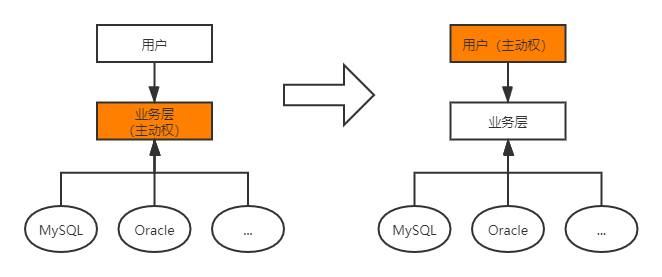
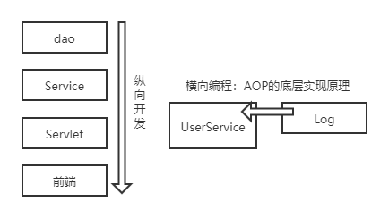

# 一、Spring简介

Spring理念：使现有技术更加容易使用，本身是一个大杂烩。

- SSH：Struct2+Spring+Hibernate
- SSM：SpringMVC+Spring+MyBatis

官网： https://spring.io/projects/spring-framework#overview

官网下载：https://repo.spring.io/release/org/springframework/spring/

Github：https://github.com/spring-projects/spring-framework

[Spring Web MVC](https://mvnrepository.com/artifact/org.springframework/spring-webmvc) **»** [5.2.5.RELEASE](https://mvnrepository.com/artifact/org.springframework/spring-webmvc/5.2.5.RELEASE)

```xml
<!-- https://mvnrepository.com/artifact/org.springframework/spring-webmvc -->
<dependency>
    <groupId>org.springframework</groupId>
    <artifactId>spring-webmvc</artifactId>
    <version>5.2.5.RELEASE</version>
</dependency>

<!-- https://mvnrepository.com/artifact/org.springframework/spring-jdbc -->
<dependency>
    <groupId>org.springframework</groupId>
    <artifactId>spring-jdbc</artifactId>
    <version>5.2.3.RELEASE</version>
</dependency>
```

- Spring是开源的免费的容器。
- Spring是轻量级的，非入侵式的。
- 控制反转（IOC），面向切面编程（AOP）。
- 支持事务处理，对框架整合的支持。

**总结：Spring是一个轻量级的控制反转（IOC）和面向切面编程（AOP）的的框架。**

# 二、IOC理论推导

1. UserDao接口

   ```java
   public interface UserDao {
       void getUser();
   }
   ```

2. UserDaoImp实现类

   ```java
   public class UserDaoImpl implements UserDao{
       public void getUser() {
           System.out.println("默认获取用户的数据！");
       }
   }
   ```

3. UserService业务接口

   ```java
   public interface UserService {
       void getUser();
   }
   ```

4. UserServiceImp业务接口实现类

   ```java
   public class UserServiceImpl implements UserService{
   
       private UserDao userDao;
   
       //以往方式：需求改变，需要在此修改源码
       //private UserDao userDao = new UserDaoImpl();
       //private UserDao userDao = new UserDaoMysqlImpl();
       //private UserDao userDao = new UserDaoOracleImpl();
   
       //注入方式：通过set接口实现
       public void setUserDao(UserDao userDao){
           this.userDao = userDao;
       }
   
       public void getUser() {
           userDao.getUser();
       }
   }
   ```

**存在的问题：用户需求可能影响原来的代码！**

**解决方案：使用一个set接口实现**

```java
    private UserDao userDao;

    //以往方式：需求改变，需要在此修改源码
    //private UserDao userDao = new UserDaoImpl();
    //private UserDao userDao = new UserDaoMysqlImpl();
    //private UserDao userDao = new UserDaoOracleImpl();

    //注入方式：利用set进行动摇实现值得注入
    public void setUserDao(UserDao userDao){
        this.userDao = userDao;
    }
```

- 以往由程序主动创建对象，控制权在程序员手中。
- 使用set后，程序不再有主动性，变成了被动接收对象。

从本质上解决了问题，程序员不再管理对象的创建，系统的耦合度大幅降低，以更加专注于业务的实现，此即IOC原型！



IOC的本质：

控制反转IoC（Inversion of Control）是一种设计思想，DI（依赖注入）是现在IoC的一种方法，。对象的创建由程序控制，在控制反转后将对象的创建转移给第三方（获得依赖对象的方式反转了）

采用XML方式配置Bean的时候，Bean的定义与实现分离；而采用注解方式时二者合为一体，Bean的定义信息以注解形式定义在实现类中，从而达到零配置的目的。

**控制反转是一种通过描述（XML或注解）并通过第三方生产或获取特定对象的方式。在Spring中实现控制反转的是IoC容器，其实现方式是依赖注入（Dependency Injection，DI）。**

# 三、HelloSpring

1. 新建模块HelloSpring

2. 编写实体类Hello（pojo）

   ```java
   package com.shinrin.pojo;
   
   public class Hello {
       private String str;
       public String getStr(){
           return str;
       }
   
       public void setStr(String str){
           this.str = str;
       }
   
       @Override
       public String toString() {
           return "Hello{" +
                   "str='" + str + '\'' +
                   '}';
       }
   }
   ```

3. 配置文件bean.xml

   ```xml
   <?xml version="1.0" encoding="UTF-8"?>
   <beans xmlns="http://www.springframework.org/schema/beans"
          xmlns:xsi="http://www.w3.org/2001/XMLSchema-instance"
          xsi:schemaLocation="http://www.springframework.org/schema/beans
           https://www.springframework.org/schema/beans/spring-beans.xsd">
   
       <!--使用Spring来创建对象（Bean）-->
       <!--
       类型 变量名 = new 类型();
       Hello hello = new Hello();
       id = 变量名
       class = 实体类
       property 设置对象的属性值
       -->
       <bean id="hello" class="com.shinrin.pojo.Hello">
           <property name="str" value="Spring"/>
       </bean>
   </beans>
   ```

4. 测试程序

   ```java
       @Test
       public void test(){
           //获取Spring的上下文对象context
           ApplicationContext context = new ClassPathXmlApplicationContext("beans.xml");
           //对象由Spring管理，使用时通过context.getBean()获取
           Hello hello = (Hello) context.getBean("hello");
           System.out.println(hello.toString());
       }
   ```

***补充：第二章中的问题，使用IOC解决***

配置文件bean.xml

```xml
<?xml version="1.0" encoding="UTF-8"?>
<beans xmlns="http://www.springframework.org/schema/beans"
       xmlns:xsi="http://www.w3.org/2001/XMLSchema-instance"
       xsi:schemaLocation="http://www.springframework.org/schema/beans
        https://www.springframework.org/schema/beans/spring-beans.xsd">

    <bean id="mysqlImpl" class="com.shinrin.dao.UserDaoMysqlImpl"/>
    <bean id="oracleImpl" class="com.shinrin.dao.UserDaoOracleImpl"/>
    <bean id="UserServiceImpl" class="com.shinrin.service.UserServiceImpl">
    <!--
        ref：引用Spring容器中创建好的对象
        value：具体的值，基本数据类型。
    -->
        <property name="userDao" ref="mysqlImpl"/>
    </bean>
</beans>
```

测试程序：

```java
    @Test
    public void test1(){
        //获取ApplicationContext，拿到Spring的容器
        ApplicationContext context = new ClassPathXmlApplicationContext("bean.xml");
        //get
        UserServiceImpl userServiceImpl = (UserServiceImpl) context.getBean("UserServiceImpl");
        userServiceImpl.getUser();
    }
```

# 四、IOC创建对象的方式

1. 使用无参构造（默认）创建对象。

   ```xml
       <bean id="user" class="com.shinrin.pojo.User">
           <!--默认使用无参构造-->
           <property name="name" value="Teemo"/>
       </bean>
   ```

2. 使用有参构造创建对象。

   1. 下标赋值

      ```xml
          <bean id="user" class="com.shinrin.pojo.User">
              <constructor-arg index="0" value="Yasuo"/>
          </bean>
      ```

   2. 类型赋值（不建议使用，）

      ```xml
          <bean id="user" class="com.shinrin.pojo.User">
              <constructor-arg type="java.lang.String" value="Yasuo"/>
          </bean>
      ```

   3. 直接通过参数名赋值

      ```xml
          <bean id="user" class="com.shinrin.pojo.User">
              <constructor-arg name="name" value="Yasuo"/>
          </bean>
      ```

**bean.xml被加载后即实例化对象并保存。**

# 五、Spring设置

别名

```xml
    <!--设置别名，亦可使用别名获取对象-->
    <alias name="user" alias="U_s_e_r"/>
```

bean的配置

```xml
    <!--
    id = 对象名
    class = 类名
    name = 对象别名（可多个，逗号、空格、分号分隔）
    -->
    <bean id="userT" class="com.shinrin.pojo.User" name="user2, u2"/>
```

import

```xml
 	<!--当前文件：applicationContext.xml，应用程序中加载该文件即可-->   
	<!--合并配置文件：用于团队合作开发-->
    <import resource="bean1.xml"/>
    <import resource="bean2.xml"/>
    <import resource="bean3.xml"/>
```

# 六、DI依赖注入

1. 构造器注入

2. set方式注入（重点）
   - 依赖：bean对象的创建依赖于容器。
   - 注入：bean对象中的所有属性，由容器来注入。

**环境搭建（复杂类型）**

Student类

```java
package com.shinrin.pojo;

import java.util.*;

public class Student {
    private String name;
    private Address address;

    private String[] books;
    private List<String> hobbies;

    private Map<String, String> card;
    private Set<String> game;

    private Properties infor;
    private String wife;

    public String getName() {
        return name;
    }

    public Address getAddress() {
        return address;
    }

    public String[] getBooks() {
        return books;
    }

    public List<String> getHobbies() {
        return hobbies;
    }

    public Map<String, String> getCard() {
        return card;
    }

    public Set<String> getGame() {
        return game;
    }

    public Properties getInfor() {
        return infor;
    }

    public String getWife() {
        return wife;
    }

    public void setName(String name) {
        this.name = name;
    }

    public void setAddress(Address address) {
        this.address = address;
    }

    public void setBooks(String[] books) {
        this.books = books;
    }

    public void setHobbies(List<String> hobbies) {
        this.hobbies = hobbies;
    }

    public void setCard(Map<String, String> card) {
        this.card = card;
    }

    public void setGame(Set<String> game) {
        this.game = game;
    }

    public void setInfor(Properties infor) {
        this.infor = infor;
    }

    public void setWife(String wife) {
        this.wife = wife;
    }

    @Override
    public String toString() {
        return "Student{" +
                "name='" + name + '\'' +
                ", address=" + address +
                ", books=" + Arrays.toString(books) +
                ", hobbies=" + hobbies +
                ", card=" + card +
                ", game=" + game +
                ", infor=" + infor +
                ", wife='" + wife + '\'' +
                '}';
    }
}
```

Address类

```java
package com.shinrin.pojo;

public class Address {
    private String address;

    public String getAddress() {
        return address;
    }

    public void setAddress(String address) {
        this.address = address;
    }

    @Override
    public String toString() {
        return "Address{" +
                "address='" + address + '\'' +
                '}';
    }
}
```

User类

```java
package com.shinrin.pojo;

public class User {
    private String name;
    private int age;
    private Address address;

    public User() {
    }

    public User(String name, int age, Address address) {
        this.name = name;
        this.age = age;
        this.address = address;
    }

    public String getName() {
        return name;
    }

    public void setName(String name) {
        this.name = name;
    }

    public int getAge() {
        return age;
    }

    public void setAge(int age) {
        this.age = age;
    }

    public Address getAddress() {
        return address;
    }

    public void setAddress(Address address) {
        this.address = address;
    }

    @Override
    public String toString() {
        return "User{" +
                "name='" + name + '\'' +
                ", age=" + age +
                ", address=" + address +
                '}';
    }
}
```

**依赖注入**

配置文件（bean1.xml）

```xml
<?xml version="1.0" encoding="UTF-8"?>
<beans xmlns="http://www.springframework.org/schema/beans"
       xmlns:xsi="http://www.w3.org/2001/XMLSchema-instance"
       xsi:schemaLocation="http://www.springframework.org/schema/beans
        https://www.springframework.org/schema/beans/spring-beans.xsd">

    <bean id="adddress" class="com.shinrin.pojo.Address">
        <property name="address" value="Changsha"/>
    </bean>

    <bean id="student" class="com.shinrin.pojo.Student">
        <property name="name" value="shinrin"/>
        <property name="address" ref="adddress"/>

        <property name="books">
            <array>
                <value>沙海</value>
                <value>世界</value>
                <value>防风氏</value>
            </array>
        </property>

        <property name="hobbies">
            <list>
                <value>Play</value>
                <value>Coding</value>
                <value>Music</value>
            </list>
        </property>

        <property name="card">
            <map>
                <entry key="1" value="12"/>
                <entry key="2" value="34"/>
            </map>
        </property>

        <property name="game">
            <set>
                <value>FGO</value>
                <value>LOL</value>
                <value>PUBG</value>
            </set>
        </property>

        <property name="wife">
            <null></null>
        </property>

        <property name="infor">
            <props>
                <prop key="id">1704</prop>
                <prop key="name">jonah</prop>
            </props>
        </property>

    </bean>
</beans>
```

**通过第三方注入依赖（c标签和p标签）**

依赖注入（bean2.xml）

```xml
<?xml version="1.0" encoding="UTF-8"?>
<beans xmlns="http://www.springframework.org/schema/beans"
       xmlns:xsi="http://www.w3.org/2001/XMLSchema-instance"
       xmlns:p="http://www.springframework.org/schema/p"
       xmlns:c="http://www.springframework.org/schema/c"
       xsi:schemaLocation="http://www.springframework.org/schema/beans
        https://www.springframework.org/schema/beans/spring-beans.xsd">

    <bean id="addr" class="com.shinrin.pojo.Address">
        <property name="address" value="Yordel"/>
    </bean>

    <!--构造器注入-->
    <bean id="user1" class="com.shinrin.pojo.User">
        <constructor-arg index="0" value="Yasuo"/>
        <constructor-arg index="1" value="27"/>
        <constructor-arg index="2" ref="addr"/>
    </bean>
    <!--c命名空间(构造器注入)-->
    <bean id="user2" class="com.shinrin.pojo.User" c:name = "Yasuo" c:age="27" c:address-ref="addr"/>

    <!--set注入-->
    <bean id="user3" class="com.shinrin.pojo.User">
        <property name="name" value="Teemo"/>
        <property name="age" value="7"/>
        <property name="address" ref="addr"/>
    </bean>
    <!--p命名空间注入(set注入)-->
    <bean id="user4" class="com.shinrin.pojo.User" p:name = "Teemo" p:age="10" p:address-ref="addr"/>

</beans>
```

注：c命名空间和p命名空间。

> ```xml
>        xmlns:p="http://www.springframework.org/schema/p"
>        xmlns:c="http://www.springframework.org/schema/c"
> ```
>
> c命名空间用于构造器。
>
> p命名空间用于set注入。

**bean的作用域**

1. 单例模式（默认）

   ```xml
       <!--单例模式-->
       <bean id="user2" class="com.shinrin.pojo.User" c:name = "Yasuo" c:age="27" p:address-ref="addr" scope="singleton"/>
   ```

2. 原型模式：每次get时都产生一个新对象。

   ```xml
       <!--原型模式-->
       <bean id="user2" class="com.shinrin.pojo.User" c:name = "Yasuo" c:age="27" p:address-ref="addr" scope="prototype"/>
   ```

3. 其余request、session、application只在web开发中使用。

   

# 七、bean的自动装配

- 自动装配是Spring满足bean依赖的一种方式。
- Spring会在上下文自动查找，并自动给bean装配属性。

Spring中三种装配的方式：

1. 在xml中显式配置
2. 在java中显式配置
3. 隐式自动装配【重要】

## 7.1 环境搭建

一人一喵一汪

Cat类

```java
public class Cat {
    public void bray(){
        System.out.println("cat meow。。。");
    }
}
```

Dog类

```java
public class Dog {
    public void bray(){
        System.out.println("Barking...");
    }
}
```

Person类

```java
package com.shinrin.pojo;

public class Person {
    private Cat cat;
    private Dog dog;
    private String name;

    public Cat getCat() {
        return cat;
    }

    public void setCat(Cat cat) {
        this.cat = cat;
    }

    public Dog getDog() {
        return dog;
    }

    public void setDog(Dog dog) {
        this.dog = dog;
    }

    public String getName() {
        return name;
    }

    public void setName(String name) {
        this.name = name;
    }

    @Override
    public String toString() {
        return "Person{" +
                "cat=" + cat +
                ", dog=" + dog +
                ", name='" + name + '\'' +
                '}';
    }
}
```

## 7.2 使用xml自动装配

**byName自动装配：自动查找与对象set对应的值（属性名）相对应的id（bean）**

beans2.xml

```xml
<beans xmlns="http://www.springframework.org/schema/beans"
       xmlns:xsi="http://www.w3.org/2001/XMLSchema-instance"
       xmlns:context="http://www.springframework.org/schema/context"
       xsi:schemaLocation="http://www.springframework.org/schema/beans
        https://www.springframework.org/schema/beans/spring-beans.xsd
        http://www.springframework.org/schema/context
        https://www.springframework.org/schema/context/spring-context.xsd">

    <context:annotation-config/>

    <bean id="cat" class="com.shinrin.pojo.Cat"/>
    <bean id="cat11" class="com.shinrin.pojo.Cat"/>

    <bean id="dog" class="com.shinrin.pojo.Dog"/>
    <bean id="dog11" class="com.shinrin.pojo.Dog"/>

    <!--byName自动查找和对象set对应的值相对应的id-->
    <bean id="person" class="com.shinrin.pojo.Person" autowire="byName">
        <property name="name" value="shinrin"/>
    </bean>

</beans>
```

**byType自动装配：自动查找与对象属性（类型）相同的bean**

beans3.xml

```xml
<beans xmlns="http://www.springframework.org/schema/beans"
       xmlns:xsi="http://www.w3.org/2001/XMLSchema-instance"
       xmlns:context="http://www.springframework.org/schema/context"
       xsi:schemaLocation="http://www.springframework.org/schema/beans
        https://www.springframework.org/schema/beans/spring-beans.xsd
        http://www.springframework.org/schema/context
        https://www.springframework.org/schema/context/spring-context.xsd">

    <context:annotation-config/>

    <bean id="cat" class="com.shinrin.pojo.Cat"/>

    <bean id="dog11" class="com.shinrin.pojo.Dog"/>

    <!--byType自动查找和对象属性相同的bean-->
    <bean id="person" class="com.shinrin.pojo.Person" autowire="byType">
        <property name="name" value="shinrin"/>
    </bean>

</beans>
```

## 7.3 使用注解自动装配

**@Autowire**

1. @Autowired通过byType实现，默认要求对象必须存在。
2. 通过@Autowired(required = false)以允许对象不存在（为null值）。
3. 如果有多个对象，使用 @Qualifier(value = "cat11")以指定唯一的id对象。

**@Resource**

1. @Resource默认通过byName实现，未指定name和type时，按byName（属性名）查找匹配，无匹配时回退至原始类型（属性类型）通过byType查找，如匹配则自动装配。
2. 如同时指定name和type，则在上下文中查询唯一匹配装配，未果抛出异常。
3. 如只指定name，则在上下文中查询名称（id）匹配的bean装配，未果抛出异常。
4. 如只指定type，则在上下文中查询类型匹配的唯一bean装配，无匹配或多个匹配抛出异常。

Person.java

```java
    //默认byType实现，要求对象必须存在
    //指定参数required = false以允许对象为null
    @Autowired(required = false)
    //有多个对象时，按bean的id查找
    @Qualifier(value = "cat11")
    private Cat cat;

    //默认byName实现，查询未果时再按byType查找
    @Resource(name = "dog11")
    private Dog dog;
```

beans1.xml

```xml
<beans xmlns="http://www.springframework.org/schema/beans"
       xmlns:xsi="http://www.w3.org/2001/XMLSchema-instance"
       xmlns:context="http://www.springframework.org/schema/context"
       xsi:schemaLocation="http://www.springframework.org/schema/beans
        https://www.springframework.org/schema/beans/spring-beans.xsd
        http://www.springframework.org/schema/context
        https://www.springframework.org/schema/context/spring-context.xsd">

    <context:annotation-config/>

    <bean id="cat" class="com.shinrin.pojo.Cat"/>
    <bean id="cat11" class="com.shinrin.pojo.Cat"/>

    <bean id="dog" class="com.shinrin.pojo.Dog"/>
    <bean id="dog11" class="com.shinrin.pojo.Dog"/>
    <bean id="dog22" class="com.shinrin.pojo.Dog"/>

    <bean id="person" class="com.shinrin.pojo.Person">
    <property name="name" value="shinrin"/>
    </bean>

</beans>
```

# 八、使用注解开发

**@Component及衍生注解**（web开发中，MVC架构中分层）

- dao（@Repository）
- service（@Service）
- controller（@Controller）

**作用：将类注册到容器中。**

**作用域@Scope("singleton")**

1. 属性注入：

```java
@Component
//@Scope("prototype")
@Scope("singleton")
public class User {

    @Value("shinrin")
    private String name;

    public String getName() {
        return name;
    }

    public void setName(String name) {
        this.name = name;
    }
}
```

2. beans.xml配置

```xml
<?xml version="1.0" encoding="UTF-8"?>
<beans xmlns="http://www.springframework.org/schema/beans"
       xmlns:xsi="http://www.w3.org/2001/XMLSchema-instance"
       xmlns:context="http://www.springframework.org/schema/context"
       xsi:schemaLocation="http://www.springframework.org/schema/beans
        https://www.springframework.org/schema/beans/spring-beans.xsd
        http://www.springframework.org/schema/context
        https://www.springframework.org/schema/context/spring-context.xsd">

    <context:annotation-config/>
    <!--指定要扫描的包-->
    <context:component-scan base-package="com.pojo"/>

</beans>
```

**总结**：xml更加灵活，维护简单；注解只能针对当前类，维护复杂。

**实践**：

- xml管理bean
- 注解完成属性的注入

# 九、使用java方式配置Spring

**JavaConfig：Spring的一个子项目，在spring4之后，成为核心功能**

Config2.java

```java
//其他配置文件（团队协作）
@Configuration
public class Config2 {
}
```

MyConfig.java

```java
//本身是一个@Component，也会被Spring容器托管，注册到容器中。
//@Configuration代表Spring配置类，同beans.xml
@Configuration
@ComponentScan("com.shinrin.pojo")
@Import(Config2.class)
public class MyConfig {

    //注册一个bean：相当于bean标签。
    //方法名称：相当于bean标签的id属性。
    //方法返回值：相当于bean标签中的class属性。
    @Bean
    public User getUser(){
        return new User();//返回注入到bean中的对象。
    }
}
```

实体类：

```java
@Component
public class User {

    @Value("shinrin")
    private String name;

    public String getName() {
        return name;
    }

    public void setName(String name) {
        this.name = name;
    }

    @Override
    public String toString() {
        return "User{" +
                "name='" + name + '\'' +
                '}';
    }
}
```

测试：

```java
    @Test
    public void test(){
        //如果完全使用配置方式：只能通过AnnotationConfig上下文来获取容器，通过配置类的class对象加载。
        ApplicationContext context = new AnnotationConfigApplicationContext(MyConfig.class);
        User getUser = (User) context.getBean("getUser");
        System.out.println(getUser);
    }
```

**纯Java配置方式，常见于SpringBoot。**

# 十、代理模式

静态代理和动态代理。

## 10.1静态代理

角色分析：

- 抽象角色：一般会使用接口和抽象类来解决。
- 真实角色：被代理角色。
- 代理角色：代理真实角色，添加附属操作。
- 客户：访问代理对象的人。

代理步骤：

1. 接口
2. 真实角色
3. 代理角色
4. 客户端访问代理角色

代理模式的好处：

- 使真实角色的操作更加单纯，不用关注一些公共业务。
- 公共业务交由代理角色，**实现业务分工**。
- 公共**业务扩展时，方便管理**。

缺点：

- 一个真实角色产生一个代理角色，使开发效率降低。

------

**实例：通过代理模式增加日志功能。**

1. UserService.java（接口）

   ```java
   public interface UserService {
       public void add();
       public void delete();
       public void update();
       public void query();
   }
   ```

2. UserServiceImpl.java

   ```java
   public class UserServiceImpl implements UserService{
   
       public void add() {
           System.out.println("增加了一个用户");
       }
   
       public void delete() {
           System.out.println("删除了一个用户");
       }
   
       public void update() {
           System.out.println("修改了一个用户");
       }
   
       public void query() {
           System.out.println("查询了一个用户");
       }
   }
   ```

3. UserServiceProxy.java

   ```java
   public class UserServiceProxy implements UserService{
   
       private UserServiceImpl userService;
   
       public void setUserService(UserServiceImpl userService) {
           this.userService = userService;
       }
   
       public void add() {
           log("add");
           userService.add();
       }
   
       public void delete() {
           userService.delete();
       }
   
       public void update() {
           userService.update();
       }
   
       public void query() {
           userService.query();
       }
   
       //日志方法
       public void log(String msg){
           System.out.println("[Debug] 使用了" + msg + "方法。");
       }
   }
   ```

4. Client.java

   ```java
   public class Client {
       public static void main(String[] args) {
           UserServiceImpl userService = new UserServiceImpl();
           UserServiceProxy proxy = new UserServiceProxy();
           proxy.setUserService(userService);
           proxy.add();
       }
   }
   ```



## 10.2 动态代理

- 动态代理和静态代理角色一样。

- 动态代理的代理类是动态生成的。
- 动态代理的分类：基于接口的动态代理、基于类的动态代理。
  - 基于接口——JDK动态代理
  - 基于类：cglib
  - javasist

【查看JDK帮助文档】

**InvocationHandler：调用处理程序。**

- 代理实例的调用处理程序实现的接口。
- 每个代理实例都有一个关联的调用处理程序。

```java
Object invoke(Object proxy, 方法 method, Object[] args)；
//参数
//proxy - 调用该方法的代理实例
//method -所述方法对应于调用代理实例上的接口方法的实例。方法对象的声明类将是该方法声明的接口，它可以是代理类继承该方法的代理接口的超级接口。
//args -包含的方法调用传递代理实例的参数值的对象的阵列，或null如果接口方法没有参数。原始类型的参数包含在适当的原始包装器类的实例中，例如java.lang.Integer或java.lang.Boolean 。
```

**Proxy：代理，提供创建动态代理类和实例的静态方法。**

```java
//生成代理类
public Object getProxy(){
   return Proxy.newProxyInstance(this.getClass().getClassLoader(),
                                 rent.getClass().getInterfaces(),this);
}
```

动态代理实现租房：

1. Rent.java（接口）

   ```java
   public interface Rent {
       public void rent();
   }
   ```

2. Host.java

   ```java
   public class Host implements Rent {
       public void rent() {
           System.out.println("host rent");
       }
   }
   ```

3. ProxyInvocationHandler.java

   ```java
   //使用此类，自动生成代理类
   public class ProxyInvocationHandler implements InvocationHandler {
   
       //被代理的接口
       private Rent rent;
   
       public void setRent(Rent rent){
           this.rent = rent;
       }
   
       //生成代理类
       //第二个参数：获取要代理的抽象角色（一类）。
       public Object getProxy(){
           return Proxy.newProxyInstance(this.getClass().getClassLoader(), rent.getClass().getInterfaces(), this);
       }
   
       //proxy：代理类
       //method：代理类的调用处理程序的方法对象。
       //处理代理实例上的方法调用并返回结果。
       public Object invoke(Object proxy, Method method, Object[] args) throws Throwable {
           seeHouse();
           //本质利用反射实现。
           Object result = method.invoke(rent, args);
           fare();
           return result;
       }
   
       public void seeHouse(){
           System.out.println("see house");
       }
   
       public void fare(){
           System.out.println("fare");
       }
   }
   ```

4. Client.java

   ```java
   public class Client {
       public static void main(String[] args) {
           //真实角色
           Host host = new Host();
           //代理实例的调用处理程序
           ProxyInvocationHandler proxyInvocationHandler = new ProxyInvocationHandler();
           //放置真实角色
           proxyInvocationHandler.setRent(host);
           //动态生成对应的代理类
           Rent proxy = (Rent) proxyInvocationHandler.getProxy();
           proxy.rent();
       }
   }
   ```

核心：**一个动态代理，一般代理某一类业务，一个动态代理可以代理多个类（通过代理接口实现）。**

------

使用动态代理实现代理UserService：（亦可编写通用的动态代理实现的类，代理对象设置为Object）

代理类：ProxyInvocationHandler.java

```java
public class ProxyInvocationHandler implements InvocationHandler{

    private Object target;

    public void setTarget(Object target) {
        this.target = target;
    }

    //生成代理类
    public Object getProxy(){
        return Proxy.newProxyInstance(this.getClass().getClassLoader(), target.getClass().getInterfaces(), this);
    }

    //proxy代理类
    //method：代理类的调用处理程序的方法对象
    public Object invoke(Object proxy, Method method, Object[] args) throws Throwable {
        log(method.getName());
        Object result = method.invoke(target, args);
        return result;
    }

    public void log(String methodName){
        System.out.println("执行了" + methodName + "方法");
    }
}
```

测试：Client.java

```java
package com.shinrin.demo04;

public class Client {
    public static void main(String[] args) {
        //真实对象
        UserServiceImpl userService = new UserServiceImpl();
        //代理对象的调用处理程序
        ProxyInvocationHandler pih = new ProxyInvocationHandler();
        pih.setTarget(userService);//设置要代理的对象
        UserService proxy = (UserService) pih.getProxy();//动态生成代理类
        proxy.delete();
    }
}
```

动态代理的优势：

1. 使真实角色更加纯粹，不用关注公共的事情。
2. 公共业务由代理完成，实现了业务的分工。
3. 公共业务扩展时更加集中，方便管理。
4. 一个动态代理，一般代理某一类业务。
5. 一个动态代理可以代理多个类，代理的是接口。


