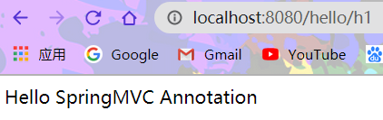

# 一、MVC

## 1.1 MVC简介

**MVC是模型（Model）、视图（View）和控制器（Controller）的简写，是一种软件设计规范。**

- 将业务逻辑、数据、显示分离的方法来组织代码。
- MVC的主要作用是**降低了视图与业务逻辑间的双向耦合**。
- **MVC是一种架构模式**。

**Model（模型）** 

> 数据模型，提供要展示的数据，因此包含数据和行为，可以认为是领域模型或JavaBean组件（包含数据和行为），不过现在一般都分离开来：Value Object（数据Dao） 和 服务层（行为Service）。也就是模型提供了模型数据查询和模型数据的状态更新等功能，包括数据和业务。 

**View（视图）**

> 负责进行模型的展示，一般就是我们见到的用户界面，客户想看到的东西。

**Controller（控制器）**

> 接收用户请求，委托给模型进行处理（状态改变），处理完毕后把返回的模型数据返回给视图，由视图负责展示。也就是说控制器做了个调度员的工作。

**最典型的MVC就是JSP + servlet + javabean的模式：**

1. 用户发请求
2. Servlet接收请求数据，并调用对应的业务逻辑方法
3. 业务处理完毕，返回更新后的数据给servlet
4. servlet转向到JSP，由JSP来渲染页面
5. 响应给前端更新后的页面

**MVC职责分析：**

- Controller：控制器
  1. 获取表单数据
  2. 调用业务逻辑
  3. 转向指定页面

- Model：模型
  1. 业务逻辑
  2. 保存数据的状态

- View：视图
  1. 显示页面

.png)

## 1.2 MVC的发展

- Model1：模型+视图。

- Model2：模型+视图+控制。

Model2不仅提高了代码的复用率与项目的扩展性，且大大降低了项目的维护成本。Model 1模式的实现比较简单，适用于快速开发小规模项目，Model1中JSP页面身兼View和Controller两种角色，将控制逻辑和表现逻辑混杂在一起，从而导致代码的重用性非常低，增加了应用的扩展性和维护的难度。Model2消除了Model1的缺点。

## 1.3 回顾Servlet

1. 新建父工程，导入依赖：pom.xml

```xml
<?xml version="1.0" encoding="UTF-8"?>
<project xmlns="http://maven.apache.org/POM/4.0.0"
         xmlns:xsi="http://www.w3.org/2001/XMLSchema-instance"
         xsi:schemaLocation="http://maven.apache.org/POM/4.0.0 http://maven.apache.org/xsd/maven-4.0.0.xsd">
    <modelVersion>4.0.0</modelVersion>

    <groupId>com.shinrin</groupId>
    <artifactId>SpringMVC_PROJ</artifactId>
    <packaging>pom</packaging>
    <version>1.0-SNAPSHOT</version>
    <modules>
        <module>SpringMVC_01_Servlet</module>
    </modules>

    <dependencies>
        <dependency>
            <groupId>junit</groupId>
            <artifactId>junit</artifactId>
            <version>4.13</version>
            <scope>test</scope>
        </dependency>
        <dependency>
            <groupId>org.springframework</groupId>
            <artifactId>spring-webmvc</artifactId>
            <version>5.2.5.RELEASE</version>
        </dependency>
    </dependencies>

</project>
```

2. 创建Servlet子模块（添加Web app支持）
3. 导入servlet和jsp的依赖：pom.xml

```xml
  <dependencies>
    <dependency>
      <groupId>javax.servlet</groupId>
      <artifactId>servlet-api</artifactId>
      <version>2.5</version>
    </dependency>
    <dependency>
      <groupId>javax.servlet.jsp</groupId>
      <artifactId>jsp-api</artifactId>
      <version>2.2</version>
    </dependency>
    <dependency>
      <groupId>javax.servlet</groupId>
      <artifactId>jstl</artifactId>
      <version>1.2</version>
    </dependency>
  </dependencies>
```

4. 配置文件过滤：pom.xml

```xml
  <!-- 解决资源过滤问题 -->
  <build>
    <resources>
      <resource>
        <directory>src/main/resources</directory>
        <includes>
          <include>**/*.properties</include>
          <include>**/*.xml</include>
        </includes>
      </resource>
      <resource>
        <directory>src/main/java</directory>
        <includes>
          <include>**/*.properties</include>
          <include>**/*.xml</include>
        </includes>
        <filtering>true</filtering>
      </resource>
    </resources>
  </build>
```

5. 编写Servlet类，处理用户请求

```java
//实现Servlet接口
public class HelloServlet extends HttpServlet {
    @Override
    protected void doGet(HttpServletRequest req, HttpServletResponse resp) throws ServletException, IOException {
        //取得参数
        String method = req.getParameter("method");
        if (method.equals("add")){
            req.getSession().setAttribute("msg", "执行了add方法。");
        }
        if (method.equals("delete")){
            req.getSession().setAttribute("msg", "执行了delete方法。");
        }
        //业务逻辑
        //视图跳转
        req.getRequestDispatcher("/WEB-INF/jsp/hello.jsp").forward(req,resp);
    }

    @Override
    protected void doPost(HttpServletRequest req, HttpServletResponse resp) throws ServletException, IOException {
        super.doPost(req, resp);
    }
}
```

6. 编写Hello.jsp，在WEB-INF目录下创建jsp文件夹，新建hello.jsp

```jsp
<%@ page contentType="text/html;charset=UTF-8" language="java" %>
<html>
<head>
    <title>shinrin</title>
</head>
<body>
${msg}
</body>
</html>
```

7. web.xml中注册Servlet

```xml
<?xml version="1.0" encoding="UTF-8"?>
<web-app xmlns="http://xmlns.jcp.org/xml/ns/javaee"
         xmlns:xsi="http://www.w3.org/2001/XMLSchema-instance"
         xsi:schemaLocation="http://xmlns.jcp.org/xml/ns/javaee http://xmlns.jcp.org/xml/ns/javaee/web-app_4_0.xsd"
         version="4.0">
  <servlet>
    <servlet-name>HelloServlet</servlet-name>
    <servlet-class>com.shinrin.servlet.HelloServlet</servlet-class>
  </servlet>
  <servlet-mapping>
    <servlet-name>HelloServlet</servlet-name>
    <url-pattern>/user</url-pattern>
  </servlet-mapping>

</web-app>
```

8. 配置Tomcat（http://localhost:8080/）
9. 测试
   - http://localhost:8080/user?method=add
   - http://localhost:8080/user?method=delete

# 二、SpringMVC

## 2.1 SpringMVC简介

**Spring的功能**

1. 将url映射到java类或java类的方法 。
2. 封装用户提交的数据 。
3. 处理请求、调用相关的业务处理、封装响应数据 。
4. 将响应的数据进行渲染 . jsp / html 等表示层数据 。

> 常见的服务器端MVC框架有：Struts、Spring MVC、ASP.NET MVC、Zend、Framework、JSF。
>
> 常见前端MVC框架：vue、angularjs、react、backbone。
>
> 由MVC演化出了另外一些模式如：MVP、MVVM 等等

**Spring MVC的特点**

1. 轻量级，简单易学
2. 高效 , 基于请求响应的MVC框架
3. 与Spring兼容性好，无缝结合
4. 约定优于配置
5. 功能强大：RESTful、数据验证、格式化、本地化、主题等
6. 简洁灵活

> Spring的web框架围绕**DispatcherServlet** [ 调度Servlet ] 设计。DispatcherServlet的作用是将请求分发到不同的处理器。从Spring 2.5开始，使用Java 5或者以上版本的用户可以采用基于注解形式进行开发。

## 2.2 中心控制器

Spring MVC框架以请求为驱动 , 围绕一个中心Servlet分派请求及提供其他功能，DispatcherServlet是一个实际的Servlet (它继承自HttpServlet 基类)。


**SpringMVC的原理**

.png)

流程说明：

（1）客户端（浏览器）发送请求，直接请求到任务分发器DispatcherServlet。

（2）DispatcherServlet根据请求信息调用HandlerMapping，解析请求对应的Handler。

（3）解析到对应的Handler后，开始由HandlerAdapter适配器处理。

（4）HandlerAdapter会根据Handler来调用真正的处理器来处理请求，并处理相应的业务逻辑。

（5）处理器处理完业务后，会返回一个ModelAndView对象，Model是返回的数据对象，View是逻辑上的View。

（6）视图解析器ViewResolver会根据逻辑View查找实际的View。

（7）DispaterServlet把返回的Model（数据对象）传递给View。

（8）通过View将数据对象返回给请求者（浏览器）

**SpringMVC执行原理**

-1604583010993.png)

实线表示SpringMVC框架提供的技术，不需要开发者实现，虚线表示需要开发者实现。

**简单分析执行流程**

1. DispatcherServlet表示前置控制器，是整个SpringMVC的控制中心。用户发出请求，DispatcherServlet接收请求并拦截请求。

   假设请求的url为 : http://localhost:8080/SpringMVC/hello

   **如上url拆分成三部分：**

   http://localhost:8080服务器域名

   SpringMVC部署在服务器上的web站点

   hello表示控制器

   通过分析，如上url表示为：请求位于服务器localhost:8080上的SpringMVC站点的hello控制器。

2. HandlerMapping为处理器映射。DispatcherServlet调用HandlerMapping,HandlerMapping根据请求url查找Handler。

3. HandlerExecution表示具体的Handler,其主要作用是根据url查找控制器，如上url被查找控制器为：hello。

4. HandlerExecution将解析后的信息传递给DispatcherServlet,如解析控制器映射等。

5. HandlerAdapter表示处理器适配器，其按照特定的规则去执行Handler。

6. Handler让具体的Controller执行。

7. Controller将具体的执行信息返回给HandlerAdapter，如ModelAndView。

8. HandlerAdapter将视图逻辑名或模型传递给DispatcherServlet。

9. DispatcherServlet调用视图解析器(ViewResolver)来解析HandlerAdapter传递的逻辑视图名。

10. 视图解析器将解析的逻辑视图名传给DispatcherServlet。

11. DispatcherServlet根据视图解析器解析的视图结果，调用具体的视图。

12. 最终视图呈现给用户。

## 2.3 SpringMVC测试

1. 新建Maven子模块（web模板）：hellomvc

   项目结构如下：


2. 配置依赖及文件过滤：pom.xml

   ```xml
   <?xml version="1.0" encoding="UTF-8"?>
   
   <project xmlns="http://maven.apache.org/POM/4.0.0" xmlns:xsi="http://www.w3.org/2001/XMLSchema-instance"
            xsi:schemaLocation="http://maven.apache.org/POM/4.0.0 http://maven.apache.org/xsd/maven-4.0.0.xsd">
       <parent>
           <artifactId>SpringMVC_PROJ</artifactId>
           <groupId>com.shinrin</groupId>
           <version>1.0-SNAPSHOT</version>
       </parent>
       <modelVersion>4.0.0</modelVersion>
   
       <artifactId>SpringMVC_02_hellomvc</artifactId>
       <packaging>war</packaging>
   
       <properties>
           <project.build.sourceEncoding>UTF-8</project.build.sourceEncoding>
           <maven.compiler.source>1.7</maven.compiler.source>
           <maven.compiler.target>1.7</maven.compiler.target>
       </properties>
   
       <dependencies>
           <dependency>
               <groupId>junit</groupId>
               <artifactId>junit</artifactId>
               <version>4.13</version>
               <scope>test</scope>
           </dependency>
           <dependency>
               <groupId>org.springframework</groupId>
               <artifactId>spring-webmvc</artifactId>
               <version>5.2.5.RELEASE</version>
           </dependency>
           <dependency>
               <groupId>javax.servlet</groupId>
               <artifactId>servlet-api</artifactId>
               <version>2.5</version>
           </dependency>
           <dependency>
               <groupId>javax.servlet.jsp</groupId>
               <artifactId>jsp-api</artifactId>
               <version>2.2</version>
           </dependency>
           <dependency>
               <groupId>javax.servlet</groupId>
               <artifactId>jstl</artifactId>
               <version>1.2</version>
           </dependency>
       </dependencies>
   
       <!-- 解决资源过滤问题 -->
       <build>
           <resources>
               <resource>
                   <directory>src/main/resources</directory>
                   <includes>
                       <include>**/*.properties</include>
                       <include>**/*.xml</include>
                   </includes>
                   <filtering>false</filtering>
               </resource>
               <resource>
                   <directory>src/main/java</directory>
                   <includes>
                       <include>**/*.properties</include>
                       <include>**/*.xml</include>
                   </includes>
                   <filtering>false</filtering>
               </resource>
           </resources>
       </build>
       
   </project>
   ```

3. 检查项目依赖（Project Structure  == >  Artifacts）

   

4. 跳转视图文件：web/WEB-INF/jsp/test.jsp

   ```jsp
   <%@ page contentType="text/html;charset=UTF-8" language="java" %>
   <html>
   <head>
       <title>Title</title>
   </head>
   <body>
   
   ${msg}
   
   </body>
   </html>
   ```

5. 配置web.xml

   ```xml
   <?xml version="1.0" encoding="UTF-8"?>
   <web-app xmlns="http://xmlns.jcp.org/xml/ns/javaee"
            xmlns:xsi="http://www.w3.org/2001/XMLSchema-instance"
            xsi:schemaLocation="http://xmlns.jcp.org/xml/ns/javaee http://xmlns.jcp.org/xml/ns/javaee/web-app_4_0.xsd"
            version="4.0">
   
   <!--配置DispatchServlet：SpringMVC的核心；请求分发器，前端控制器-->
     <servlet>
       <servlet-name>springmvc</servlet-name>
       <servlet-class>org.springframework.web.servlet.DispatcherServlet</servlet-class>
       <!--DispatchServlet绑定Spring的配置文件-->
       <init-param>
         <param-name>contextConfigLocation</param-name>
         <param-value>classpath:springmvc-servlet.xml</param-value>
       </init-param>
       <!--启动级别：1-->
       <load-on-startup>1</load-on-startup>
     </servlet>
     <!--
     SpringMVC中，/ 与 /* 的区别。
     /只匹配所有请求，不匹配jsp页面。
     /*匹配所有的请求，包括jsp页面。
     -->
     <servlet-mapping>
       <servlet-name>springmvc</servlet-name>
       <url-pattern>/</url-pattern>
     </servlet-mapping>
   
   </web-app>
   ```

6. 配置SpringMVC：springmvc-servlet.xml

   ```xml
   <?xml version="1.0" encoding="UTF-8"?>
   <beans xmlns="http://www.springframework.org/schema/beans"
          xmlns:xsi="http://www.w3.org/2001/XMLSchema-instance"
          xsi:schemaLocation="http://www.springframework.org/schema/beans
          http://www.springframework.org/schema/beans/spring-beans.xsd">
   
       <!--处理器映射器-->
       <bean class="org.springframework.web.servlet.handler.BeanNameUrlHandlerMapping"/>
       <!--处理器适配器-->
       <bean class="org.springframework.web.servlet.mvc.SimpleControllerHandlerAdapter"/>
       <!--视图解析器：模板引擎Thymeleaf Freemarker...-->
       <bean class="org.springframework.web.servlet.view.InternalResourceViewResolver" id="internalResourceViewResolver">
           <!--前缀-->
           <property name="prefix" value="/WEB-INF/jsp/"/>
           <!--后缀-->
           <property name="suffix" value=".jsp"/>
       </bean>
   
       <!--BeanNameUrlHandlerMapping:bean-->
       <bean id="/hello" class="com.shinrin.controller.HelloController"/>
   
   </beans>
   ```

7. 实现Controller类

   ```java
   package com.shinrin.controller;
   
   import org.springframework.web.servlet.ModelAndView;
   import org.springframework.web.servlet.mvc.Controller;
   
   public class HelloController implements Controller {
   
       @Override
       public ModelAndView handleRequest(javax.servlet.http.HttpServletRequest httpServletRequest, javax.servlet.http.HttpServletResponse httpServletResponse) throws Exception {
           ModelAndView mv = new ModelAndView();
   
           //业务代码
           String result = "Hello SpringMVC";
           mv.addObject("msg", result);
   
           //视图跳转（test.jsp）
           mv.setViewName("test");
   		//向视图解析器返回
           return mv;
       }
   }
   ```

8. 配置Tomcat，启动测试

   

   

## 2.4 使用注解开发SpringMVC

1. 新建web项目（Maven子模块添加Web Application（4.0）支持）

   

2. 导入依赖、配置过滤：pom.xml

   ```xml
   <?xml version="1.0" encoding="UTF-8"?>
   <project xmlns="http://maven.apache.org/POM/4.0.0"
            xmlns:xsi="http://www.w3.org/2001/XMLSchema-instance"
            xsi:schemaLocation="http://maven.apache.org/POM/4.0.0 http://maven.apache.org/xsd/maven-4.0.0.xsd">
       <parent>
           <artifactId>SpringMVC_PROJ</artifactId>
           <groupId>com.shinrin</groupId>
           <version>1.0-SNAPSHOT</version>
       </parent>
       <modelVersion>4.0.0</modelVersion>
   
       <artifactId>SpringMVC_03_Annotation</artifactId>
   
       <dependencies>
           <dependency>
               <groupId>junit</groupId>
               <artifactId>junit</artifactId>
               <version>4.13</version>
               <scope>test</scope>
           </dependency>
           <dependency>
               <groupId>org.springframework</groupId>
               <artifactId>spring-webmvc</artifactId>
               <version>5.2.5.RELEASE</version>
           </dependency>
           <dependency>
               <groupId>javax.servlet</groupId>
               <artifactId>servlet-api</artifactId>
               <version>2.5</version>
           </dependency>
           <dependency>
               <groupId>javax.servlet.jsp</groupId>
               <artifactId>jsp-api</artifactId>
               <version>2.2</version>
           </dependency>
           <dependency>
               <groupId>javax.servlet</groupId>
               <artifactId>jstl</artifactId>
               <version>1.2</version>
           </dependency>
       </dependencies>
   
       <!-- 解决资源过滤问题 -->
       <build>
           <resources>
               <resource>
                   <directory>src/main/resources</directory>
                   <includes>
                       <include>**/*.properties</include>
                       <include>**/*.xml</include>
                   </includes>
                   <filtering>false</filtering>
               </resource>
               <resource>
                   <directory>src/main/java</directory>
                   <includes>
                       <include>**/*.properties</include>
                       <include>**/*.xml</include>
                   </includes>
                   <filtering>false</filtering>
               </resource>
           </resources>
       </build>
   
   </project>
   ```

3. 设置项目打包结构（加入lib包）

   

4. 编写web.xml，注册DispatcherServlet

   ```xml
   <?xml version="1.0" encoding="UTF-8"?>
   <web-app xmlns="http://xmlns.jcp.org/xml/ns/javaee"
            xmlns:xsi="http://www.w3.org/2001/XMLSchema-instance"
            xsi:schemaLocation="http://xmlns.jcp.org/xml/ns/javaee http://xmlns.jcp.org/xml/ns/javaee/web-app_4_0.xsd"
            version="4.0">
   
       <!--配置DispatchServlet：SpringMVC的核心；请求分发器，前端控制器-->
       <servlet>
           <servlet-name>springmvc</servlet-name>
           <servlet-class>org.springframework.web.servlet.DispatcherServlet</servlet-class>
           <!--DispatchServlet绑定Spring的配置文件-->
           <init-param>
               <param-name>contextConfigLocation</param-name>
               <param-value>classpath:springmvc-servlet.xml</param-value>
           </init-param>
           <!--启动级别：1-->
           <load-on-startup>1</load-on-startup>
       </servlet>
       <!--
       SpringMVC中，/ 与 /* 的区别。
       /只匹配所有请求，不匹配jsp页面。
       /*匹配所有的请求，包括jsp页面。
       -->
       <servlet-mapping>
           <servlet-name>springmvc</servlet-name>
           <url-pattern>/</url-pattern>
       </servlet-mapping>
   
   </web-app>
   ```

5. 编写SpringMVC配置文件：springmvc-servlet.xml

   ```xml
   <?xml version="1.0" encoding="UTF-8"?>
   <beans xmlns="http://www.springframework.org/schema/beans"
          xmlns:xsi="http://www.w3.org/2001/XMLSchema-instance"
          xmlns:context="http://www.springframework.org/schema/context"
          xmlns:mvc="http://www.springframework.org/schema/mvc"
          xsi:schemaLocation="http://www.springframework.org/schema/beans
          http://www.springframework.org/schema/beans/spring-beans.xsd
          http://www.springframework.org/schema/context
          https://www.springframework.org/schema/context/spring-context.xsd
          http://www.springframework.org/schema/mvc
          https://www.springframework.org/schema/mvc/spring-mvc.xsd">
   
       <!--自动扫描包，让指定包下的注解生效，由IOC容易统一管理-->
       <context:component-scan base-package="com.shinrin.controller"/>
       <!--配置Spring MVVC不处理静态资源 .css .js .html .mp3 .mp4-->
       <mvc:default-servlet-handler/>
       <!--替代映射器和适配器-->
       <mvc:annotation-driven/>
   
       <!--视图解析器：模板引擎Thymeleaf Freemarker...-->
       <bean class="org.springframework.web.servlet.view.InternalResourceViewResolver" id="internalResourceViewResolver">
           <!--前缀-->
           <property name="prefix" value="/WEB-INF/jsp/"/>
           <!--后缀-->
           <property name="suffix" value=".jsp"/>
       </bean>
   
   </beans>
   ```

6. 创建控制类：HelloController.java

   ```java
   package com.shinrin.controller;
   
   import org.springframework.stereotype.Controller;
   import org.springframework.ui.Model;
   import org.springframework.web.bind.annotation.RequestMapping;
   
   @Controller
   @RequestMapping("/hello")
   public class HelloController {
   
       //真实访问路径：localhost:8080/项目名/hello/h1
       @RequestMapping("/h1")
       public String hello(Model model){
           //封装数据
           model.addAttribute("msg", "Hello SpringMVC Annotation");
           //由视图解析器处理（拼接为/WEB-INF/jsp/hello.jsp）
           return "hello";
       }
   }
   ```

7. 创建跳转视图hello.jsp与Controller对应（web\WEB-INF\jsp\hello.jsp）

   ```jsp
   <%@ page contentType="text/html;charset=UTF-8" language="java" %>
   <html>
   <head>
       <title>Title</title>
   </head>
   <body>
   ${msg}
   </body>
   </html>
   ```

8. 测试运行

   

使用SpringMVC必须配置：**处理器映射器、处理器适配器、视图解析器**。

其中，**只需手动配置视图解析器，处理器映射器和处理器适配器只需开启注解驱动**即可。

# 三、SpringMVC详解

## 3.1 Controller配置

**不使用注解**

SpringMVC配置：

```xml
    <!--视图解析器：模板引擎Thymeleaf Freemarker...-->
    <bean class="org.springframework.web.servlet.view.InternalResourceViewResolver" id="internalResourceViewResolver">
        <!--前缀-->
        <property name="prefix" value="/WEB-INF/jsp/"/>
        <!--后缀-->
        <property name="suffix" value=".jsp"/>
    </bean>

    <!--不使用注解时-->
    <bean name="/t1" class="com.shinrin.controller.ControllerTest1"/>
```

ControllerTest（实现Controller接口）：

```java
//实现Controller接口的类为控制器
public class ControllerTest1 implements Controller {

    public ModelAndView handleRequest(HttpServletRequest httpServletRequest, HttpServletResponse httpServletResponse) throws Exception {
        ModelAndView mv = new ModelAndView();
        mv.addObject("msg", "ControllerTest 1");
        mv.setViewName("test");

        return mv;
    }
}
```

**使用注解**

SpringMVC配置：

```xml
    <!--扫描包-->
    <context:component-scan base-package="com.shinrin.controller"/>
    <!--过滤静态资源-->
    <mvc:default-servlet-handler/>
    <!--注解驱动-->
    <mvc:annotation-driven/>

    <!--视图解析器：模板引擎Thymeleaf Freemarker...-->
    <bean class="org.springframework.web.servlet.view.InternalResourceViewResolver" id="internalResourceViewResolver">
        <!--前缀-->
        <property name="prefix" value="/WEB-INF/jsp/"/>
        <!--后缀-->
        <property name="suffix" value=".jsp"/>
    </bean>
```

ControllerTest（使用Controller注解）：

```java
@Controller//代表该类被Spring接管，其中所有的方法如返回值是String，则跳转到指定视图
public class ControllerTest2 {

    @RequestMapping("/t2")
    public String test2(Model model){
        model.addAttribute("msg", "ControllerTest 2");
        return "test";  //WEB-INF/jsp/test.jsp
    }

    //视图复用
    @RequestMapping("/t3")
    public String test3(Model model){
        model.addAttribute("msg", "ControllerTest 3");
        return "test";  //WEB-INF/jsp/test.jsp
    }
}
```

注：Controller的相关注解

| 注解        | 应用       |
| ----------- | ---------- |
| @Component  | 组件       |
| @Service    | service    |
| @Controller | controller |
| @Repository | dao        |

## 3.2 RequestMapping注解

@RequestMapping注解用于映射url到控制器类或一个特定的处理程序方法（用于类或方法），作用于类时，表示类中的所有响应请求的方法都是以该地址作为父路径。

```java
@Controller
@RequestMapping("/test3")
public class ControllerTest3 {

    @RequestMapping("/t1")
    public String test1(Model model){
        model.addAttribute("msg", "ControllerTest 3  /test/t1");
        return "test";
    }

    @RequestMapping("/t1/t1")
    public String test2(Model model){
        model.addAttribute("msg", "ControllerTest 3  /test/t1/t1");
        return "test";
    }
}
```

## 3.4 RestFul风格

RestFul是一个资源定位及资源操作的风格。（基于该风格，软件更简洁，更有层次，更易于实现缓存。）

原始方法：

```java
@Controller
public class RestFulController {

    //原始方法：http://localhost:8080/add?a=1&b=2
    public String test1(int a, int b, Model model){
        String res = a + b;
        model.addAttribute("msg", "结果为：" + res);
        return "test";
    }
}
```

**RestFul风格：**

```java
@Controller
public class RestFulController {

    //RestFul：http://localhost:8080/add/a/b
    //@RequestMapping("/add")
    //①通过method属性约束请求类型（value与path互为别名）
    //@RequestMapping(value = "/add/{a}/{b}", method = RequestMethod.GET)
    //②通过Mapping的变体约束请求类型
    @GetMapping("/add/{a}/{b}")
    public String test2(@PathVariable int a, @PathVariable String b, Model model){
        String res = a + b;
        model.addAttribute("msg", "[GET]结果为：" + res);
        return "test";
    }

    @PostMapping("/add/{a}/{b}")
    public String test3(@PathVariable int a, @PathVariable String b, Model model){
        String res = a + b;
        model.addAttribute("msg", "[POST]结果为：" + res);
        return "test";
    }
}
```

- 通过method属性约束请求的类型：

```java
@RequestMapping(value = "/add/{a}/{b}", method = RequestMethod.GET)
```

- 通过Mapping的变体约束请求的类型：

```java
@GetMapping("/add/{a}/{b}")
```

- 同时存在GET和POST时，默认调用GET，但可通过前端表单指定使用POST：

```jsp
<%@ page contentType="text/html;charset=UTF-8" language="java" %>
<html>
<head>
    <title>Title</title>
</head>
<body>

<form action="/add/1/3" method="post">
    <input type="submit">
</form>

</body>
</html>
```

小黄鸭调试法：...对着小黄鸭讲代码...

## 3.5 结果跳转方式

**ModelAndView**

设置ModelAndView对象，根据View的名称和视图解析器跳转到指定的页面。

页面：{视图解析器前缀} + viewName + {视图解析器后缀}

- 视图解析器

  ```xml
      <!--视图解析器-->
      <bean class="org.springframework.web.servlet.view.InternalResourceViewResolver" id="internalResourceViewResolver">
          <!--前缀-->
          <property name="prefix" value="/WEB-INF/jsp/"/>
          <!--后缀-->
          <property name="suffix" value=".jsp"/>
      </bean>
  ```

- 对应的Controller类

  ```java
  //实现Controller接口的类为控制器
  public class ControllerTest1 implements Controller {
  
      public ModelAndView handleRequest(HttpServletRequest httpServletRequest, HttpServletResponse httpServletResponse) throws Exception {
          ModelAndView mv = new ModelAndView();
          mv.addObject("msg", "ControllerTest 1");
          mv.setViewName("test");
  
          return mv;
      }
  }
  ```

**ServletAPI**

通过设置ServletAPI，不需要视图解析器

1. 通过HttpServletResponse进行输出

2. 通过HttpServletResponse实现重定向

3. 通过HttpServletResponse实现转发

```java
@Controller
public class ResultGo {

    @RequestMapping("/result/t1")
    public void test1(HttpServletRequest request, HttpServletResponse response) throws IOException {
        response.getWriter().println("Hello, Spring By Servlet API");
    }

    //重定向
    @RequestMapping("/result/t2")
    public void test2(HttpServletRequest request, HttpServletResponse response) throws IOException {
        response.sendRedirect("/index.jsp");
    }

    //转发
    @RequestMapping("/result/t3")
    public void test3(HttpServletRequest request, HttpServletResponse response) throws IOException, ServletException {
       request.setAttribute("msg", "/result/t3");
       request.getRequestDispatcher("/WEB-INF/jsp/test.jsp").forward(request, response);
    }
}
```

**SpringMVC**

- 通过SpringMVC实现转发和重定向，无需视图解析器（*测试前注释视图解析器*）。

```java
@Controller
public class ResultSpringMVC1 {

    //转发一
    @RequestMapping("/rsm1/t1")
    public String test1(){
        return "/index.jsp";
    }

    //转发二
    @RequestMapping("/rsm1/t2")
    public String test2(){
        return "forward:/index.jsp";
    }

    //重定向
    @RequestMapping("/rsm1/t3")
    public String test3(){
        return "redirect:/index.jsp";
    }
}
```

- 通过SpringMVC实现转发和重定向，需要视图解析器。

```java
@Controller
public class ResultSpringMVC2 {

    //转发
    @RequestMapping("/rsm2/t1")
    public String test1(){
        return "test";
    }

    //重定向
    @RequestMapping("/rsm2/t2")
    public String test2(){
        return "redirect:/index.jsp";
    }
}
```

## 3.6 数据处理

**处理提交数据**

User实体类：

```java
@Data
@AllArgsConstructor
@NoArgsConstructor
public class User {
    private int id;
    private String name;
    private int age;
}
```

UserController控制类：

1. 前端提交的域名称与处理方法的参数名一致

   ```java
   //localhost:8080/user/t1?name=shinrin
   @GetMapping("/t1")
   public String test1(String name, Model model){
       System.out.println("接受到前端的参数是：" + name);
       model.addAttribute("msg", name);
       return "test";
   }
   ```

2. 前端提交的域名称与处理方法的参数名不一致（@RequestParam：约定前端传入的参数名）

   ```java
   //localhost:8080/user/t2?username=shinrin
   //注解@RequestParam：约定前端传入的参数名
   @GetMapping("/t2")
   public String test2(@RequestParam("username") String name, Model model){
       System.out.println("接受到前端的参数是：" + name);
       model.addAttribute("msg", name);
       return "test";
   }
   ```

3. 提交一个对象（要求提交的表单域和对象的属性名一致  , 方法参数使用对象）

   ```java
   //http://localhost:8080/user/t2?id=1&name=shinrin&age=17
   @GetMapping("/t3")
   public String test3(User user){
       System.out.println(user);
       return "test";
   }
   ```

**数据显示到前端**

- 通过ModelAndView

  ```java
  //ModelAndView
  @RequestMapping("/1")
  public ModelAndView ModelAndViewTest(HttpServletRequest httpServletRequest, HttpServletResponse httpServletResponse) throws Exception {
      ModelAndView mv = new ModelAndView();
      mv.addObject("msg", "ModelAndView Test");
      mv.setViewName("test");
      return mv;
  }
  ```

- 通过ModelMap

  ```java
  //ModelMap
  @RequestMapping("/2")
  public String ModelMapTest(ModelMap model){
      //封装要显示到视图中的数据
      //相当于req.setAttribute("name",name);
      model.addAttribute("msg", "ModelMap Test");
      return "test";
  }
  ```

- 通过Model

  ```java
  //Model
  @RequestMapping("/3")
  public String hello(Model model){
      //封装要显示到视图中的数据
      //相当于req.setAttribute("name",name);
      model.addAttribute("msg", "Model Test");
      return "test";
  }
  ```

总结：

> Model只适合用于储存数据（简化）。
>
> ModelMap 继承了 LinkedMap ，除了实现了自身的一些方法，同样的继承 LinkedMap 的方法和特性。
>
> ModelAndView 可以在储存数据的同时，可以进行设置返回的逻辑视图，进行控制展示层的跳转。

## 3.7 乱码问题

**环境搭建**

- form.jsp表单：

```jsp
<%@ page contentType="text/html;charset=UTF-8" language="java" %>
<html>
<head>
    <title>Title</title>
</head>
<body>

<form action="/e/t1" method="post">
    <input type="text" name="name">
    <input type="submit">
</form>

</body>
</html>
```

- 控制器处理类：

```java
@Controller
public class EncodingController {

    @PostMapping("/e/t1")
    public String test1(String name, Model model){
        System.out.println(name);
        model.addAttribute("msg", name);
        return "test";
    }
}
```

- 访问form.jsp提交（中文），页面乱码。

**方法一：自定义过滤器**

修改Tomcat配置文件：

```xml
<Connector URIEncoding="utf-8" port="8080" protocol="HTTP/1.1"
          connectionTimeout="20000"
          redirectPort="8443" />
```

编写过滤器类：

```java
package com.kuang.filter;

import javax.servlet.*;
import javax.servlet.http.HttpServletRequest;
import javax.servlet.http.HttpServletRequestWrapper;
import javax.servlet.http.HttpServletResponse;
import java.io.IOException;
import java.io.UnsupportedEncodingException;
import java.util.Map;

/**
* 解决get和post请求 全部乱码的过滤器
*/
public class GenericEncodingFilter implements Filter {

   @Override
   public void destroy() {
  }

   @Override
   public void doFilter(ServletRequest request, ServletResponse response, FilterChain chain) throws IOException, ServletException {
       //处理response的字符编码
       HttpServletResponse myResponse=(HttpServletResponse) response;
       myResponse.setContentType("text/html;charset=UTF-8");

       // 转型为与协议相关对象
       HttpServletRequest httpServletRequest = (HttpServletRequest) request;
       // 对request包装增强
       HttpServletRequest myrequest = new MyRequest(httpServletRequest);
       chain.doFilter(myrequest, response);
  }

   @Override
   public void init(FilterConfig filterConfig) throws ServletException {
  }

}

//自定义request对象，HttpServletRequest的包装类
class MyRequest extends HttpServletRequestWrapper {

   private HttpServletRequest request;
   //是否编码的标记
   private boolean hasEncode;
   //定义一个可以传入HttpServletRequest对象的构造函数，以便对其进行装饰
   public MyRequest(HttpServletRequest request) {
       super(request);// super必须写
       this.request = request;
  }

   // 对需要增强方法 进行覆盖
   @Override
   public Map getParameterMap() {
       // 先获得请求方式
       String method = request.getMethod();
       if (method.equalsIgnoreCase("post")) {
           // post请求
           try {
               // 处理post乱码
               request.setCharacterEncoding("utf-8");
               return request.getParameterMap();
          } catch (UnsupportedEncodingException e) {
               e.printStackTrace();
          }
      } else if (method.equalsIgnoreCase("get")) {
           // get请求
           Map<String, String[]> parameterMap = request.getParameterMap();
           if (!hasEncode) { // 确保get手动编码逻辑只运行一次
               for (String parameterName : parameterMap.keySet()) {
                   String[] values = parameterMap.get(parameterName);
                   if (values != null) {
                       for (int i = 0; i < values.length; i++) {
                           try {
                               // 处理get乱码
                               values[i] = new String(values[i]
                                      .getBytes("ISO-8859-1"), "utf-8");
                          } catch (UnsupportedEncodingException e) {
                               e.printStackTrace();
                          }
                      }
                  }
              }
               hasEncode = true;
          }
           return parameterMap;
      }
       return super.getParameterMap();
  }

   //取一个值
   @Override
   public String getParameter(String name) {
       Map<String, String[]> parameterMap = getParameterMap();
       String[] values = parameterMap.get(name);
       if (values == null) {
           return null;
      }
       return values[0]; // 取回参数的第一个值
  }

   //取所有值
   @Override
   public String[] getParameterValues(String name) {
       Map<String, String[]> parameterMap = getParameterMap();
       String[] values = parameterMap.get(name);
       return values;
  }
}
```

注册过滤器类（web.xml）

```xml
<!--注册自定义过滤器-->
<filter>
    <filter-name>encoding</filter-name>
    <filter-class>com.shinrin.filter.GenericEncodingFilter</filter-class>
</filter>
<filter-mapping>
    <filter-name>encoding</filter-name>
    <url-pattern>/*</url-pattern>
</filter-mapping>
```

**方法二：SpringMVC过滤器**

```xml
<filter>
   <filter-name>encoding</filter-name>
   <filter-class>org.springframework.web.filter.CharacterEncodingFilter</filter-class>
   <init-param>
       <param-name>encoding</param-name>
       <param-value>utf-8</param-value>
   </init-param>
</filter>
<filter-mapping>
   <filter-name>encoding</filter-name>
   <url-pattern>/*</url-pattern>
</filter-mapping>
```

# 四、 JSON

## 4.1 什么是JSON？

- JSON(JavaScript Object Notation, JS 对象标记) 是一种轻量级的数据交换格式，目前使用广泛。
- 采用完全独立于编程语言的**文本格式**来存储和表示数据。
- 简洁和清晰的层次结构使得 JSON 成为理想的数据交换语言。
- 易于阅读和编写，同时也易于机器解析和生成，并有效地提升网络传输效率。

**JSON与JavaScript的比较**

在 JavaScript 语言中，一切都是对象。因此，任何JavaScript 支持的类型都可以通过 JSON 来表示，例如字符串、数字、对象、数组等。语法格式为：

- 对象表示为键值对，数据由逗号分隔
- 花括号保存对象
- 方括号保存数组

**JSON 键值对**是用来保存 JavaScript 对象的一种方式，和 JavaScript 对象的写法相似，键/值对组合中的键名写在前面并用双引号 "" 包裹，使用冒号 : 分隔，然后紧接着值：

```json
{"name": "樊川"}
{"age": "3"}
{"sex": "男"}
```

JSON是JavaScript对象的字符串表示法，使用文本表示一个JS对象的信息，本质是一个字符串。

```javascript
var obj = {a: 'Hello', b: 'World'}; //这是一个对象，注意键名也是可以使用引号包裹的
var json = '{"a": "Hello", "b": "World"}'; //这是一个 JSON 字符串，本质是一个字符串
```

**JSON与JavaScript的互转**

JSON字符串转换为JavaScript对象：

```javascript
var obj = JSON.parse('{"a": "Hello", "b": "World"}');
//结果是 {a: 'Hello', b: 'World'}
```

JavaScript对象转换为JSON字符串：

```javascript
var json = JSON.stringify({a: 'Hello', b: 'World'});
//结果是 '{"a": "Hello", "b": "World"}'
```

代码测试：

```html
    <script type="text/javascript">
        //编写一个JavaScript对象
        var user = {
            name:"樊川",
            age:3,
            sex:"男"
        };
        console.log(user);

        //将js对象转换为json对象
        var json = JSON.stringify(user);
        console.log(json);

        //将json对象转换为js对象
        var obj = JSON.parse(json);
        console.log(obj);
        
    </script>
```

控制台：


## 4.2 Jackson

导入maven依赖：

```xml
<dependencies>
    <!-- https://mvnrepository.com/artifact/com.fasterxml.jackson.core/jackson-databind -->
    <dependency>
        <groupId>com.fasterxml.jackson.core</groupId>
        <artifactId>jackson-databind</artifactId>
        <version>2.10.0</version>
    </dependency>
</dependencies>
```

配置web.xml：

```xml
<?xml version="1.0" encoding="UTF-8"?>
<web-app xmlns="http://xmlns.jcp.org/xml/ns/javaee"
         xmlns:xsi="http://www.w3.org/2001/XMLSchema-instance"
         xsi:schemaLocation="http://xmlns.jcp.org/xml/ns/javaee http://xmlns.jcp.org/xml/ns/javaee/web-app_4_0.xsd"
         version="4.0">
    
    <!--1.注册DispatchServlet-->
    <servlet>
        <servlet-name>springmvc</servlet-name>
        <servlet-class>org.springframework.web.servlet.DispatcherServlet</servlet-class>
        <init-param>
            <param-name>contextConfigLocation</param-name>
            <param-value>classpath:springmvc-servlet.xml</param-value>
        </init-param>
        <load-on-startup>1</load-on-startup>
    </servlet>
    <!--SpringMVC拦截所有请求-->
    <servlet-mapping>
        <servlet-name>springmvc</servlet-name>
        <url-pattern>/</url-pattern>
    </servlet-mapping>

    <!--注册SpringMVC过滤器-->
    <filter>
        <filter-name>encoding</filter-name>
        <filter-class>org.springframework.web.filter.CharacterEncodingFilter</filter-class>
        <init-param>
            <param-name>encoding</param-name>
            <param-value>utf-8</param-value>
        </init-param>
    </filter>
    <filter-mapping>
        <filter-name>encoding</filter-name>
        <url-pattern>/*</url-pattern>
    </filter-mapping>

</web-app>
```

配置SpringMVC：

```xml
<?xml version="1.0" encoding="UTF-8"?>
<beans xmlns="http://www.springframework.org/schema/beans"
       xmlns:xsi="http://www.w3.org/2001/XMLSchema-instance"
       xmlns:context="http://www.springframework.org/schema/context"
       xmlns:mvc="http://www.springframework.org/schema/mvc"
       xsi:schemaLocation="http://www.springframework.org/schema/beans
       http://www.springframework.org/schema/beans/spring-beans.xsd
       http://www.springframework.org/schema/context
       https://www.springframework.org/schema/context/spring-context.xsd
       http://www.springframework.org/schema/mvc
       https://www.springframework.org/schema/mvc/spring-mvc.xsd">

    <!--使用注解-->
    <!--扫描包-->
    <context:component-scan base-package="com.shinrin.controller"/>
    <!--过滤静态资源-->
    <mvc:default-servlet-handler/>
    <!--注解驱动-->
    <mvc:annotation-driven/>

    <!--视图解析器-->
    <bean class="org.springframework.web.servlet.view.InternalResourceViewResolver" id="internalResourceViewResolver">
        <!--前缀-->
        <property name="prefix" value="/WEB-INF/jsp/"/>
        <!--后缀-->
        <property name="suffix" value=".jsp"/>
    </bean>

</beans>
```

测试类：

```java
@Data
@AllArgsConstructor
@NoArgsConstructor
public class User {
    private String name;
    private int age;
    private String sex;
}
```

控制类测试：输出页面乱码

```java
@Controller
public class UserController {

    @RequestMapping("/json1")
    @ResponseBody//不走视图解析器，直接返回一个字符串
    public String json1() throws JsonProcessingException {
        
        //jackson ObjectMapper
        ObjectMapper mapper = new ObjectMapper();
        //创建一个对象
        User user = new User("樊川", 3, "男");
        String str = mapper.writeValueAsString(user);
        return str;
    }
}
```

乱码问题的解决：

```java
////produces:指定响应体返回类型和编码
@RequestMapping(value = "/json1", produces = "application/json;character=utf-8")
```

该方法需要为每一条请求添加，十分繁琐。

**统一解决乱码：**

SpringMVC配置：

```xml
<!--注解驱动-->
<!--统一解决JSON乱码-->
<mvc:annotation-driven>
    <mvc:message-converters register-defaults="true">
        <bean class="org.springframework.http.converter.StringHttpMessageConverter">
            <constructor-arg value="UTF-8"/>
        </bean>
        <bean class="org.springframework.http.converter.json.MappingJackson2HttpMessageConverter">
            <property name="objectMapper">
                <bean class="org.springframework.http.converter.json.Jackson2ObjectMapperFactoryBean">
                    <property name="failOnEmptyBeans" value="false"/>
                </bean>
            </property>
        </bean>
    </mvc:message-converters>
</mvc:annotation-driven>
```

**统一返回JSON字符串：**

类上加@RestController注解，替代每个方法的@ResponseBody注解。

```java
@RestController
public class UserController {

    //produces:指定响应体返回类型和编码
    //@RequestMapping(value = "/json1", produces = "application/json;character=utf-8")
    @RequestMapping("/json1")
    //@ResponseBody//不走视图解析器，直接返回一个字符串；已使用 @RestController 代替
    public String json1() throws JsonProcessingException {

        //创建一个jackson的对象映射器，用来解析数据
        ObjectMapper mapper = new ObjectMapper();
        //创建一个对象
        User user = new User("樊川", 3, "男");
        String str = mapper.writeValueAsString(user);
        //使用注解以返回字符串
        return str;
    }
}
```

**测试Jackson**

1. 测试输出集合对象：

```java
@RequestMapping("/json2")
public String json2() throws JsonProcessingException {

    ObjectMapper mapper = new ObjectMapper();
    User user1 = new User("樊川", 17, "男");
    User user2 = new User("樊川", 17, "男");
    User user3 = new User("樊川", 17, "男");
    User user4 = new User("樊川", 17, "男");
    ArrayList<User> list = new ArrayList<User>();
    list.add(user1);
    list.add(user2);
    list.add(user3);
    list.add(user4);

    String str = mapper.writeValueAsString(list);
    return str;
}
```

2. 测试输出时间对象：

```java
@RequestMapping("/json3")
public String json3() throws JsonProcessingException {
    ObjectMapper mapper = new ObjectMapper();
    Date date = new Date();
    String str = mapper.writeValueAsString(date);
    return str;
}
```

> Jackson默认将时间转换为timestamps形式，可取消该形式以自定义时间格式。
>
> ```java
> @RequestMapping("/json4")
> public String json4() throws JsonProcessingException {
>     ObjectMapper mapper = new ObjectMapper();
>     //不使用时间戳方式
>     mapper.configure(SerializationFeature.WRITE_DATES_AS_TIMESTAMPS, false);
>     //自定义日期格式
>     SimpleDateFormat sdf = new SimpleDateFormat("yyyy-MM-dd HH:mm:ss");
>     //指定日期格式
>     mapper.setDateFormat(sdf);
> 
>     Date date = new Date();
>     String str = mapper.writeValueAsString(date);
>     return str;
> }
> ```
>
> 将以上抽象为工具类：
>
> ```java
> package com.shinrin.utils;
> 
> import com.fasterxml.jackson.core.JsonProcessingException;
> import com.fasterxml.jackson.databind.ObjectMapper;
> import com.fasterxml.jackson.databind.SerializationFeature;
> 
> import java.text.SimpleDateFormat;
> 
> public class JsonUtils {
> 
>     public static String getJson(Object object) {
>         return getJson(object,"yyyy-MM-dd HH:mm:ss");
>     }
> 
>     public static String getJson(Object object,String dateFormat) {
>         ObjectMapper mapper = new ObjectMapper();
>         //不使用时间差的方式
>         mapper.configure(SerializationFeature.WRITE_DATES_AS_TIMESTAMPS, false);
>         //自定义日期格式对象
>         SimpleDateFormat sdf = new SimpleDateFormat(dateFormat);
>         //指定日期格式
>         mapper.setDateFormat(sdf);
>         try {
>             return mapper.writeValueAsString(object);
>         } catch (JsonProcessingException e) {
>             e.printStackTrace();
>         }
>         return null;
>     }
> }
> ```
>
> 使用该工具类输出时间对象：
>
> ```java
> @RequestMapping("/json5")
> public String json5(){
>     Date date = new Date();
>     String json = JsonUtils.getJson(date);
>     return json;
> }
> ```

## 4.3 FastJson

导入依赖：

```xml
<dependency>
    <groupId>com.alibaba</groupId>
    <artifactId>fastjson</artifactId>
    <version>1.2.60</version>
</dependency>
```

FastJson的三个类：

1. JSONObject：
   - 实现了Map接口，底层由Map实现。
   - 对应json对象，通过各种形式的get()获取json对象中的数据，本质通过Map接口调用接口中的方法。

2. JSONArray：
   - 代表json数组。
   - 内部由List接口中的方法完成操作。

3. JSON：
   - 代表JSONObject和JSONArray的转化。
   - 主要实现json对象，json对象数组，javabean对象，json字符串之间的相互转化。

代码测试：

```java
public class FastJsonTest {
    public static void main(String[] args) {
        User user1 = new User("樊川1号", 3, "男");
        User user2 = new User("樊川2号", 3, "男");
        User user3 = new User("樊川3号", 3, "男");
        User user4 = new User("樊川4号", 3, "男");
        List<User> list = new ArrayList<User>();
        list.add(user1);
        list.add(user2);
        list.add(user3);
        list.add(user4);

        System.out.println("*******Java对象 转 JSON字符串*******");
        String str1 = JSON.toJSONString(list);
        System.out.println("JSON.toJSONString(list)==>"+str1);
        String str2 = JSON.toJSONString(user1);
        System.out.println("JSON.toJSONString(user1)==>"+str2);

        System.out.println("\n****** JSON字符串 转 Java对象*******");
        User jp_user1=JSON.parseObject(str2,User.class);
        System.out.println("JSON.parseObject(str2,User.class)==>"+jp_user1);

        System.out.println("\n****** Java对象 转 JSON对象 ******");
        JSONObject jsonObject1 = (JSONObject) JSON.toJSON(user2);
        System.out.println("(JSONObject) JSON.toJSON(user2)==>"+jsonObject1.getString("name"));

        System.out.println("\n****** JSON对象 转 Java对象 ******");
        User to_java_user = JSON.toJavaObject(jsonObject1, User.class);
        System.out.println("JSON.toJavaObject(jsonObject1, User.class)==>"+to_java_user);
    }
}
```

