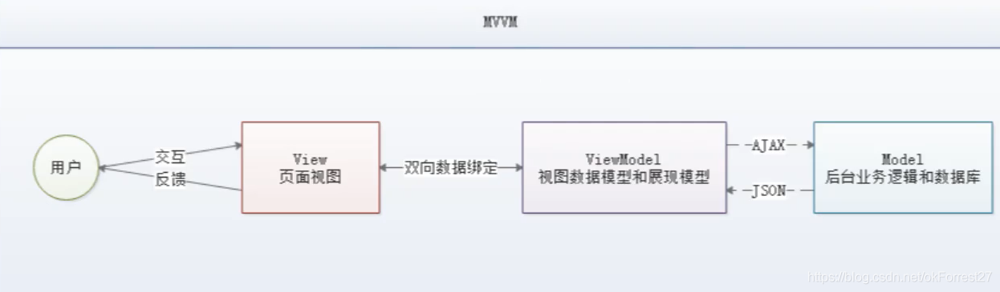

# VUE

# 一、Vue概述与前端知识

## 1.1 Vue概述

Vue (读音/vju/, 类似于view)是一套用于构建用户界面的渐进式框架，发布于2014年2月。与其它大型框架不同的是，Vue被设计为可以**自底向上逐层应用**。Vue的核心库**只关注视图层**，不仅易于上手，还便于与第三方库(如: vue-router: 跳转，vue-resource: 通信，vuex:管理)或既有项目整合。

网址：https://cn.vuejs.org/

## 1.2 前端三要素

**结构层（HTML）**

HTML (结构) ：超文本标记语言(Hyper Text Markup Language) ，决定网页的结构和内容。

**表现层（CSS）**

层叠样式表(Cascading Style sheets) ，设定网页的表现样式。CSS层叠样式表是一门标记语言，非编程语言，因此不可以自定义变量，不可以引用等，即不具备任何语法支持。

> 主要缺陷如下:
>
> - 语法不够强大，比如无法嵌套书写，导致模块化开发中需要写很多重复的选择器。
> - 没有变量和合理的样式复用机制，使得逻辑上相关的属性值必须以字面量的形式重复输出，导致难以维护且增加了工作量。
>
> **CSS预处理器**：提供CSS缺失的样式层复用机制、减少冗余代码，提高样式代码的可维护性。定义了一种专门的编程语言以进行Web页面样式设计，再通过编译器转化为正常的CSS文件。
>
> 常用的CSS预处理器有：
>
> - **SASS**:基于Ruby,通过服务端处理，功能强大。解析效率高。需要学习Ruby语言，上手难度高于LESS。
> - **LESS**:基于NodeJS,通过客户端处理，使用简单。功能比SASS简单，解析效率也低于SASS,但在实际开发中足够了，所以我们后台人员如果需要的话，**建议使用LESS。**

**行为层（JavaScript）**

 JavaScript一门弱类型脚本语言，其源代码在发往客户端运行之前不需经过编译，而是将文本格式的字符代码发送给浏览器由浏览器解释运行。

## 1.3 Native原生JS开发


原生JS开发，也就是让我们按照[ECMAScript] 标准的开发方式，简称是ES,特点是所有浏览器都支持。截止到当前博客发布时间，ES 标准已发布如下版本:

- ES3

- ES4 (内部,未征式发布)

- ES5 (全浏览器支持)

- ES6 (常用，当前主流版本: webpack打包成为ES5支持! )

- ES7

- ES8

- ES9 (草案阶段)

## 1.4 TypeScript

TypeScript是一种由微软开发的自由和开源的编程语言。它是JavaScript的一个超集，本质上添加了可选的静态类型和基于类的面向对象编程。

语言特点：除具备ES的特性之外还纳入许多不在标准范围内的新特性，导致很多浏览器不能直接支持TypeScript语法，需要编译后(编译成JS)才能被浏览器正确执行。

## 1.5 JavaScript框架

- **jQuery**：JavaScript框架简化了DOM操作，但是**DOM操作太频繁**，影响前端性能；仅用于兼容IE6、7、8。
- **Angular**：Google的前端框架，将后台的MVC模式搬到了前端并增加了**模块化开发的理念**，采用TypeScript语法开发；缺点：版本迭代不合理。
- **React**：Facebook出品，一款高性能的JS前端框架；特点：提出了新概念[**虚拟DOM**]用于
  **减少真实DOM操作**，在内存中模拟DOM操作，有效的提升了前端渲染效率；缺点：使用复
  杂，因为需要额外学习一门[JSX] 语言。
- **Vue**：一款渐进式JavaScript框架，所谓渐进式就是逐步实现新特性的意思，如实现模块化开发、路由、状态管理等新特性。**其特点是综合了Angular (模块化)和React (虚拟DOM)的优点**。

- **Axios** ：前端通信框架；Vue 仅处理DOM,所以并不具备通信能力，需要使用通信框架与服务器交互，或可选择jQuery提供的AJAX通信功能。

前端三大框架：**Angular**、**React**、**Vue**

## 1.6 UI框架

- Ant-Design:阿里巴巴出品，基于React的UI框架。
- **ElementUI、 iview、 ice：饿了么出品，基于Vue的UI框架**。
- Bootstrap：Twitter推出的一个用于前端开发的开源工具包。
- AmazeUI：又叫"妹子UI"，一款HTML5跨屏前端框架。
- JavaScript：构建工具。
- Babel：JS编译工具，主要用于浏览器不支持的ES新特性，比如用于编译TypeScript。
- WebPack：模块打包器，主要作用是打包、压缩、合并及按序加载。
  注：以上知识点将WebApp开发所需技能全部梳理完毕。

## 1.7 混合开发（Hybid App）

实现一套代码三端统一（PC、Android：.apk、iOS：.ipa ）并能备够调用到底层件（如：传感器、GPS、 摄像头等），打包方式主要有以下两种：

- 云打包： **HBuild -> HBuildX， DCloud出品， API Cloud**
- 本地打包：**Cordova** (前身是PhoneGap)

NodeJS方便前端人员开发后台应用，但其作者已声称放弃NodeJS 并着手开始开发全新架构的Deno。NodeJS 框架及项目管理工具如下:

- Express: NodeJS框架。
- Koa: Express简化版.
- NPM:项目综合管理工具，类似于Maven。
- YARN: NPM的替代方案，类似于Maven和Gradle的关系。

# 二、MVVM

安装Vue：

安装插件（右上角为IDE安装）：https://plugins.jetbrains.com/plugin/9442-vue-js/versions

测试：01\Demo_01.html

```html
<!DOCTYPE html>
<html lang="en">
<head>
    <meta charset="UTF-8">
    <title>Title</title>

    <!--导入vue.js-->
    <script src="https://cdn.jsdelivr.net/npm/vue@2.5.21/dist/vue.min.js"></script>

</head>
<body>

<div id="aop">
    {{message}}
</div>

<script>
    let vm = new Vue({
        el:"#aop",
        data:{
            message:"hello, vue"
        }
    });
</script>

</body>
</html>
```

## 2.1 什么是MVVM模式

MVVM (Model-View-ViewModel) 是一种软件架构设计模式，是一种简化用户界面的事件驱动编程方式。MVVM源自于经典的MVC (ModI-View-Controller) 模式。

**MVVM模式**：

- Model：模型层，表示JavaScript对象
- View：视图层，表示DOM (HTML操作的元素)
- ViewModel：连接视图和数据的中间件（由Vue.js实现）。

> 在MVVM架构中，不允许数据和视图直接通信的，只能通过ViewModel来通信。
>
> ViewModel定义了一个Observer观察者：
>
> 1. 观察数据的变化，对视图对应的内容进行更新。
> 2. 监听视图的变化，通知数据发生改变。

MVVM的核心是ViewModel层，负责转换Model中的数据对象来让数据变得更容易管理和使用，其作用如下：

1. 向上与视图层进行双向数据绑定。
2. 向下与Model层通过接口请求进行数据交互。



Vue.js是MVVM的实现者，其核心是实现了DOM监听和数据绑定。

## 2.2 MVVM的优点

MVVM模式和MVC模式一样，主要目的是分离视图（View）和模型（Model），优势如下：

1. 低耦合：视图(View)独立于Model变化和修改，一个ViewModel可以绑定到不同的
   View上，当View变化的时候Model可以不变，当Model变化的时候View也可以不变。
2. 可复用：视图逻辑可放置在ViewModel中，由多个View重用此段视图逻辑。
3. 独立开发：开发人员可以专注于业务逻辑和数据的开发(ViewModel)，设计人员可以专注于页面设计。
4. 可测试：测试可针对ViewModel来写。

# 三、VUE基础语法学习

## 3.1 if-else

测试：Demo_02.html

```html
<div id="app">
    <h1 v-if="ok">Yes!</h1>
    <h1 v-else>No!</h1>
</div>

<script>
    let vm = new Vue({
        el:"#app",
        data:{
            ok:true
        }
    });
</script>
```

## 3.2 for循环

测试：Demo_03.html

```html
<div id="app">
    <li v-for="text in allTexts">
        {{text.message}}
    </li>
</div>

<script>
    let vm = new Vue({
        el:"#app",
        data:{
            allTexts:[
                {message:"1"},
                {message:"2"},
                {message:"3"},
            ]
        }
    });
</script>
```

## 3.3 事件绑定

测试：Demo_04.html

```html
<div id="app">
    <button v-on:click="sayHi()">点击</button>
</div>
<script>
    let vm = new Vue({
        el: "#app",
        data: {
            message: "shinrin"
        },
        methods: {
            sayHi : function(){
                alert(this.message);
            }
        }
    });
</script>
```

## 3.4 双向数据绑定

数据双向绑定，即当数据发生变化的时候，视图也发生变化；当视图发生变化，数据也同步变化。

- 全局性数据流使用单向绑定，便于跟踪。

- 局部性数据流使用双向绑定，简单易操作。

**双向数据绑定（表单）**

使用v-model指令在表单和元素上创建双向数据绑定。

测试：Demo_05.html（输入框输入文字，并输出文字）

```html
<div id="app">
    <input type="text" v-model="message">{{message}}
</div>

<script>
    let vm = new Vue({
        el: "#app",
        data: {
            message: ""
        },
    });
</script>
```

## 3.5 组件

组件：可复用的Vue实例，即一组可重复使用的模板，通常一个应用应以一颗嵌套的组件树的形式来组织。

***在实际开发中采用vue-cli创建.vue模板文件的方式开发。***

Vue.component()方法注册组件。

测试：Demo_06.html

```html
<!--
item获取数组元素，并将其传递给组件shinrin的参数she。
-->

<div id="app">
    <shinrin v-for="item in items" v-bind:she="item"></shinrin>
</div>

<script>

    Vue.component("shinrin",{
        props:['she'],
        template:  '<li>{{she}}</li>'
    });

    var vm = new Vue({
        el: "#app",
        data:{
            items:["Java", "Linux", "前端"]
        }
    })

</script>
```

## 3.6 Axios异步通信（通信框架）

Axios是一个开源的可用于浏览器端和NodeJS 的异步通信框架，主要作用是实现AJAX异步通信，其功能特点如下：

1. 从浏览器中创建XMLHttpRequests
2. 从node.js创建http请求
3. 支持Promise API [JS中链式编程]
4. 拦截请求和响应
5. 转换请求数据和响应数据
6. 取消请求
7. 自动转换JSON数据
8. 客户端支持防御XSRF (跨站请求伪造)

GitHub: https://github.com/ axios/axios
中文文档: http://www.axios-js.com/

**为什么要使用Axios**

由于Vue.js是一个视图层框架并且严格准守SoC (关注度分离原则)，所以Vue.js并不包含AJAX的通信功能，为了解决通信问题，作者单独开发了一个名为vue-resource的插件，不过在进入2.0 版本以后停止了对该插件的维护并推荐了Axios 框架。应避免使用jQuery，因为操作Dom太过频繁。

**Vue的生命周期**

从创建到销毁：创建==>初始化数据==>编译模板==>挂载DOM==>渲染==>更新==>渲染==>卸载。

测试：Demo_07.html

```html
<!DOCTYPE html>
<html lang="en">
<head>
    <meta charset="UTF-8">
    <title>Title</title>
    <!--在线CDN-->
    <!--1.导入vue.js-->
    <script src="https://cdn.jsdelivr.net/npm/vue@2.5.21/dist/vue.min.js"></script>
    <!--导入axios-->
    <script src="https://cdn.bootcdn.net/ajax/libs/axios/0.19.2/axios.min.js"></script>

</head>
<body>

<div id="app">
    <div>{{info.name}}</div>
    <a v-bind:href="info.url">百度</a>
</div>

<script>
    let vm = new Vue({
        el: "#app",
        //和data: 不同 属性：vm
        data() {
            return {
                info: {
                    name:null,
                    url:null,
                },
            }
        },
        mounted() {
            //钩子函数 链式编程 ES6新特性
            axios.get("../data.json").then(response => (this.info=response.data));
        }
    });
</script>

</body>
</html>
```

data.json

```json
{
  "name": "shinrin",
  "age": "18",
  "sex": "男",
  "url":"https://www.baidu.com",
  "address": {
    "street": "风居住的街道",
    "city": "长沙",
    "country": "中国"
  },
  "links": [
    {
      "name": "bilibili",
      "url": "https://www.bilibili.com"
    },
    {
      "name": "baidu",
      "url": "https://www.baidu.com"
    },
    {
      "name": "shinrin video",
      "url": "https://www.4399.com"
    }
  ]
}
```

