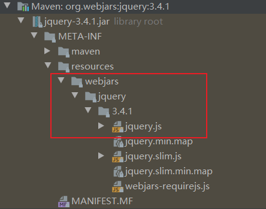
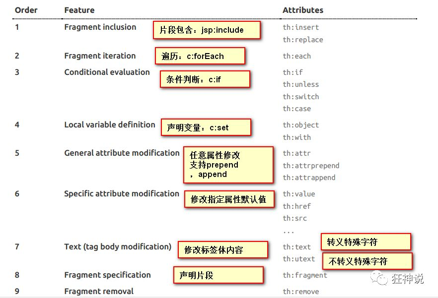
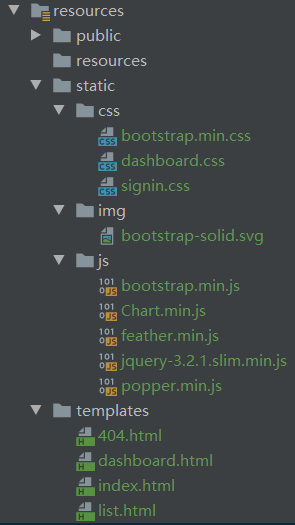
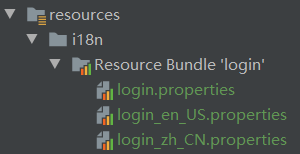

SpringBoot：

1. 编写yaml配置
2. 自动装配原理（重要）
3. 集成web开发：业务的核心
4. 集成数据库Druid
5. 分布式开发：Dubbo+zookeeper
6. swagger：接口文档
7. 任务调度
8. SpringSecurity / shiro

SpringCloud：

1. 微服务
2. SpringCloud入门
3. Restful
4. Eureka
5. Ribbon
6. Feign
7. HyStrix
8. Zuul路由网关
9. SpringCloud config：git

# 一、SpringBoot简介

**Spring是如何简化Java开发？**

为了降低Java开发的复杂性，Spring采用了以下4种关键策略：

1. 基于POJO的轻量级和最小侵入性编程，所有东西都是bean；
2. 通过IOC，依赖注入（DI）和面向接口实现解耦合；
3. 基于切面（AOP）和惯例进行声明式编程；
4. 通过切面和模版减少样式代码，RedisTemplate，xxxTemplate；

Java企业级应用：J2EE ==> spring ==> springboot

SpringBoot以约定大于配置作为核心思想，集成了大量常用的第三方库配置（例如 Redis、MongoDB、Jpa、RabbitMQ、Quartz 等等），简化了配置。

微服务架构：围绕高内聚低耦合，开发模块化。

# 二、HelloSpringBoot

## 2.1 项目创建

方式一：使用使用Spring Initializr 的 Web页面创建项目

1. 访问https://start.spring.io/
2. 填写项目信息
3. 添加初始化组件spring web
4. 点击"Generate Project"按钮生成项目，并下载
5. 解压并用IDEA以Maven项目导入

方式二：

1. IDEA新建Spring Initializr项目
2. 填写项目信息
3. 添加初始化组件spring web
4. 填写项目路径并生成项目

## 2.2 项目结构分析

1. 程序的主启动类：src\main\java\com\shinrin\helloworld\HelloworldApplication.java
2. 配置文件：src\main\resources\application.properties
3. 测试类：src\test\java\com\shinrin\helloworld\HelloworldApplicationTests.java
4. pom.xml：pom.xml

**pom.xml**，SpringBoot项目的依赖

```xml
	<!--父依赖-->
	<parent>
		<groupId>org.springframework.boot</groupId>
		<artifactId>spring-boot-starter-parent</artifactId>
		<version>2.3.5.RELEASE</version>
		<relativePath/> <!-- lookup parent from repository -->
	</parent>

	<dependencies>
		<!--web场景启动器-->
		<dependency>
			<groupId>org.springframework.boot</groupId>
			<artifactId>spring-boot-starter-web</artifactId>
		</dependency>
		<!--SpringBoot单元测试-->
		<dependency>
			<groupId>org.springframework.boot</groupId>
			<artifactId>spring-boot-starter-test</artifactId>
			<scope>test</scope>
			<exclusions>
				<!--剔除依赖-->
				<exclusion>
					<groupId>org.junit.vintage</groupId>
					<artifactId>junit-vintage-engine</artifactId>
				</exclusion>
			</exclusions>
		</dependency>
	</dependencies>

	<build>
		<plugins>
			<!--打包插件-->
			<plugin>
				<groupId>org.springframework.boot</groupId>
				<artifactId>spring-boot-maven-plugin</artifactId>
			</plugin>
		</plugins>
	</build>
```

**编写http接口**

1. 主程序同级目录下：新建controller包

2. controller包中新建HelloController类

```java
@RestController
public class HelloController {

    //接口：http://localhost:8080/hello
    @RequestMapping("/hello")
    public String hello(){
        //调用业务，返回前端参数
        return "Hello SpringBoot";
    }
}
```

3. 从主程序启动项目，测试：http://localhost:8080/hello

## 2.3 项目打包（jar）

maven ==> package

可能因测试用例导致打包失败，以下配置以跳过项目运行测试用例：

```xml
<!--
    在工作中,很多情况下我们打包是不想执行测试用例的
    可能是测试用例不完事,或是测试用例会影响数据库数据
    跳过测试用例执
    -->
<plugin>
    <groupId>org.apache.maven.plugins</groupId>
    <artifactId>maven-surefire-plugin</artifactId>
    <configuration>
        <!--跳过项目运行测试用例-->
        <skipTests>true</skipTests>
    </configuration>
</plugin>
```

打包成功后，通过以下命令执行（命令行）：

```
java -jar helloworld-0.0.1-SNAPSHOT.jar
```

# 三、SpringBoot运行原理

## 3.1 pom.xml

**父依赖**

pom.xml依赖于一个父项目，主要管理项目的资源过滤和插件。

```xml
	<!--父依赖-->
	<parent>
		<groupId>org.springframework.boot</groupId>
		<artifactId>spring-boot-starter-parent</artifactId>
		<version>2.3.5.RELEASE</version>
		<relativePath/> <!-- lookup parent from repository -->
	</parent>
```

父项目的父依赖：管理SpringBoot应用中所有依赖的版本，即SpringBoot的版本控制中心。

```xml
  <parent>
    <groupId>org.springframework.boot</groupId>
    <artifactId>spring-boot-dependencies</artifactId>
    <version>2.3.5.RELEASE</version>
  </parent>
```

如果导入的包不在依赖中管理则需要手动配置版本。

**启动器：spring-boot-starter**

```xml
		<!--web场景启动器-->
		<dependency>
			<groupId>org.springframework.boot</groupId>
			<artifactId>spring-boot-starter-web</artifactId>
		</dependency>
```

> springboot-boot-starter-xxx：spring-boot的场景启动器。
>
> spring-boot-starter-web：导入web模块正常运行所依赖的组件。
>
> SpringBoot将所有的功能场景都抽取出来，做成starter （启动器），在项目中引入starter即可导入相关的依赖 ；可自定义 starter。

## 3.2 主启动类

默认的主启动类

```java
//该注解用以标记主程序类，表明此为Spring Boot应用。
@SpringBootApplication
public class HelloworldApplication {

	public static void main(String[] args) {
		SpringApplication.run(HelloworldApplication.class, args);
	}
}
```

### @SpringBootApplication

作用：标记类作为SpringBoot的主配置类，SpringBoot运行该类的main方法以启动SpringBoot应用。

```java
@SpringBootConfiguration
@EnableAutoConfiguration
@ComponentScan(
    excludeFilters = {@Filter(
    type = FilterType.CUSTOM,
    classes = {TypeExcludeFilter.class}
), @Filter(
    type = FilterType.CUSTOM,
    classes = {AutoConfigurationExcludeFilter.class}
)}
)
public @interface SpringBootApplication {
	//......
}
```

**@ComponentScan**

对应XML配置中的元素。

作用：自动扫描并加载符合条件的组件或者bean ， 将bean定义加载到IOC容器中。

**@SpringBootConfiguration**

作用：标记类作为SpringBoot的配置类。

查看该注解：@Configuration表明该类为配置类，对应Spring的xml配置文件。

```java
@Configuration
public @interface SpringBootConfiguration {
	//......	
}
```

查看注解@Configuration：@Component表明该注解为Spring中的一个组件，负责启动应用。

```java
@Component
public @interface Configuration {
	//......
}
```

**@EnableAutoConfiguration**

作用：开启自动配置功能。

查看该注解：@AutoConfigurationPackage表示自动配置包。

```java
@AutoConfigurationPackage
public @interface EnableAutoConfiguration {
	//......
}
```

查看注解：Spring底层注解@Import，向容器中导入一个组件。Registrar.class：将主启动类的所在包及包下面所有子包里面的所有组件扫描到Spring容器 。

```java
@Import({Registrar.class})
public @interface AutoConfigurationPackage {
	//......
}
```

*@Import({AutoConfigurationImportSelector.class})* ：给容器导入组件。 

- AutoConfigurationImportSelector类：自动配置导入选择器。
  -  getCandidateConfigurations()方法。
    - SpringFactoriesLoader类。
      - loadFactoryNames()方法。
        - loadSpringFactories()方法。
          - 文件：spring.factories

总结：

1. SpringBoot在启动时从类路径下的META-INF/spring.factories中获取EnableAutoConfiguration指定的值。
2. 将获取的值作为自动配置类导入容器 ，自动配置类生效 ，进行自动配置工作。
3. 整个J2EE的整体解决方案和自动配置都在springboot-autoconfigure的jar包中。
4. 向容器中导入自动配置类 （xxxAutoConfiguration）, 向容器中导入当前场景需要的所有组件 ， 并配置好这些组件 。

### SpringApplication分析

SpringApplication.run()方法：该方法包含两个部分，①SpringApplication的实例化。②run方法的执行。

**SpringApplication类**

1. 推断应用的类型（普通/Web）。
2. 查找并加载所有可用初始化器，设置到initializers属性中。
3. 查找所有的应用程序监听器，设置到listeners属性中。
4. 推断并设置main方法的定义类，找到运行的主类。

构造器如下：

```java
public SpringApplication(ResourceLoader resourceLoader, Class... primarySources) {
    // ......
    this.webApplicationType = WebApplicationType.deduceFromClasspath();
    this.setInitializers(this.getSpringFactoriesInstances();
    this.setListeners(this.getSpringFactoriesInstances(ApplicationListener.class));
    this.mainApplicationClass = this.deduceMainApplicationClass();
}
```

**run方法的执行**


# 四、yaml配置注入

## 4.1 yaml语法

**配置文件**

SpringBoot使用一个全局的配置文件，文件名固定：

- application.properties
  - 语法结构 ：key=value
- application.yml
  - 语法结构 ：key：空格 value

作用：修改SpringBoot自动配置的默认值。

**yaml概述**

以数据为中心的非标记语言。

对比xml与yaml配置：

- xml配置：

  ```xml
  <server>
      <port>8081<port>
  </server>
  ```

- yaml配置

  ```yaml
  server：
    prot: 8080
  ```

**yaml基础语法**

说明：

> 不能省略空格。
>
> 以缩进控制层级关系。
>
> 大小写敏感。

①字面量：普通值	[数字、布尔值、字符串]

```yaml
k: v
```

注：

1. 字符串默认不加双引号或单引号。
2. 双引号不会转移特殊字符。
3. 单引号会转移特殊字符。

②对象、Map（键值对）

```yaml
#对象、Map格式
k: 
    v1:
    v2:
```

示例：

```yaml
student:
    name: shinrin
    age: 3
```

行内写法：

```yaml
student: {name: shinrin,age: 3}
```

③数组（List、set）

```yaml
pets:
 - cat
 - dog
 - pig
```

行内写法：

```yaml
pets: [cat,dog,pig]
```

④修改SpringBoot默认端口号

```yaml
server:
  port: 8082
```

## 4.2 注入方式

yaml可为实体类直接注入匹配值。

### 4.2.1 原始的注入方式

Dog类：

```java
@Data
@Component
public class Dog {
    @Value("阿黄")
    private String name;
    @Value("18")
    private Integer age;
}
```

SpringBoot测试类：

```java
	@Autowired
    Dog dog;

    @Test
    void contextLoads() {
        System.out.println(dog);
```

### 4.2.2 使用properties配置文件注入

shinrin.properties：

```properties
name=shinrin
```

Person类：

```java
@Data
@Component
//加载指定的配置文件
@PropertySource(value = "classpath:shinrin.properties")
public class Person {
    @Value("${name}")
    private String name;
    private Integer age;
    private Boolean happy;
    private Date birth;
    private Map<String, Object> maps;
    private List<Object> list;
    private Dog dog;
}

```

SpringBoot测试类：

```java
    @Autowired
    Person person;

    @Test
    void contextLoads() {
        System.out.println(person);
    }
```

### 4.2.3 使用yaml配置文件注入

Person类：

```java
@Data
@Component
@ConfigurationProperties(prefix = "person")
public class Person {
    private String name;
    private Integer age;
    private Boolean happy;
    private Date birth;
    private Map<String, Object> maps;
    private List<Object> list;
    private Dog dog;
}
```

application.yaml

```yaml
person:
  name: shinrin
  age: 17
  happy: true
  birth: 1996/12/08
  maps: {k1: v1, k2: v2}
  list:
    - code
    - music
  dog:
    name: 旺财
    age: 3
```

pom配置文件（可选，报红但不影响运行）：

```xml
        <dependency>
            <groupId>org.springframework.boot</groupId>
            <artifactId>spring-boot-configuration-processor</artifactId>
            <optional>true</optional>
        </dependency>
        
            <plugin>
                <groupId>org.springframework.boot</groupId>
                <artifactId>spring-boot-maven-plugin</artifactId>
                <configuration>
                    <excludes>
                        <exclude>
                            <groupId>org.springframework.boot</groupId>
                            <artifactId>spring-boot-configuration-processor</artifactId>
                        </exclude>
                    </excludes>
                </configuration>
            </plugin>
```

SpringBoot测试类：

```java
    @Autowired
    Person person;

    @Test
    void contextLoads() {
        System.out.println(person);
    }
```

## 4.3 配置文件占位符

```yaml
person:
  name: shinrin${random.uuid}
  age: ${random.int}
  happy: true
  birth: 1996/12/08
  maps: {k1: v1, k2: v2}
  list:
    - code
    - music
  hello: Good
  dog:
    name: ${person.hello:Nice}_旺财
    # 如果person存在hello属性（Good），则值为Good_旺财
    # 如果person不存在hello属性，则值为Nice_旺财
    age: 3
```

**yaml支持松散绑定**

如类中的firstName = yaml中的first-name。

Dog类：

```java
@Data
@Component
@ConfigurationProperties(value = "dog")
public class Dog {
    //@Value("阿黄")
    private String firstName;
    //@Value("18")
    private Integer age;
}
```

yaml配置文件：

```yaml
dog:
  first-name: 大黄
  age: 3
```

## 4.4 JSR303数据校验

校验数据是否合法

| 注解                          | 功能                                                         |
| ----------------------------- | ------------------------------------------------------------ |
| @Notnull                      | 验证对象是否不为mul，无法检査长度为0的字符串，于验证基本数据类型 |
| @Null                         | 验证对象是否为null                                           |
| @AssertTrue                   | 验证 Boolean对象是否为true                                   |
| @AssertFalse                  | 验证 Boolean对象是否为false                                  |
| @Max(value)                   | 验正Number和String对象是否小于等于指定的值                   |
| @Min(value)                   | 验正Number和String对象是否大于等于指定的值                   |
| @DecimalMax(value)            | 被标注的值必须不大于约束中指定的最大值。这个约束的参数是一个通过 Big Decimal定义的最大值的字符串表示，小数存在精度 |
| @DecimalMin(value)            | 被标注的值必须不小于约束中指定的最小值。这个约束的参数是一个通过 Big Decimal定义的最小值的字符串表示，小数存在精度 |
| @Digits（integer， fraction） | 验证字符串是否是符合指定格式的数字， Interger指定整数精度， fraction指定小数精度 |
| @Size(min, max)               | 验证对象（Array、Collection、Map、 String）长度是否在给定的范围之内 |
| @Past                         | 验证Date和 Calendar对象是否在当前时间之前                    |
| @Future                       | 验证Date和 Calendar对象是否在当前时间之后                    |
| @Pattern                      | 验证 String对象是否符合正则表达式的规则                      |
| @NotBlank                     | 检查约束字符串是不是Null，被Trim的长度是否大于0。只对字符串，且会去掉前后空格 |
| @URL                          | 验证是否是合法的url                                          |
| @Email                        | 验证是否是合法的邮件地址                                     |
| @CreditCardNumber             | 验证是否是合法的信用卡号码                                   |
| @Length(min, max)             | 验证字符串的长度必须在指定的范围内                           |
| @NotEmpty                     | 检査元素是否为NULL或者 EMPTY。用于Array、Collection、Map、 String |
| @Range（min， max， message） | 验证属性值必须在合适的范围内                                 |

导入jar包：

```xml
	<!--JSR303依赖 -->
	<dependency>
		<groupId>org.springframework.boot</groupId>
		<artifactId>spring-boot-starter-validation</artifactId>
	</dependency>
```

测试：

```java
@Data
@Component
@Validated  //声明使用JSR303检验
@ConfigurationProperties(prefix = "person")
public class Person {
    
    //JSR303校验邮箱格式
    @Email(message = "电子邮件格式")
    private String email;
}
```

参考博客：https://blog.csdn.net/qq_41813208/article/details/107091288

## 4.5 多环境切换

profile是Spring对不同环境提供不同配置功能的支持，可以通过激活不同的环境版本，实现快速切换环境；

### 4.5.1 使用properties配置

我们在主配置文件编写的时候，文件名可以是 application-{profile}.properties/yml , 用来指定多个环境版本；

**例如：**

- application-test.properties 代表测试环境配置

  ```properties
  server.port=8081
  ```

- application-dev.properties 代表开发环境配置

  ```properties
  server.port=8081
  ```

Springboot默认使用application.properties主配置文件，通过配置可选择需要激活的环境：

```properties
#比如在配置文件中指定使用dev环境，我们可以通过设置不同的端口号进行测试；
#我们启动SpringBoot，就可以看到已经切换到dev下的配置了；
spring.profiles.active=dev
```

### 4.5.2 使用yaml配置

application.yml

```yaml
server:
  port: 8081
spring:
  profiles:
    active: dev

---
server:
  port: 8082
spring:
  profiles: dev

---
server:
  port: 8083
spring:
  profiles: test
```

# 五、自动配置原理


```java
@SpringBootApplication
public class SpringBootApplication {

    public static void main(String[] args) {
        SpringApplication.run(SpringBoot03Config2Application.class, args);
    }

}
```

@SpringBootApplication

- @EnableAutoConfiguration（开启自动配置），查看
  - @Import({AutoConfigurationImportSelector.class})，查看AutoConfigurationImportSelector

## 5.2 MVC自动配置原理

SpringBoot对SpringMVC做了哪些配置，包括如何扩展，如何定制。

https://docs.spring.io/spring-boot/docs/2.2.5.RELEASE/reference/htmlsingle/#boot-features-spring-mvc-auto-configuration

```

Spring MVC Auto-configuration
// Spring Boot为Spring MVC提供了自动配置，它可以很好地与大多数应用程序一起工作。
Spring Boot provides auto-configuration for Spring MVC that works well with most applications.
// 自动配置在Spring默认设置的基础上添加了以下功能：
The auto-configuration adds the following features on top of Spring’s defaults:
// 包含视图解析器
Inclusion of ContentNegotiatingViewResolver and BeanNameViewResolver beans.
// 支持静态资源文件夹的路径，以及webjars
Support for serving static resources, including support for WebJars 
// 自动注册了Converter：
// 转换器，即网页提交数据到后台自动封装成为对象的东西，比如把"1"字符串自动转换为int类型
// Formatter：【格式化器，比如页面中的2019-8-10，会自动格式化为Date对象】
Automatic registration of Converter, GenericConverter, and Formatter beans.
// HttpMessageConverters
// SpringMVC用来转换Http请求和响应的的，比如我们要把一个User对象转换为JSON字符串，可以去看官网文档解释；
Support for HttpMessageConverters (covered later in this document).
// 定义错误代码生成规则的
Automatic registration of MessageCodesResolver (covered later in this document).
// 首页定制
Static index.html support.
// 图标定制
Custom Favicon support (covered later in this document).
// 初始化数据绑定器：帮我们把请求数据绑定到JavaBean中！
Automatic use of a ConfigurableWebBindingInitializer bean (covered later in this document).

/*
如果您希望保留Spring Boot MVC功能，并且希望添加其他MVC配置（拦截器、格式化程序、视图控制器和其他功能），则可以添加自己
的@configuration类，类型为webmvcconfiguer，但不添加@EnableWebMvc。如果希望提供
RequestMappingHandlerMapping、RequestMappingHandlerAdapter或ExceptionHandlerExceptionResolver的自定义
实例，则可以声明WebMVCregistrationAdapter实例来提供此类组件。
*/
If you want to keep Spring Boot MVC features and you want to add additional MVC configuration 
(interceptors, formatters, view controllers, and other features), you can add your own 
@Configuration class of type WebMvcConfigurer but without @EnableWebMvc. If you wish to provide 
custom instances of RequestMappingHandlerMapping, RequestMappingHandlerAdapter, or 
ExceptionHandlerExceptionResolver, you can declare a WebMvcRegistrationsAdapter instance to provide such components.

// 如果您想完全控制Spring MVC，可以添加自己的@Configuration，并用@EnableWebMvc进行注释。
If you want to take complete control of Spring MVC, you can add your own @Configuration annotated with @EnableWebMvc.
```

**ContentNegotiatingViewResolver 内容协商视图解析器**

自动配置了ViewResolver（SpringMVC的视图解析器），即根据方法的返回值取得视图对象（View），然后由视图对象决定如何渲染（转发，重定向）。


# 六、SpringBoot Web开发

jar：webapp

自动装配

SpringBoot：

1. xxxAutoConfiguration：向容器中自动配置组件
2. xxxProperties：自动配置类，装配配置文件中自定义的一些内容。

要解决的问题：

1. 导入静态资源
2. 首页
3. jsp，模板引擎Thymeleaf
4. 装配扩展SpringMVC
5. 增删改查
6. 拦截器
7. 国际化（中英文切换）

## 6.1 静态资源处理

- WebMvcAutoConfiguration类（IDEA双击shift查找此类）
  - WebMvcAutoConfigurationAdapter类
    - addResourceHandlers 方法

```java
public void addResourceHandlers(ResourceHandlerRegistry registry) {
    if (!this.resourceProperties.isAddMappings()) {
        logger.debug("Default resource handling disabled");
    } else {
        Duration cachePeriod = this.resourceProperties.getCache().getPeriod();
        CacheControl cacheControl = this.resourceProperties.getCache().getCachecontrol().toHttpCacheControl();
        if (!registry.hasMappingForPattern("/webjars/**")) {
            this.customizeResourceHandlerRegistration(registry.addResourceHandler(new String[]{"/webjars/**"}).addResourceLocations(new String[]{"classpath:/META-INF/resources/webjars/"}).setCachePeriod(this.getSeconds(cachePeriod)).setCacheControl(cacheControl).setUseLastModified(this.resourceProperties.getCache().isUseLastModified()));
        }

        String staticPathPattern = this.mvcProperties.getStaticPathPattern();
        if (!registry.hasMappingForPattern(staticPathPattern)) {
            this.customizeResourceHandlerRegistration(registry.addResourceHandler(new String[]{staticPathPattern}).addResourceLocations(WebMvcAutoConfiguration.getResourceLocations(this.resourceProperties.getStaticLocations())).setCachePeriod(this.getSeconds(cachePeriod)).setCacheControl(cacheControl).setUseLastModified(this.resourceProperties.getCache().isUseLastModified()));
        }

    }
}
```

### 第一种映射规则

所有的 /webjars/** ， 都需要去 classpath:/META-INF/resources/webjars/ 寻找对应的资源。

**webjars**

Webjars本质就是以jar包的方式引入我们的静态资源 ， 我们以前要导入一个静态资源文件，直接导入即可。

使用SpringBoot需要使用Webjars，网站：https://www.webjars.org 

例：使用jQuery

1. 引入jQuery对应版本的pom依赖即可。

```xml
<dependency>    
    <groupId>org.webjars</groupId>
    <artifactId>jquery</artifactId>
    <version>3.4.1</version>
</dependency>
```

2. 导入完毕，查看webjars目录结构。

   

3. 访问Jquery.js文件：http://localhost:8080/webjars/jquery/3.4.1/jquery.js

### 第二种映射规则

- getStaticPathPattern()

  - staticPathPattern
    - this.staticPathPattern = "/**";	//访问当前的项目任意资源

- getStaticLocations()

  - staticLocations

    ```java
    private static final String[] CLASSPATH_RESOURCE_LOCATIONS = new String[]{
        "classpath:/META-INF/resources/",
        "classpath:/resources/", 
        "classpath:/static/", 
        "classpath:/public/"
    };
    ```

- ResourceProperties：设置和静态资源有关的参数；指向寻找资源的文件夹，即上面数组。

总结：以下四个目录可存放静态资源。

```java
"classpath:/META-INF/resources/"
"classpath:/resources/"
"classpath:/static/"
"classpath:/public/"
```

### 自定义静态资源路径

（通过配置文件application.properties）

```properties
spring.resources.static-locations=classpath:/coding/,classpath:/shinrin/
```

一旦自定义，原有配置将失效。

总结：

1. SpringBoot中，使用以下方式处理静态资源。
   - webjars：`localhost:8080/webjars/`
   - public，static，/**，resources：`localhost:8080/`

2. 优先级：resources > static（默认） > public

## 6.2 首页和图标定制

**首页**

- WebMvcAutoConfiguration类（文件内搜索：Ctrl+F）


```java
private Optional<Resource> getWelcomePage() {
    String[] locations = WebMvcAutoConfiguration.getResourceLocations(this.resourceProperties.getStaticLocations());
    return Arrays.stream(locations).map(this::getIndexHtml).filter(this::isReadable).findFirst();
}

private Resource getIndexHtml(String location) {
    return this.resourceLoader.getResource(location + "index.html");
}
```

由上可知，首页为index.html。

**图标**

SpringBoot2.0以上的版本需要用link调取图标，图片必须为icon格式。

## 6.3 Thymeleaf模板引擎

**模板引擎**

常用的模板引擎：jsp、freemarker、Thymeleaf（SpringBoot推荐）。

模板引擎的作用：

后台封装数据，然后将模板和数据交给模板引擎，模板引擎按照数据解析表达式并填充到指定位置，然后将数据生成内容并写入。

SpringBoot与JSP的恩恩怨怨：https://blog.csdn.net/sundacheng1989/article/details/93612447

Thymeleaf 官网：https://www.thymeleaf.org/

Thymeleaf 在Github 的主页：https://github.com/thymeleaf/thymeleaf

**引入Thymeleaf**

```xml
<!--thymeleaf-->
<dependency>
    <groupId>org.springframework.boot</groupId>
    <artifactId>spring-boot-starter-thymeleaf</artifactId>
</dependency>
```

**Thymeleaf分析**

Thymeleaf自动配置类：

```java
@ConfigurationProperties(
    prefix = "spring.thymeleaf"
)
public class ThymeleafProperties {
    private static final Charset DEFAULT_ENCODING;
    public static final String DEFAULT_PREFIX = "classpath:/templates/";
    public static final String DEFAULT_SUFFIX = ".html";
    private boolean checkTemplate = true;
    private boolean checkTemplateLocation = true;
    private String prefix = "classpath:/templates/";
    private String suffix = ".html";
    private String mode = "HTML";
    private Charset encoding;
}
```

html页面存放在类路径下的templates目录，thymeleaf自动渲染。

**测试**

1. TestController.java

```java
@Controller
public class TestController {

    @RequestMapping("/t1")
    public String test1(Model model){
        //classpath：/templates/test1.html
        model.addAttribute("msg", "Hello Thymeleaf");
        return "test1";
    }

    @RequestMapping("/t2")
    public String test2(Map<String, Object> map){
        map.put("msg", "<h1>Hello</h1>");
        map.put("users", Arrays.asList("shinrin", "樊川"));
        return "test2";
    }
}
```

test.html

```html
<!DOCTYPE html>
<html lang="en" xmlns:th="http://www.thymeleaf.org">
<head>
    <meta charset="UTF-8">
    <title>SHINRIN</title>
</head>
<body>

<h1>Thymeleaf测试页面</h1>


<!--th:text 将div中的值设定为指定的值-->
<div th:text="${msg}"></div>
<!--不转义-->
<div th:utext="${msg}"></div>

<!--遍历数据-->
<!--每个元素都创建一个新的标签-->
<h4 th:each="user:${users}" th:text="${user}"></h4>

<h4>
    <!--行内写法-->
    <span th:each="user:${users}">[[${user}]]</span>
</h4>

</body>
</html>
```

**Thymeleaf语法**

可使用任意的 th:attr 来替换Html中原生属性的值。



表达式

```
Simple expressions:（表达式语法）
Variable Expressions: ${...}：获取变量值；OGNL；
    1）、获取对象的属性、调用方法
    2）、使用内置的基本对象：#18
         #ctx : the context object.
         #vars: the context variables.
         #locale : the context locale.
         #request : (only in Web Contexts) the HttpServletRequest object.
         #response : (only in Web Contexts) the HttpServletResponse object.
         #session : (only in Web Contexts) the HttpSession object.
         #servletContext : (only in Web Contexts) the ServletContext object.

    3）、内置的一些工具对象：
　　　　　　#execInfo : information about the template being processed.
　　　　　　#uris : methods for escaping parts of URLs/URIs
　　　　　　#conversions : methods for executing the configured conversion service (if any).
　　　　　　#dates : methods for java.util.Date objects: formatting, component extraction, etc.
　　　　　　#calendars : analogous to #dates , but for java.util.Calendar objects.
　　　　　　#numbers : methods for formatting numeric objects.
　　　　　　#strings : methods for String objects: contains, startsWith, prepending/appending, etc.
　　　　　　#objects : methods for objects in general.
　　　　　　#bools : methods for boolean evaluation.
　　　　　　#arrays : methods for arrays.
　　　　　　#lists : methods for lists.
　　　　　　#sets : methods for sets.
　　　　　　#maps : methods for maps.
　　　　　　#aggregates : methods for creating aggregates on arrays or collections.
==================================================================================

  Selection Variable Expressions: *{...}：选择表达式：和${}在功能上是一样；
  Message Expressions: #{...}：获取国际化内容
  Link URL Expressions: @{...}：定义URL；
  Fragment Expressions: ~{...}：片段引用表达式

Literals（字面量）
      Text literals: 'one text' , 'Another one!' ,…
      Number literals: 0 , 34 , 3.0 , 12.3 ,…
      Boolean literals: true , false
      Null literal: null
      Literal tokens: one , sometext , main ,…
      
Text operations:（文本操作）
    String concatenation: +
    Literal substitutions: |The name is ${name}|
    
Arithmetic operations:（数学运算）
    Binary operators: + , - , * , / , %
    Minus sign (unary operator): -
    
Boolean operations:（布尔运算）
    Binary operators: and , or
    Boolean negation (unary operator): ! , not
    
Comparisons and equality:（比较运算）
    Comparators: > , < , >= , <= ( gt , lt , ge , le )
    Equality operators: == , != ( eq , ne )
    
Conditional operators:条件运算（三元运算符）
    If-then: (if) ? (then)
    If-then-else: (if) ? (then) : (else)
    Default: (value) ?: (defaultvalue)
    
Special tokens:
    No-Operation: _
```

# 七、员工管理系统

## 7.1 准备工作

**导入静态资源**



**pojo实体类**

DepartmentDao.java

```java
@Data
@AllArgsConstructor
@NoArgsConstructor
public class Department {

    private Integer id;
    private String departmentName;
}
```

Employee.java

```java
@Data
@NoArgsConstructor
public class Employee {

    private Integer id;
    private String lastName;
    private String email;
    private Integer gender;// 0：女，1：男
    private Department department;
    private Date birth;

    public Employee(Integer id, String lastName, String email, Integer gender, Department department) {
        this.id = id;
        this.lastName = lastName;
        this.email = email;
        this.gender = gender;
        this.department = department;
        this.birth = new Date();
    }
}
```

**dao层**

DepartmentDao.java

```java
@Repository
public class DepartmentDao {

    //模拟数据库中的数据
    private static Map<Integer, Department> departments;
    static {
        departments = new HashMap<Integer, Department>();//创建一个部门表

        departments.put(101,new Department(101,"教学部"));
        departments.put(101,new Department(102,"教研部"));
        departments.put(101,new Department(103,"市场部"));
        departments.put(101,new Department(104,"运营部"));
        departments.put(101,new Department(105,"后勤部"));
    }

    //获得所有部门信息
    public Collection<Department> getDepartments(){
        return departments.values();
    }

    //通过id得到部门
    public  Department getDepartmentById(Integer id){
        return departments.get(id);
    }
}
```

EmployeeDao.java

```java
@Repository
public class EmployeeDao {

    //模拟数据库中的数据
    private static Map<Integer, Employee> employees = null;
    //员工所属的部门
    @Autowired
    private DepartmentDao departmentDao;

    static {
        employees = new HashMap<Integer, Employee>();

        employees.put(1001,new Employee(1001,"A","a123@qq.com",0,new Department(101,"教学部")));
        employees.put(1002,new Employee(1002,"B","b123@qq.com",1,new Department(101,"教研部")));
        employees.put(1003,new Employee(1003,"C","c123@qq.com",0,new Department(101,"市场部")));
        employees.put(1004,new Employee(1004,"D","d123@qq.com",1,new Department(101,"运营部")));
        employees.put(1005,new Employee(1005,"E","e123@qq.com",0,new Department(101,"后勤部")));

    }

    //主键自增
    private static Integer initId = 1006;
    //增加一个员工
    public void save(Employee employee){
        if (employee.getId() == null){
            employee.setId(initId++);
        }
        employee.setDepartment(departmentDao.getDepartmentById(employee.getId()));
        employees.put(employee.getId(), employee);
    }

    //获得所有部门信息
    public Collection<Employee> getAll(){
        return employees.values();
    }

    //通过id得到部门
    public  Employee getEmployeeById(Integer id){
        return employees.get(id);
    }

    //通过ID删除员工
    public void delete(Integer id){
        employees.remove(id);
    }
}
```

## 7.2 首页实现

**Spring配置类**：MyMvcConfig.java

```java
@Configuration
public class MyMvcConfig implements WebMvcConfigurer {

    @Override
    public void addViewControllers(ViewControllerRegistry registry) {
        registry.addViewController("/").setViewName("index");
        registry.addViewController("/index.html").setViewName("index");
    }
}
```

修改静态资源以支持Thymeleaf（@符号：直达/resources/static目录）

> 所有的静态资源都需要使用thymeleaf接管。

```html
<!DOCTYPE html>
<html lang="en" xmlns:th="http://www.thymeleaf.org">
    
    	
		<link th:href="@{/css/bootstrap.min.css}" rel="stylesheet">

```

## 7.3 国际化

以主页（index.html）为例。

**国际化配置文件**：login.properties（通过Resource Bundle可视化修改）



```properties
login.btn=登录
login.password=密码
login.remember=记住我
login.tip=请登录
login.username=用户名
```

**Spring配置文件**：application.properties

```properties
# 国际化配置文件目录
spring.messages.basename=i18n.login
```

**主页**：index.html

```html
<form class="form-signin" action="dashboard.html">
    
    <h1 class="h3 mb-3 font-weight-normal" th:text="#{login.tip}">Please sign in</h1>
    <input type="text" class="form-control" th:placeholder="#{login.username}" required="" autofocus="">
    <input type="password" class="form-control" th:placeholder="#{login.password}" required="">
    <div class="checkbox mb-3">
        <label>
            <input type="checkbox" value="remember-me"> [[#{login.remember}]]
        </label>
    </div>
    <button class="btn btn-lg btn-primary btn-block" type="submit" >[[#{login.btn}]]</button>
    <p class="mt-5 mb-3 text-muted">© 2017-20120</p>
    <a class="btn btn-sm" th:href="@{/index.html(l='zh_CN')}">中文</a>
    <a class="btn btn-sm" th:href="@{/index.html(l='en_US')}">English</a>
</form>
```

**自定义国际化组件**：MyLocaleResolver.java

```java
public class MyLocaleResolver implements LocaleResolver {

    //解析请求
    @Override
    public Locale resolveLocale(HttpServletRequest request) {
        //获取请求中的语言参数
        String language = request.getParameter("l");
        //如果请求链接中未携带国际化参数，使用默认
        Locale locale = Locale.getDefault();
        //如果请求链接中携带了国际化参数
        if (!StringUtils.isEmpty(language)){
            String[] split = language.split("_");
            //语言，国家
            locale = new Locale(split[0], split[1]);
        }
        return locale;
    }

    @Override
    public void setLocale(HttpServletRequest httpServletRequest, HttpServletResponse httpServletResponse, Locale locale) {}
}
```

**国际化组件注册到Spring容器**：MyMvcConfig.java

```java
//注册国际化组件
@Bean
public LocaleResolver localeResolver(){
    return new MyLocaleResolver();
}
```

## 7.4 实现登录

**首页**：index.html

```html
<form class="form-signin" th:action="@{/user/login}">
    
    <p style="color: red" th:text="${msg}" th:if="${not #strings.isEmpty(msg)}"></p>
    <input type="text" name="username" class="form-control" th:placeholder="#{login.username}" required="" autofocus="">
    <input type="password" name="password" class="form-control" th:placeholder="#{login.password}" required="">
```

**控制层**：LoginController.java

```java
@Controller
public class LoginController {

    @RequestMapping("/user/login")
    public String login(@RequestParam("username") String username,
                        @RequestParam("password") String password, Model model){

        //具体业务
        if (!StringUtils.isEmpty(username) && "123456".equals(password)){
            //此处通过重定向隐藏了账户密码信息。
            return "redirect:/main.html";
        }else {
            model.addAttribute("msg", "用户名或密码错误！");
            return "index";
        }
    }
}
```

**Spring配置类**：MyMvcConfig.java

```java
@Override
public void addViewControllers(ViewControllerRegistry registry) {
    registry.addViewController("/").setViewName("index");
    registry.addViewController("/index.html").setViewName("index");
    registry.addViewController("/main.html").setViewName("dashboard");
}
```

## 7.5 登录拦截器

**拦截器**：LoginHandlerInterceptor.java

```java
public class LoginHandlerInterceptor implements HandlerInterceptor {

    @Override
    public boolean preHandle(HttpServletRequest request, HttpServletResponse response, Object handler) throws Exception {

        //登录成功后，存在用户的session
        Object loginUser = request.getSession().getAttribute("loginUser");
        if (loginUser == null){
            request.setAttribute("msg", "非法访问，请先登录");
            request.getRequestDispatcher("/index.html").forward(request,response);
            return false;
        }else {
            return true;
        }
    }
}
```

**Spring配置类**：MyMvcConfig.java

```java
//拦截器
@Override
public void addInterceptors(InterceptorRegistry registry) {
    registry.addInterceptor(new LoginHandlerInterceptor()).addPathPatterns("/**")
        .excludePathPatterns("/index.html", "/", "/user/login");
}
```

补充：dashboard页面显示登录用户的username。

```html
<a class="navbar-brand col-sm-3 col-md-2 mr-0" href="http://getbootstrap.com/docs/4.0/examples/dashboard/#">[[${session.loginUser}]]</a>
```

## 7.6 展示员工

```html
<a class="nav-link" href="http://getbootstrap.com/docs/4.0/examples/dashboard/#" th:href="@{/emps}">

```

## 7.7 增加员工

## 7.8 修改员工

## 7.9 删除员工

# 八、如何创建一个网站

1. 前端：前端模板
2. 设计数据库（根据前端）
3. 前端独立运行，独立化工程。
4. 数据库接口对接：json。
5. 前后端联调。

一套自己熟悉的后台模板（工作必要）：xadmin

前端页面：至少自己可通过前端框架组合出网站页面

- index
- about
- blog
- post
- user

# 九、SpringBoot与数据库

## 9.1 结合JDBC API

配置数据源（application.yml）。

```yml
spring:
  datasource:
    username: root
    password: 1704
    url: jdbc:mysql://localhost:3306/mybatis?serverTimezone=UTC&useUnicode=true&characterEncoding=utf-8
    driver-class-name: com.mysql.cj.jdbc.Driver
```

增删改查。

```java
@RestController
public class JDBCController {

    @Autowired
    JdbcTemplate jdbcTemplate;

    //查询数据库的所有信息
    //没有实体类，如何获取？Map
    @GetMapping("/userList")
    public List<Map<String, Object>> userList(){

        String sql = "select * from mybatis.user";
        List<Map<String, Object>> list_maps = jdbcTemplate.queryForList(sql);
        return list_maps;
    }

    @GetMapping("/addUser")
    public String addUser(){

        String sql = "insert into mybatis.user(id, name, pwd) values(7, 'Pix', 'Lulu')";
        jdbcTemplate.update(sql);
        return "update ok";
    }

    @GetMapping("/updateUser/{id}")
    public String updateUser(@PathVariable("id") String id){

        String sql = "update mybatis.user set name=?,pwd=? where id="+id;
        Object[] objects = new Object[2];
        objects[0] = "Teemo";
        objects[1] = "123456";
        jdbcTemplate.update(sql, objects);
        return "update ok";
    }

    @GetMapping("/deleteUser/{id}")
    public String deleteUser(@PathVariable("id") String id){

        String sql = "delete from mybatis.user where id=?";
        jdbcTemplate.update(sql, id);
        return "delete ok";
    }

}
```

## 9.2 结合Druid数据源

1. 导入依赖

```xml
<!-- https://mvnrepository.com/artifact/com.alibaba/druid -->
<dependency>
    <groupId>com.alibaba</groupId>
    <artifactId>druid</artifactId>
    <version>1.2.3</version>
</dependency>
```

2. 修改默认数据源

```yml
spring:
  datasource:
    username: root
    password: 1704
    url: jdbc:mysql://localhost:3306/mybatis?serverTimezone=UTC&useUnicode=true&characterEncoding=utf-8
    driver-class-name: com.mysql.cj.jdbc.Driver
    type: com.alibaba.druid.pool.DruidDataSource #自定义数据源

    #Spring Boot 默认是不注入这些属性值的，需要自己绑定
    #druid 数据源专有配置
    initialSize: 5
    minIdle: 5
    maxActive: 20
    maxWait: 60000
    timeBetweenEvictionRunsMillis: 60000
    minEvictableIdleTimeMillis: 300000
    validationQuery: SELECT 1 FROM DUAL
    testWhileIdle: true
    testOnBorrow: false
    testOnReturn: false
    poolPreparedStatements: true

    #配置监控统计拦截的filters，stat:监控统计、log4j：日志记录、wall：防御sql注入
    #如果允许时报错  java.lang.ClassNotFoundException: org.apache.log4j.Priority
    #则导入 log4j 依赖即可，Maven 地址：https://mvnrepository.com/artifact/log4j/log4j
    filters: stat,wall,log4j
    maxPoolPreparedStatementPerConnectionSize: 20
    useGlobalDataSourceStat: true
    connectionProperties: druid.stat.mergeSql=true;druid.stat.slowSqlMillis=500
```

3. 导入log4j依赖

```xml
<dependency>
    <groupId>log4j</groupId>
    <artifactId>log4j</artifactId>
    <version>1.2.17</version>
</dependency>
```

4. DruidDataSource绑定全局配置并注册到容器

> DruidConfig.java

```java
@Configuration
public class DruidConfig {

    @ConfigurationProperties(prefix = "spring.datasource")
    @Bean
    public DataSource druidDataSource(){
        return new DruidDataSource();
    }
}

```

> 测试

```java
    @Test
    void contextLoads() throws SQLException {

        //查看数据源
        System.out.println(dataSource.getClass());
        //获得数据库连接
        Connection connection = dataSource.getConnection();
        System.out.println(connection);
        DruidDataSource druidDataSource = (DruidDataSource) dataSource;
        System.out.println("druidDataSource 数据源最大连接数：" + druidDataSource.getMaxActive());
        System.out.println("druidDataSource 数据源初始化连接数：" + druidDataSource.getInitialSize());
        //关闭
        connection.close();
    }
```

5. 后台监控

> DriudConfig.java

```java
    //后台监控：web.xml
    //访问：http://localhost:8080/druid/login.html
    @Bean
    public ServletRegistrationBean statViewServlet(){
        ServletRegistrationBean bean = new ServletRegistrationBean<>(new StatViewServlet(), "/druid/*");
        //后台登录，配置账号密码
        HashMap<String, String> initParameters = new HashMap<>();//登录key（固定）
        initParameters.put("loginUsername", "admin");
        initParameters.put("loginPassword", "123456");
        //允许访问
        initParameters.put("allow","");//所有人可访问
        //initParameters.put("allow","localhost");//仅本地可访问
        bean.setInitParameters(initParameters);//设置初始化参数
        return bean;
    }
```

6. 过滤器

```java
    //过滤器
    @Bean
    public FilterRegistrationBean webStatFilter(){
        FilterRegistrationBean<Filter> bean = new FilterRegistrationBean<>();
        bean.setFilter(new WebStatFilter());
        //可过滤的请求
        HashMap<String, String> initParameters = new HashMap<>();
        //不参与统计的请求
        initParameters.put("exclusions", "*.js,*.css,/druid/*");
        bean.setInitParameters(initParameters);
        return bean;
    }
```

## 9.3 整合MyBatis

1. 导入依赖

```xml
<!-- https://mvnrepository.com/artifact/org.mybatis.spring.boot/mybatis-spring-boot-starter -->
<dependency>
    <groupId>org.mybatis.spring.boot</groupId>
    <artifactId>mybatis-spring-boot-starter</artifactId>
    <version>2.1.4</version>
</dependency>
```

2. 数据库配置（application.properties）

```properties
spring.datasource.username=root
spring.datasource.password=1704
spring.datasource.url=jdbc:mysql://localhost:3306/mybatis?serverTimezone=UTC&useUnicode=true&characterEncoding=utf-8
spring.datasource.driver-class-name=com.mysql.cj.jdbc.Driver

# 整合MyBatis
mybatis.type-aliases-package=com.serein.pojo
mybatis.mapper-locations=classpath:mybatis/mapper/*.xml
```

3. 测试

```java
@Autowired
DataSource dataSource;

@Test
void contextLoads() throws SQLException {
    System.out.println(dataSource.getClass());
    System.out.println(dataSource.getConnection());
}
```

4. pojo类

```java
@Data
@AllArgsConstructor
@NoArgsConstructor
public class User {
    int id;
    String name;
    String pwd;
}
```

5. Mapper接口

```java
//Mapper：mybatis的mapper类。
@Mapper
//Repository：注册到Spring容器
@Repository
public interface UserMapper {
    List<User> queryUserList();

    User queryUserById(int id);

    int addUser(User user);

    int updateUser(User user);

    int deleteUser(int id);
}
```

6. UserMapper.xml

```xml
<?xml version="1.0" encoding="UTF-8" ?>
<!DOCTYPE mapper
        PUBLIC "-//mybatis.org//DTD Mapper 3.0//EN"
        "http://mybatis.org/dtd/mybatis-3-mapper.dtd">

<mapper namespace="com.serein.mapper.UserMapper">
    <select id="queryUserList" resultType="User">
        select * from mybatis.user
    </select>

    <select id="queryUserById" resultType="user">
        select * from mybatis.user where id = #{id};
    </select>

    <insert id="addUser" parameterType="User">
        insert into mybatis.user(id, name, pwd) values (#{id}, #{name}, #{pwd})
    </insert>

    <update id="updateUser" parameterType="user">
        update mybatis.user set name=#{name},pwd=#{pwd} where id = #{id}
    </update>

    <delete id="deleteUser" parameterType="int">
        delete from mybatis.user where id=#{id}
    </delete>
</mapper>
```

7. UserController.java

```java
@RestController
public class UserController {

    @Autowired
    private UserMapper userMapper;

    @GetMapping("/queryUserList")
    public List<User> queryUserList(){
        List<User> userList = userMapper.queryUserList();
        for (User user : userList) {
            System.out.println(user);
        }
        return userList;
    }
}
```

# 十、SpringSecurity

用户身份认证：支持主流的认证方式，包括 HTTP 基本认证、HTTP 表单验证、HTTP 摘要认证、OpenID 和 LDAP 等。

用户授权：提供了基于角色的访问控制和访问控制列表（Access Control List，ACL），可以对应用中的领域对象进行细粒度的控制。

1. 添加Thymeleaf支持

```xml
<dependency>
    <groupId>org.springframework.boot</groupId>
    <artifactId>spring-boot-starter-thymeleaf</artifactId>
</dependency>
```

2. 添加SpringSecurity支持

```xml
<dependency>
    <groupId>org.springframework.boot</groupId>
    <artifactId>spring-boot-starter-security</artifactId>
</dependency>
<dependency>
    <groupId>org.thymeleaf.extras</groupId>
    <artifactId>thymeleaf-extras-springsecurity5</artifactId>
</dependency>
<dependency>
    <groupId>org.springframework.security</groupId>
    <artifactId>spring-security-test</artifactId>
    <scope>test</scope>
</dependency>
```

3. /controller/RouterController

```java
@Controller
public class RouterController {

    @RequestMapping({"/", "/index"})
    public String index(){
        return "index";
    }

    @RequestMapping("/toLogin")
    public String toLogin(){
        return "views/login";
    }

    @RequestMapping("/level1/{id}")
    public String level1(@PathVariable("id") int id){
        return "views/level1/"+id;
    }

    @RequestMapping("/level2/{id}")
    public String level2(@PathVariable("id") int id){
        return "views/level2/"+id;
    }

    @RequestMapping("/level3/{id}")
    public String level3(@PathVariable("id") int id){
        return "views/level3/"+id;
    }
}
```

4. /config/SecurityConfig.java

```java
//开启WebSecurity
@EnableWebSecurity
public class SecurityConfig extends WebSecurityConfigurerAdapter {

    //AOP：拦截器
    @Override
    protected void configure(HttpSecurity http) throws Exception {
        //定制请求的授权规则
        //首页所有人可访问，功能页对应权限访问
        http.authorizeRequests()
                .antMatchers("/").permitAll()
                .antMatchers("/level1/**").hasRole("vip1")
                .antMatchers("/level2/**").hasRole("vip2")
                .antMatchers("/level3/**").hasRole("vip3");
        //无权限默认跳转到登录页
        http.formLogin()
                .usernameParameter("username")
                .passwordParameter("password")
                .loginPage("/toLogin")
                .loginProcessingUrl("/login");//登录表单提交请求
        //关闭csrf
        http.csrf().disable();
        //开启记住我功能：cookie，默认保存两周。
        http.rememberMe().rememberMeParameter("remember");
        //开启注销，注销成功跳转到登录页
        http.logout().logoutSuccessUrl("/");
    }

    //认证
    //密码编码：PasswordEncoder
    @Override
    protected void configure(AuthenticationManagerBuilder auth) throws Exception {
        //开发时数据从数据库中读取
        auth.inMemoryAuthentication().passwordEncoder(new BCryptPasswordEncoder())
                .withUser("serein").password(new BCryptPasswordEncoder().encode(("123456"))).roles("vip2","vip3")
                .and()
                .withUser("root").password(new BCryptPasswordEncoder().encode(("123456"))).roles("vip1","vip2","vip3")
                .and()
                .withUser("guest").password(new BCryptPasswordEncoder().encode(("123456"))).roles("vip1");
    }
}
```

5. 前端

> 登录权限判定

```html
<!--登录注销-->
<div class="right menu">

    <!--如果未登录-->
    <div sec:authorize="!isAuthenticated()">
        <a class="item" th:href="@{/toLogin}">
            <i class="address card icon"></i> 登录
        </a>
    </div>

    <!--如果已登录-->
    <div sec:authorize="isAuthenticated()">
        <a class="item">
            <i class="address card icon"></i>
            用户名：<span sec:authentication="principal.username"></span>
            角色：<span sec:authentication="principal.authorities"></span>
        </a>
    </div>

    <div sec:authorize="isAuthenticated()">
        <a class="item" th:href="@{/logout}">
            <i class="sign-out  icon"></i> 注销
        </a>
    </div>
</div>
```

> VIP不同等级对应的页面

```html
<!--菜单根据用户的角色动态的实现-->
<div class="column"  sec:authorize="hasRole('vip1')">
    <div class="ui raised segment">
        <div class="ui">
            <div class="content">
                <h5 class="content">Level 1</h5>
                <hr>
                <div><a th:href="@{/level1/1}"><i class="bullhorn icon"></i> Level-1-1</a></div>
                <div><a th:href="@{/level1/2}"><i class="bullhorn icon"></i> Level-1-2</a></div>
                <div><a th:href="@{/level1/3}"><i class="bullhorn icon"></i> Level-1-3</a></div>
            </div>
        </div>
    </div>
</div>

<div class="column"  sec:authorize="hasRole('vip2')">
    <div class="ui raised segment">
        <div class="ui">
            <div class="content">
                <h5 class="content">Level 2</h5>
                <hr>
                <div><a th:href="@{/level2/1}"><i class="bullhorn icon"></i> Level-2-1</a></div>
                <div><a th:href="@{/level2/2}"><i class="bullhorn icon"></i> Level-2-2</a></div>
                <div><a th:href="@{/level2/3}"><i class="bullhorn icon"></i> Level-2-3</a></div>
            </div>
        </div>
    </div>
</div>

<div class="column"  sec:authorize="hasRole('vip3')">
    <div class="ui raised segment">
        <div class="ui">
            <div class="content">
                <h5 class="content">Level 3</h5>
                <hr>
                <div><a th:href="@{/level3/1}"><i class="bullhorn icon"></i> Level-3-1</a></div>
                <div><a th:href="@{/level3/2}"><i class="bullhorn icon"></i> Level-3-2</a></div>
                <div><a th:href="@{/level3/3}"><i class="bullhorn icon"></i> Level-3-3</a></div>
            </div>
        </div>
    </div>
</div>
```

> 定制登录页

```html
<div sec:authorize="!isAuthenticated()">
    <a class="item" th:href="@{/toLogin}">
        <i class="address card icon"></i> 登录
    </a>
</div>
```

> 登录表单

```html
<form th:action="@{/login}" method="post">
   <div class="field">
       <label>Username</label>
       <div class="ui left icon input">
           <input type="text" placeholder="Username" name="username">
           <i class="user icon"></i>
       </div>
   </div>
   <div class="field">
       <label>Password</label>
       <div class="ui left icon input">
           <input type="password" name="password">
           <i class="lock icon"></i>
       </div>
   </div>
   <input type="submit" class="ui blue submit button"/>
</form>
```

> 记住我

```html
<div class="field">
    <input type="checkbox" name="remember"> 记住我
</div>
```

