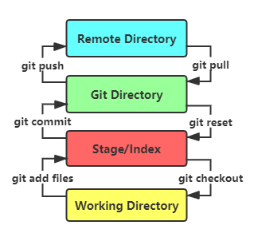
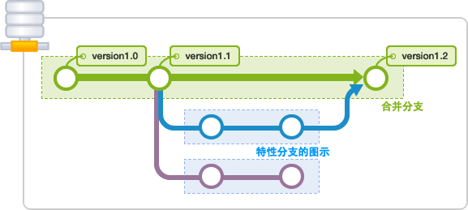

https://www.bbsmax.com/A/rV57bN3RJP/

# 一、版本控制

## 1.1 版本控制简介

版本控制（Revision control）是一种在开发的过程中用于管理我们对文件、目录或工程等内容的修改历史，方便查看更改历史记录，备份以便恢复以前的版本的软件工程技术。版本控制的优势在于：

- 实现跨区域**多人协同开发**
- 追踪和记载一个或者多个文件的历史记录
- 组织和保护源代码及文档
- 统计工作量
- 并行开发、提高开发效率
- 跟踪记录整个软件的开发过程
- 减轻开发人员的负担，节省时间，同时降低人为错误

主流版本控制器：

- **Git**
- **SVN**
- CVS
- VSS
- TFS
- Visual Studio Online

## 1.2 版本控制分类

1. 本地版本控制：记录文件每次的更新，对版本做快照，适合个人使用，如RCS。

2. 集中版本控制（代表：SVN）

   所有的版本数据都保存在服务器上，协同开发者从服务器上同步更新或上传自己的修改。用户本地只有之前同步的版本，不连网状态下，无法查看历史版本，也无法切换版本验证问题，或在不同分支工作。由于所有数据都保存在单一的服务器上，服务器损坏将丢失所有数据，因此需要定期备份。代表产品：SVN、CVS、VSS 。

3. 分布式版本控制（代表：Git）

   所有版本信息仓库全部同步到本地，用户可以在本地查看所有版本历史，离线时可在本地提交（工作），待连网时再push到相应的服务器或其他用户。由于所有用户都保存有完整的版本数据，因此只需一个用户的设备完好就可以恢复所有的数据（但增加了本地存储占用）。 

# 二、Git环境配置

1. 下载：
   - 官网： https://git-scm.com/ 
   - 淘宝镜像（Windows版）： http://npm.taobao.org/mirrors/git-for-windows/ 

2. 启动Git：
   - Git Bash：类Unix风格命令行
   - Git CMD：类Windows命令行
   - Git GUI：图形界面Git

3. Git配置：
   - 查看配置：` git config -l`
   - 查看系统配置：`git config --system -l`
   - 查看当前用户配置：`git config --global -l`

4. Git配置文件：

   - 系统级：`E:\App\Git\etc\gitconfig`（安装目录下）

   - 用户级：`‪C:\Users\shinrin\.gitconfig`（当前用户目录下）

     ```
     [user]
     	email = 714092359@qq.com
     	name = jonahcoding
     ```

5. 设置用户名和邮箱：

   - 全局设置：

     ```
     git config --global user.name "jonahcoding"  #名称
     git config --global user.email 714092359@qq.com   #邮箱
     ```

   - 单个项目配置：

     ```
     #项目目录下
     git config user.name "jonahcoding"  #名称
     git config user.email 714092359@qq.com   #邮箱
     ```


# 三、Git基本理论

## 3.1 工作区域

**本地工作区域：**工作目录（Working Directory）、暂存区(Stage/Index)、资源库(Repository或Git Directory)。

- Workspace：工作区，存放项目代码
- Index / Stage：暂存区，临时存放改动，实为文件，保存待提交的文件列表信息。
- Repository：仓库区（或本地仓库），存放安全数据，包含所有版本。其中HEAD指向最新版本。

**远程工作区域：**远程git仓库(Remote Directory)。

- Remote：远程仓库，托管代码的服务器，用于远程数据交换 。

**工作区域的转换：**



**本地工作区域详解：**


- Directory：使用Git管理的目录，即仓库，包含工作空间和Git的管理空间。
- WorkSpace：需要通过Git进行版本控制的目录和文件（组成工作空间）。
- .git：存放Git管理信息的目录，初始化仓库时自动创建。
- Index/Stage：暂存区，待提交更新区，在提交进入repo之前，存放（待提交的）更新。
- Local Repo：本地仓库，存放在本地的版本库；HEAD指向当前的开发分支（branch）。
- Stash：隐藏，一个工作状态保存栈，用于保存/恢复WorkSpace中的临时状态。

## 3.2 工作流程

工作流程：

1. 在工作目录中添加、修改文件。（文件状态：已修改（modified））

2. 将需要进行版本管理的文件放入暂存区域。（文件状态：已暂存（staged））

3. 将暂存区域的文件提交到git仓库。（文件状态：已提交(committed) ）

   

# 四、Git的使用

1. 创建工作目录（Workspace）：由Git管理的文件夹（或项目目录，可为空，建议不含中文）。

2. 常用命令：

   

   命令解释：

   | 命令         | 解释                                 |
   | ------------ | ------------------------------------ |
   | git add      | 添加到暂存区                         |
   | git commit   | 提交到本地仓库                       |
   | git checkout | 放弃修改（未使用git add缓存代码时）  |
   | git push     | 推送到远程仓库                       |
   | git fetch    | 拉取远程仓库内容（不与本地分支合并） |
   | git pull     | 拉取远程仓库内容并与本地分支合并     |
   | git clone    | 克隆远程仓库                         |

3. 本地仓库搭建

   1. 创建新的仓库（本地）

      ```
      # 在当前目录新建一个Git代码库
      $ git init
      ```

   2. 克隆远程仓库

      ```
      # 克隆项目及其版本信息
      $ git clone [url]
      ```

# 五、Git文件操作

**文件的状态（4种）**

- Untracked：未跟踪，此文件在文件夹中但未加入git库，不参与版本控制。

  - 执行`git add`加入暂存区，文件状态变为Staged。

- Unmodify：未修改，即版本库中的文件快照内容与当前一致。

  - 如文件被修改，文件状态变为Modified。
  - 执行`git rm`移出版本库，文件状态变为Untracked。

- Modified：文件已修改。

  - 执行`git add`加入暂存区，文件状态变为Staged。
  - 执行`git checkout`丢弃修改，文件状态回退为unmodify状态。

- Staged：暂存状态。

  - 执行`git commit`将修改同步到版本库中，文件状态变为Unmodify状态。
  - 执行`git reset HEAD filename`取消暂存，文件状态回退为Modified状态。

  

**查看文件状态**

```
#查看指定文件状态
git status [filename]

#查看所有文件状态
git status
```

**忽略文件**

过滤特定文件不对其使用版本控制，如数据库文件，临时文件，设计文件等。

在主目录下建立".gitignore"文件，此文件有如下规则：

1. 文件中的空行或以井号（#）开始的行将被忽略。
2. 可使用Linux通配符。例如：星号（*）代表任意多个字符，问号（？）代表一个字符，方括号（[abc]）代表可选字符范围，大括号（{string1,string2,...}）代表可选的字符串等。
3. 如果名称的最前面有一个感叹号（!），表示例外规则，将不被忽略。
4. 如果名称的最前面是一个路径分隔符（/），表示要忽略的文件在此目录下，而子目录中的文件不忽略。
5. 如果名称的最后面是一个路径分隔符（/），表示要忽略的是此目录下该名称的子目录，而非文件（默认文件或目录都忽略）。

```
#为注释
*.txt        #忽略所有.txt结尾的文件。
!lib.txt     #忽略除lib.txt外的其他文件。
build/       #忽略build目录下的所有目录和文件。
doc/*.txt    #忽略doc目录下以.txt结尾的文件（不包含子目录）。
```

# 六、Git分支

分支，即平行世界线。参考命运石之门。



常用命令：

```
# 列出所有本地分支
git branch

# 列出所有远程分支
git branch -r

# 新建一个分支，但依然停留在当前分支
git branch [branch-name]

# 新建一个分支，并切换到该分支
git checkout -b [branch]

# 合并指定分支到当前分支
$ git merge [branch]

# 删除分支
$ git branch -d [branch-name]

# 删除远程分支
$ git push origin --delete [branch-name]
$ git branch -dr [remote/branch]
```

# 七、Gitee/Github使用

1. 本地Git生成SSH（可选提交密码，回车为空）

   ```
   ssh-keygen -t rsa -C "邮箱"
   # 生成的SSH文件存放在C:/Users/用户/.ssh目录下
   # id_rsa为私钥
   # id_rsa.pub为公钥
   ```

2. Github/Gitee配置SSH

   - 账户 ==> setting ==> SSH and GPGkeys ==> New SSH key ==> 粘贴公钥Key

3. 测试SSH连接

   ```
   ssh -T git@github.com
   # 命令行：yes 回车 提示Successfully
   # Github/Gitee：配置页面SSH为绿色
   ```

4. 新建仓库

   - 本地仓库：`git init`
   - 远程仓库：Gitee/Github网站新建仓库（使用`git clone [url]`克隆到本地）。

5. 添加文件到暂存区

   ```
   git add filename
   ```

6. 提交文件到本地仓库

   ```
   git commit -m '注释'
   ```

7. 推送到远程仓库

   ```
   git push -u origin master
   ```

8. 从远程仓库拉取

   ```
   git pull
   ```

# 八、Git与IDEA

IDEA中集成了Git。

1. 创建项目

   ```
   1. VCS - > Import into Version Control -> Create Git Repository
   # 指定本地仓库的位置：项目源代码同级目录。
   ```

2. 提交

   右键项目 ==> Git ==> Commit Directory  ==> 填写Commit Message ==> Commit / Commit and Push

   - 如选择Commit and Push项提交 ==> Push Commits ==> Define remote ==> 添加远程仓库地址

3. 从远程Git获取项目源码

   IDEA启动页 ==> Check out from Version Control ==> Git ==> 填写远程仓库地址&本地仓库目录

4. 修改部分源码并提交到远程仓库

   同3，右键项目 ==> Git ==> Add ==> Commit ==> Push 

5. 从远程仓库获取其它用户的提交

   右键项目 ==> Git ==> Add ==> Repository ==> Pull

   - Fetch和Pull的区别：Fetch拉取后对比修改决定是否合并，如遵守执行**修改前先更新**可直接Pull。

6. 创建分支

   场景： 临时修改bug、开发不确定是否加入的功能等 。

   右键项目 ==> Git ==> Repository ==> Branches ==> New Branch（新建分支需要提交到远程）

   - 界面右下角显示多个分支，右键分支 ==> Checkout 以切换。

7. 提交分支到远程Git仓库

   切换到待提交的分支 ==> 右键项目 ==> Git ==> Repository ==> Push ==> Push Commits ==> Push

8. 获取其它用户提交的分支

   右键项目 ==> Git ==> Repository ==> Pull==> Pull Changes ==> 刷新按钮 ==> Pull

    ==> 界面右下角点击新的分支 ==>  Checkout as new local branch （创建本地分支）

   - 如需合并分支：Pull Changes ==> 刷新按钮 ==> 勾选分支 ==> Pull

9. 分支合并到主干

   切换到master分支 ==> Git ==> Repository ==> Merge Changes ==> 勾选要合并的分支 ==> Merge


