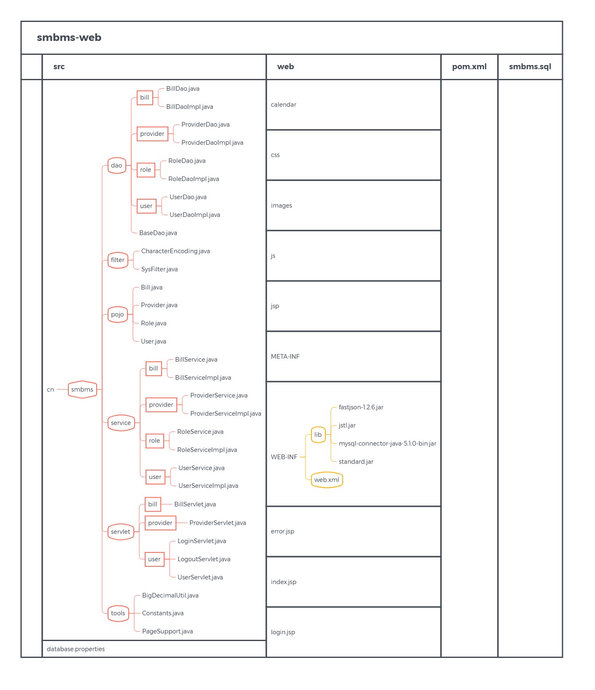

数据库配置文件

database.properties

```properties
driver=com.mysql.jdbc.Driver
#在和mysql传递数据的过程中，使用unicode编码格式，并且字符集设置为utf-8
url=jdbc:mysql://127.0.0.1:3306/smbms?useUnicode=true&characterEncoding=utf-8
user=root
password=123456
```


src/cn/smbms/pojo：数据库表的映射（实体）类

- Bill.java
- Provider.java
- Role.java
- User.java

src/cn/smbms/dao：数据访问层，调用BaseDao类。

- BaseDao.java

  > 底层数据库操作，类加载时init函数初始化（从配置文件读取）数据库连接参数（driver、url、user、password）。
  >
  > 提供方法：连接数据库、查询数据库、更新数据库、释放资源方法。

- bill
  
  - 接口、实现类
- provider
  
  - 接口、实现类
- role
  
  -  接口、实现类
- user
  
  - 接口、实现类

src/cn/smbms/service：业务处理层，调用DAO层接口。

- bill
  - 接口、实现类
- provider
  - 接口、实现类
- role
  - 接口、实现类
- user
  - 接口、实现类

src/cn/smbms/servlet：属于控制层。

- bill
- provider
- user

src/cn/smbms/filter：过滤器

src/cn/smbms/tools：