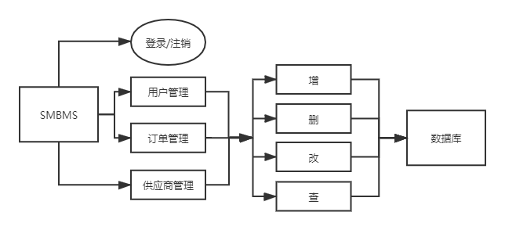
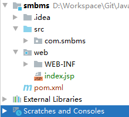
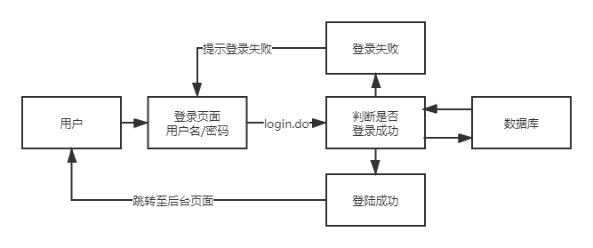

# 超市订单管理系统（Servlet）

## 一、前期准备

### 1.1 系统架构



### 1.2 数据库

数据库：smbms（超市管理系统）

```mysql
CREATE DATABASE `smbms`;
USE `smbms`;
```

- 表：
  - smbms_address（配送地址）
  - smbms_bill（订单）
  - smbms_provider（供应商）
  - smbms_role（管理员）
  - smbms_user（用户）

### 1.3 项目搭建

1. 新建Maven项目（web模板），项目名：smbms

2. 调整项目结构

   - **标记Web为指定目录**：Project Structure/Project Settings/Modules/项目名-Web
   - 标记src为Sources Root。
   - 如图：

   

   

3. 配置Tomcat并测试

   - 地址：http://localhost:8080/smbms/

4. 配置pom.xml（导包）

   ```xml
   <!--  
   ==> servlet-api
   ==> javax.servlet.jsp-api
   ==> jstl-api
   ==> mysql-connector-java
   ==> standard
   ==> junit
   ==> junit-jupiter
   其中junit-jupiter：
   -->
       <dependency>
         <groupId>org.junit.jupiter</groupId>
         <artifactId>junit-jupiter</artifactId>
         <version>RELEASE</version>
         <scope>compile</scope>
       </dependency>
   ```

5. 创建项目包结构

   - 路径：src/com/smbms/
   - 新建包：dao、filter、pojo、service、servlet、tools

6. 编写实体类（数据库表）

   - 路径：src/com/smbms/pojo/
   - Bill、Provider、Role、User

   - ORM映射：表-类映射

7. 编写公共基础类

   - 数据库配置文件

     - 文件：src/database.properties

     ```properties
     driver=com.mysql.jdbc.Driver
     #unicode编码格式，字符集为utf-8
     url=jdbc:mysql://127.0.0.1:3306/smbms?useUnicode=true&characterEncoding=utf-8
     user=root
     password=123456
     ```

   - 数据库操作类（dao）

     - 文件：src/com/smbms/dao/BaseDao.java

   - 字符编码过滤器（filter）

     - 文件：src/com/smbms/filter/CharacterEncodingFilter.java

8. 导入静态资源

   - 路径：web/
   - calendar、css、images、js、jsp文件夹。


## 二、登录流程实现



1. 导入前端登录页面

   - 文件：web/login.jsp

2. 设置首页

   - 文件：web\WEB-INF\web.xml

   ```xml
   <!--设置登录页-->
     <welcome-file-list>
       <welcome-file>login.jsp</welcome-file>
     </welcome-file-list>
   ```

3. 编写DAO层登录用户登录的接口

   - 文件：src\com\smbms\dao\user\UserDao.java

   ```java
   public interface UserDao {
       //得到要登录的用户
       public User getLoginUser(Connection connection,String userCode) throws SQLException;
   }
   ```

4. 编写DAO层登录用户登录的接口的实现类

   - 文件：src\com\smbms\dao\user\UserDaoImpl.java

   ```java
   public class UserDaoImpl implements UserDao{
       public User getLoginUser(Connection connection, String userCode) throws SQLException {
           PreparedStatement pstm = null;
           ResultSet rs = null;
           User user = null;
           if (connection == null){
               String sql = "select * from smbms_user where userCOde=?";
               Object[] params = {userCode};
   
               rs = BaseDao.execute(connection,pstm,rs,sql,params);
               if (rs.next()){
                   user = new User();
                   user.setId(rs.getInt("id"));
                   user.setUserCode(rs.getString("userCode"));
                   user.setUserName(rs.getString("userName"));
                   user.setUserPassword(rs.getString("userPassword"));
                   user.setGender(rs.getInt("gender"));
                   user.setBirthday(rs.getDate("birthday"));
                   user.setPhone(rs.getString("phone"));
                   user.setAddress(rs.getString("address"));
                   user.setUserRole(rs.getInt("userRole"));
                   user.setCreatedBy(rs.getInt("createdBy"));
                   user.setCreationDate(rs.getTimestamp("creationDate"));
                   user.setModifyBy(rs.getInt("modifyBy"));
                   user.setModifyDate(rs.getTimestamp("modifyDate"));
               }
               BaseDao.closeResource(null,pstm,rs);
           }
           return user;
       }
   }
   ```

5. 业务层接口

   ```java
   public interface UserService {
       //用户登录
       public User login(String userCode, String password);
   }
   ```

6. 业务层实现类

   ```java
   package com.shinrin.service.user;
   
   import com.shinrin.dao.BaseDao;
   import com.shinrin.dao.user.UserDao;
   import com.shinrin.dao.user.UserDaoImpl;
   import com.shinrin.pojo.User;
   import org.junit.jupiter.api.Test;
   
   import java.sql.Connection;
   
   public class UserServiceImpl implements UserService {
   
       //业务层都会调用DAO层，故引入DAO层
       private UserDao userDao;
       private UserServiceImpl(){
           userDao = new UserDaoImpl();
       }
   
       public User login(String userCode, String password) {
           Connection connection = null;
           User user = null;
   
           try {
               connection = BaseDao.getConnection();
               //通过业务层调用对应的具体的数据库操作
               user = userDao.getLoginUser(connection, userCode);
           }catch (Exception e){
               e.printStackTrace();
           }finally {
               BaseDao.closeResource(connection,null,null);
           }
           return user;
       }
   
       @Test
       //此处报错com.mysql.jdbc.exceptions.jdbc4.CommunicationsException: Communications link failure
       //原因未知。
       public void test(){
           UserServiceImpl userService = new UserServiceImpl();
           User admin = userService.login("admin", "1234567");
           System.out.println(admin.getUserPassword());
       }
   }
   ```

   