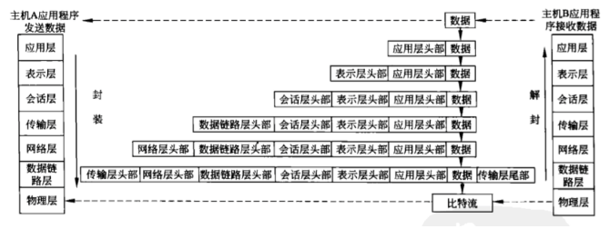
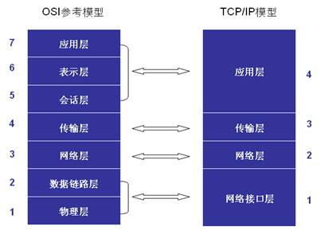
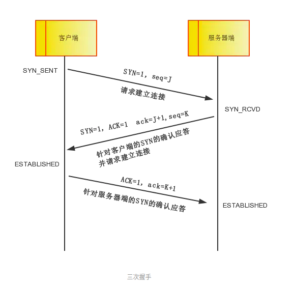
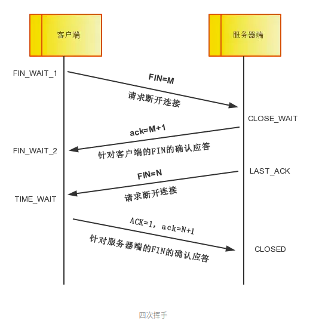

# 一、OSI七层模型

> OSI（Open System Interconnect，开放式系统互联）。
>
> 由ISO（国际标准化组织）提出的网络互联模型。
>
> 定义了网络互联的7层框架：物理层、数据链路层、网络层、传输层、会话层、表示层、应用层。

OSI网络互联模型分层的必要性：

> 将开放系统中信息交换的问题分解到具体的层级之中，各层可以对各自的功能独自做出修改和扩展，体现了解耦的思想。

1. 物理层：定义物理设备标准，通过传输介质（光纤、电缆、双绞线）以光、电信号（数模转换）传输比特流。
2. 数据链路层：定义格式化数据以帧为单位传输，控制对物理介质的访问，提供检错和纠正。
3. 网络层：负责两个主机系统之间数据的链路寻址和路由选择，主要协议：IP、ICMP。
4. 传输层：定义数据传输的协议和端口号，提供端口到端口的可靠数据传输，主要协议：TCP、UDP。
5. 会话层：负责建立、管理和终止主机之间的通信连接。
6. 表示层：负责数据格式的转换（应用层的数据格式与网络传输的数据格式），数据的压缩解压，加密解密。
7. 应用层：为应用程序（e-mail、FTP）提供SPI（Service Provider Interface）应用程序接口（网络服务）。

# 二、TCP/IP四层模型

TCP/IP模型分为：网络接口层（链路层）、网络层、传输层和应用层。

OSI模型与TCP/IP模型的对应关系：

​           

**TCP/IP协议族**

|            |                                                           |
| ---------- | --------------------------------------------------------- |
| 应用层     | HTPP、HTTPS、SMTP、POP3、IMAP、DNS、FTP、SFTP、Telnet/SSH |
| 传输层     | TCP、UDP                                                  |
| 网络层     | IP、ICMP、IGMP                                            |
| 网络接口层 | ARP、RARP                                                 |

------

HTTP（超文本传输协议）

> 用于Web浏览器和Web服务器之间传递数据的协议，HTTP协议以明文的方式发送内容，不提供任何方式的数据加密 （不安全）。

HTTPS（超文本传输安全协议）

> 在HTTP协议上加入了SSL协议，SSL依靠证书来验证服务器的身份，SSL协议作用于传输层协议和各种应用层协议之间。 

SMTP（简单邮件传输协议）

> 用于从源地址到目标地址传输邮件的协议(发送邮件)。

 DNS（域名系统）

>  可以看做是一个域名与IP地址相互映射的分布式数据库；浏览器输入域名后查询对应的IP地址，进而访问服务器。

FTP（文件传输协议）

> 将文件从一台主机传输到另一台主机，不为文件提供加密措施（不安全）。

SFTP（安全文件传输协议）

>  当使用SFTP登录到目标主机后，可以使用SFTP指定的命令进行数据传输， 并且传输的数据是加密过的。 

Telnet/SSH(Secure Shell)（远程登录协议）

> Telnet使用明文传输数据，并且没有提供数据加密措施（不安全）。 
>
> SSH协议提供了对数据的压缩和加密，并且SSH提供了对SFTP的支持。

------

TCP（传输控制协议）

> TCP协议是一种面向连接的，可靠的，基于字节流的传输协议。 
>
> TCP协议适用于对数据准确性和可靠性要求较高的应用，如文件传输等。

UDP协议（用户数据报协议）

> 与TCP协议不同，UDP协议并不保证数据传输的可靠性， 无论目标主机是否可通信，UDP都会发送数据。
>
> UDP适用于传输效率要求较高，允许一定数据丢失的应用，如语音，视频等。

# 三、TCP

## 3.1 TCP与UDP的主要区别

1. TCP基于连接，数据传输前需要做可靠性准备工作（三次握手）；UDP无连接，有数据即可发送。
2. TCP使用流量控制和拥塞控制等措施使传输更加可靠；UDP是不可靠传输。
3. TCP是面向流的数据模式(无边界)；UDP是面向报文的数据模式(有边界)。
4. TCP仅支持单播，点对点的数据传输；UDP不仅支持单播，还支持组播，广播。
5. TCP首部开销较大(最大60字节，最小20字节)；UDP首部开销较小(8字节)。

## 3.2 TCP三次握手

建立一个TCP连接时客户端和服务端总共需要发送3个数据包确认连接的建立。

|      |                |
| ---- | -------------- |
| SYN  | 请求连接标志位 |
| ACK  | 应答标志位     |
| seq  | 同步序列编号   |
| ack  | 确认序列号     |

1. 第一次握手

   > 客户端发送一个数据包给服务端。 该数据包的标志位SYN=1，表示客户端请求建立连接， 随机产生的序列号seq=J。 客户端进入SYN_SENT状态，等待服务端确认。

2. 第二次握手

   > 服务端收到客户端的数据包后，由标志位SYN=1判断客户端需要建立连接。于是响应一个数据包给客户端，该确认数据包的标志位SYN和标志位ACK都为1，确认序列号ack=J+1, 随机产生的序列号seq=K。服务端进入SYN_RCVD状态。

3. 第三次握手

   > 客户端收到服务端的数据包后，检查确认序列号ack是否为J+1，标志位ACK是否为1。 如果正确则将发送最后一个数据包给服务端。 该数据包的标志位ACK为1，确认序列号ack=J+1。 服务端收到后检查确认序列号ack是否为K+1,标志位ACK是否为1。 如果正确，则客户端和服务端都进入ESTABLISHED状态。

SYN Flood（SYN洪水、SYN洪泛）攻击

> 服务端向客户端返回一个确认的SYN-ACK包，但由于各种原因未接收到客户端的ACK包，此即半开放连接。
>
> 服务端需要耗费一定数量的系统内存来等待这个未决的连接，恶意者通过创建大量半开放连接来发动洪水攻击。

## 3.3 TCP四次挥手

断开连接时，客户端与服务端总共需要发送4个数据包确认连接的断开。

客户端或服务端任意一方都可以发送断开连接的请求。

1. 第一次挥手(假设客户端请求断开)

   > 客户端发送一个数据包给服务端，用于关闭Client到Server的数据传输。 数据包的标志位FIN=1，随机产生的序号seq=M，客户端进入FIN_WAIT_1状态。

2. 第二次挥手

   > 服务端收到客户端的断开请求后，将发送一个数据包响应给客户端。 该数据包的标志位ACK=1，确认序列号ack=M+1。 客户端收到后进入FIN_WAIT_2状态，服务端进入CLOSE_WAIT状态。

3. 第三次挥手

   > 服务端发送一个数据包给客户端，用于关闭服务端到客户端的数据传输。 数据包的标志位FIN=1，随机产生的序列号seq=N。 服务端进入LAST_ACK状态。

4. 第四次挥手

   > 客户端收到服务端的断开请求后，就可以关闭连接了。 于是发送最后一个数据包结束与服务端的连接，并进入TIME_WAIT状态。 最后一个数据包的标志位ACK=1，确认序列号ack=N+1。 服务端收到最后一个了数据包后，就关闭了连接，状态就为CLOSED， 如果服务端没有收到ACK,客户端可以重传。客户端等了一会儿， 最终没有收到响应，就代表服务端已经关闭连接了，客户端也就会关闭连接。

TIME_WAIT：主动关闭连接时形成，等待2MSL（约4分钟）时间，主要防止最后一个ACK丢失。

CLOSE_WAIT：被动关闭连接形成；系统忙于处理读、写操作，未将已收的FIN的连接进行close。

**1. 为什么需要 TIME_WAIT 状态？**

假设最终的ACK丢失，server将重发FIN，client必须维护TCP状态信息以便可以重发最终的ACK，否则会发送RST，结果server认为发生错误。TCP实现必须可靠地终止连接的两个方向(全双工关闭)，client必须进入 TIME_WAIT 状态，因为client可能面临重发最终ACK的情形。

**2. 为什么 TIME_WAIT 状态需要保持 2MSL 这么长的时间？**

如果 TIME_WAIT 状态保持时间不足够长(比如小于2MSL)，第一个连接就正常终止了。第二个拥有相同相关五元组的连接出现，而第一个连接的重复报文到达，干扰了第二个连接。TCP实现必须防止某个连接的重复报文在连接终止后出现，所以让TIME_WAIT状态保持时间足够长(2MSL)，连接相应方向上的TCP报文要么完全响应完毕，要么被 丢弃。建立第二个连接的时候，不会混淆。

**3. TCP为什么不是两次连接，而是三次握手？**

如果A与B两个进程通信，如果仅是两次连接。可能出现的一种情况就是：A发送完请报文以后，由于网络情况不好，出现了网络拥塞，即B延时很长时间后收到报文，即此时A将此报文认定为失效的报文。B收到报文后，会向A发起连接。此时两次握手完毕，B会认为已经建立了连接可以通信，B会一直等到A发送的连接请求，而A对失效的报文回复自然不会处理。依次会陷入B忙等的僵局，造成资源的浪费。

**4. 为什么建立连接协议是三次握手，而关闭连接却是四次握手呢？**

因为服务端的LISTEN状态下的SOCKET当收到SYN报文的建连请求后，它可以把ACK和SYN（ACK起应答作用，而SYN起同步作用）放在一个报文里来发送。但关闭连接时，当收到对方的FIN报文通知时，它仅仅表示对方没有数据发送给你了；但未必你所有的数据都全部发送给对方了，所以你可以未必会马上会关闭SOCKET,也即你可能还需要发送一些数据给对方之后，再发送FIN报文给对方来表示你同意现在可以关闭连接了，所以它这里的ACK报文和FIN报文多数情况下都是分开发送的。

**5.为什么TIME_WAIT状态还需要等2MSL后才能返回到CLOSED状态？**

虽然双方都同意关闭连接了，而且握手的4个报文也都协调和发送完毕，按理可以直接回到CLOSED状态（就好比从SYN_SEND状态到 ESTABLISH状态那样）；但是因为我们必须要假想网络是不可靠的，你无法保证你最后发送的ACK报文会一定被对方收到，因此对方处于 LAST_ACK状态下的SOCKET可能会因为超时未收到ACK报文，而重发FIN报文，所以这个TIME_WAIT状态的作用就是用来重发可能丢失的 ACK报文。

## 3.4 TCP如何保证可靠性传输？

TCP采用校验和（16位），确认应答ACK与序列号（32位）， 拥塞控制（拥塞窗口），流量控制（滑动窗口），超时重传， 连接管理(三次握手，四次回收)等机制保证传输的可靠性。

- 校验和(16位)

> 在数据传输过程中，将发送的数据段分成若干个16位的整数。 将这些整数加起来，并且前面的进位不能丢弃，补在后面，最后取反， 得到校验和。
>
> 发送方在发送数据之前计算校验和，并将校验和填充到TCP报文中， 而接收方收到数据后，对数据以同样的方式进行计算，求出校验和， 与发送方的进行比对。如果比较失败，接收方将丢弃数据包。

- 确认应答ACK和序列号(32位)

> 在TCP传输过程中，每次接收方收到数据后，都会对发送方进行应答， 也就是响应ACK报文，这个报文中有对应的确认序列号。

- 超时重传

> 在TCP传输时，由于确认应答和序号机制，当发送方发送完数据后， 会等待接收方的ACK报文，并解析判断ACK报文(一般来说ACK为seq+1)， 如果发送方一直没有等到接收方的ACK报文，那么将重新发送一遍数据。

- 连接管理

> 连接管理是TCP数据传输前和连接断开时的工作， 包括三次握手与四次挥手的过程。

- 流量控制(滑动窗口实现)

> TCP连接发送端和接收端都有一个缓冲区，如果发送端的发送数据过快， 导致接收端来不及处理数据，缓冲区就被填充满了，那么接下来的数据， 接收方就会丢弃数据，导致丢包等连锁反应产生。
>
> **TCP根据接收端的处理能力，来决定发送端的发送速度，这个机制就是流量控制。** **TCP的报文中，有一个16位的窗口字段， 窗口大小就是接收端计收数据缓冲区的剩余大小，这个数字越大， 代表接收端缓冲区的剩余空间越大。**
>
> 接收端在发送ACK确认报文时，会将自己当前的窗口大小填入， 这样发送方就会根据ACK报文里的窗口大小的值改变自己的发送速度。 如果接收方窗口大小的值为0，那么发送方将停止发送数据， 并定期的向接收端发送窗口探测数据，让接收端把窗口大小告诉发送端。

- 拥塞控制(拥塞窗口)

> 滑动窗口是接收端的使用的窗口大小，用来告诉发送端接收端的缓存大小， 从而可以控制发送端的发送速度。 而发送端发送的速度则是使用发送端的窗口来实现的。

## 3.5 TCP粘包和半包问题

在TCP传输数据时，客户端发送数据，实际上是把数据写入到了TCP的缓冲区中，此时可能产生粘包和半包。

> 假设客户端给服务端发送两条数据: "ABC"和"DEF"， 服务端这边的接受可能会有多种情况: 可能是一次性收到了这两条消息:"ABCDEF", 也有可能分批收到了消息:"ABC","DEF"或"AB","CD","EF"。

粘包：多次发送共用一个传输。

半包：一次发送占用多个传输。

粘包的主要原因：发送端发送的数据大小 < Socket缓冲区大小， 服务端一次性读取了Socket缓冲区数据。

半包的主要原因：发送端发送的数据大小 > Socket缓冲区大小， 服务端一次只读取一部分数据。

根本原因：TCP是面向字节流的协议，消息之间没有边界（不同于UDP）。

解决方法：

- 固定长度：为消息设定固定长度。（缺点：消息过小时浪费空间）
- 分隔符：为消息边界添加分隔符作为边界。（缺点：内容本身也有分隔符时，需要转义，整体扫描、效率低）
- 添加数据长度字段：为消息添加Length字段，存储消息的长度。如：Http协议的报文字段Content-Length。

*注：为什么UDP不会粘包？*

> TCP协议是面向流的协议，UDP是面向消息的协议。
> UDP段都是一条消息，应用程序必须以消息为单位提取数据，不能一次提取任意字节的数据。
> UDP具有保护消息边界，在每个UDP包中就有了消息头（消息来源地址，端口等信息）。

## 3.6 TCP Keeplive

**作用** 1. 探测连接的对端是否存活 2. 防止中间设备因超时删除连接相关的连接表

定义一个时间段，在这个时间段内，如果没有任何连接相关的活动，TCP 保活机制会开始作用，每隔一个时间间隔，发送一个探测报文，该探测报文包含的数据非常少，如果连续几个探测报文都没有得到响应，则认为当前的 TCP 连接已经死亡，系统内核将错误信息通知给上层应用程序

上述的可定义变量，分别被称为保活时间、保活时间间隔和保活探测次数，默认设置是 7200 秒（2 小时）、75 秒和 9 次探测。

**如果开启了 TCP 保活，需要考虑以下几种情况：**

1. 第一种，对端程序是正常工作的。当 TCP 保活的探测报文发送给对端, 对端会正常响应，这样 TCP 保活时间会被重置，等待下一个 TCP 保活时间的到来。
2. 第二种，对端程序崩溃并重启。当 TCP 保活的探测报文发送给对端后，对端是可以响应的，但由于没有该连接的有效信息，会产生一个 RST 报文，这样很快就会发现 TCP 连接已经被重置。
3. 第三种，是对端程序崩溃，或对端由于其他原因导致报文不可达。当 TCP 保活的探测报文发送给对端后，石沉大海，没有响应，连续几次，达到保活探测次数后，TCP 会报告该 TCP 连接已经死亡。

**问题：**

1. 在短暂的故障期间，Keepalive设置不合理时可能会因为短暂的网络波动而断开健康的TCP连接
2. 需要消耗额外的宽带和流量
3. 在以流量计费的互联网环境中增加了费用开销

HTTP协议的Keep-Alive意图在于TCP连接复用，同一个连接上串行方式传递请求-响应数据；TCP的Keepalive机制意图在于探测连接的对端是否存活。

# 三、HTTP

## 3.1 HTTP协议的特点

- 无状态：HTTP协议不对请求和响应之间的通信状态进行保存，对于发送过的请求和响应的结果都不做持久化处理。即每个请求都独立，后续请求使用前面的信息时需要重传，但可能导致后续连接的数据较大（通过Cookie和Session保存用户的状态信息和数据来解决该问题）。
- 无连接：限制每次TCP连接只处理一个请求，服务器处理完客户的请求，并收到客户端应答后即断开连接（优点：节省传输时间；缺点：浪费资源、效率低）。
- 支持C/S架构及B/S架构，请求由客户端发出，服务端处理并返回请求的结果。
- 灵活： HTTP允许传输任意类型的数据对象。正在传输的类型由Content-Type加以标记。 

从HTTP/1.1开始支持Keep-Alive功能， **Keep-Alive使得客户端与服务端的连接持续有效**， 当客户端对服务端有多个请求时，都会使用这一条连接。 当超过Keep-Alive规定的时间，或者出现其他意外的情况时， 客户端与服务端的连接才会被断开。

## 3.2 Cookie和Session的区别

**Cookie是在客户端保存用户信息的一种机制，用于记录用户的一些状态信息。 每一次客户端向服务端发出请求，都会携带Cookie信息。**

**Session是在服务端保存用户信息的一种机制。 一个Session对应一个客户端，当客户端第一次请求服务端时， 客户端就会被分配一个唯一SessionId，该SessionId依赖于Cookie，被存储在客户端。** 因为SessionId采用Cookie保存，所以每次客户端请求服务端， 也都会携带该SessionId，这样，服务端就能根据SessionId识别客户端身份。

注：没有Cookie仍然可以实现Session

> Session将SessionId保存在客户端的Cookie中，Cookie作为一种客户端保存请求状态的机制，可通过其它机制实现，如LocalStorage / SessionStorage也可以存储。

重定向与转发的区别

1. 转发是服务端行为，客户端无法感知；重定向是客户端行为。
2. 转发属于一次请求；重定向是客户端需要发送第二次请求。

GET和POST区别

GET和POST都是HTTP请求的一种方式，HTTP协议基于TCP协议，所以GET和POST都基于TCP协议。

所以区别到底是什么啊？

