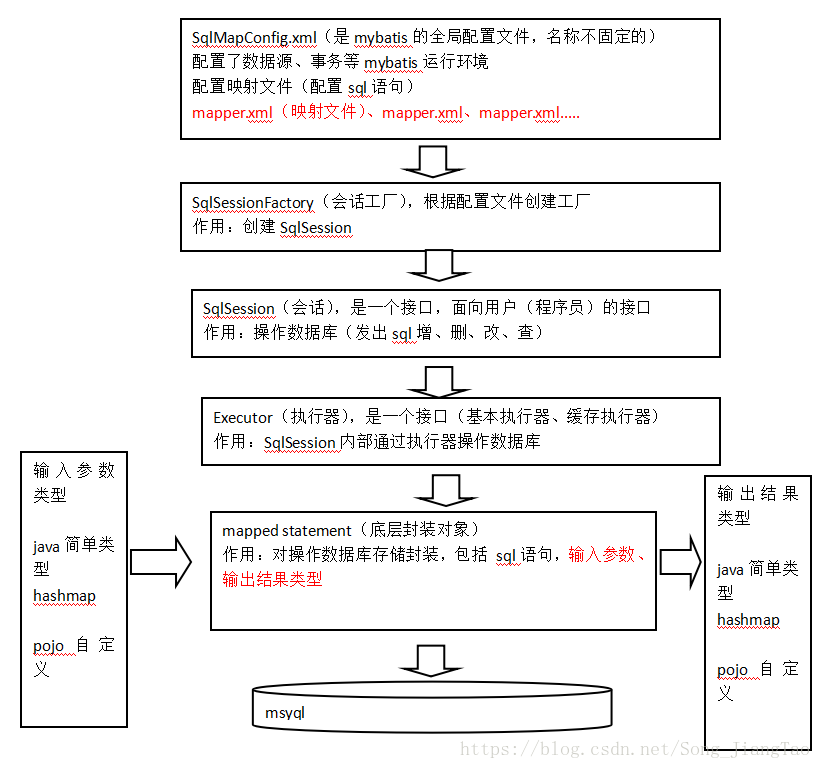

# 一、JDBC回顾

## 1.1 JDBC编程步骤

1. 加载数据库驱动
2. 创建并获取数据库连接（connection）
3. 创建JDBC statement对象
4. 设置SQL语句
5. 设置SQL语句参数（通过preparedStatement）
6. 通过statement执行SQL并获取结果（使用resultSet接收）
7. 对SQL执行结果进行解析操作
8. 释放资源（preparedStatement、resultSet、connection）

## 1.2 问题总结

1. 数据库连接使用时创建，不用时释放，频繁操作浪费资源，影响性能。
   - 优化：使用数据库连接池管理连接。
2. SQL语句硬编码在Java代码中，修改SQL语句后需要重新编译Java代码，不利于系统维护。
   - 优化：将SQL语句放置在xml配置文件中。
3. preparedStatement设置参数，对占位符位置和参数值硬编码在Java代码中，不易维护。
   - 优化：SQL语句、占位符及参数全部配置在xml中。
4. 从resultSet中遍历结果集数据时，存在硬编码，将获取表的字段进行硬编码，不易维护。
   - 优化：查询结果集自动映射为Java对象。

## 1.3 JDBC代码

```java
package com.shinrin.mybatis.jdbc;

//import java.sql.*;
import java.sql.Connection;
import java.sql.DriverManager;
import java.sql.PreparedStatement;
import java.sql.ResultSet;
import java.sql.SQLException;

public class JdbcTest {
    public static void main(String[] args) {
        //数据库连接
        Connection connection = null;
        //预编译的Statement（防止SQL注入攻击，提高数据库性能）
        PreparedStatement preparedStatement = null;
        //查询结果集
        ResultSet resultSet = null;
        try {
            //加载数据库驱动
            Class.forName("com.mysql.jdbc.Driver");
            //通过驱动管理类获取数据库连接
            connection =  DriverManager.getConnection("jdbc:mysql://localhost:3306/mybatis001?characterEncoding=utf-8", "root", "123");
            //定义sql语句（?表示占位符）
            String sql = "select * from user where username = ?";
            //获取预处理statement
            preparedStatement = connection.prepareStatement(sql);
            //设置参数，参数1为sql语句中参数的序号（从1开始），参数2为设置的参数值
            preparedStatement.setString(1, "王五");
            //向数据库发出sql执行查询（返回结果集）
            resultSet =  preparedStatement.executeQuery();
            //遍历查询结果集
            while(resultSet.next()){
                System.out.println(resultSet.getString("id")+"  "+resultSet.getString("username"));
            }
        } catch (Exception e) {
            e.printStackTrace();
        }finally{
            //释放资源
            if(resultSet!=null){
                try {
                    resultSet.close();
                } catch (SQLException e) {
                    // TODO Auto-generated catch block
                    e.printStackTrace();
                }
            }
            if(preparedStatement!=null){
                try {
                    preparedStatement.close();
                } catch (SQLException e) {
                    // TODO Auto-generated catch block
                    e.printStackTrace();
                }
            }
            if(connection!=null){
                try {
                    connection.close();
                } catch (SQLException e) {
                    // TODO Auto-generated catch block
                    e.printStackTrace();
                }
            }
        }
    }
}
```

# 二、MyBatis概述

## 2.1 MyBatis介绍

- mybatis是一个持久层的框架（封装JDBC），是apache下的顶级项目（开源）。

- mybatis托管到goolecode下，再后来托管到[github](https://github.com/mybatis/mybatis-3/releases)下。
- mybatis提供映射，可自由灵活生成（半自动化）满足需要sql语句。
  - **输入映射**：对preparedStatement中的输入参数自动进行映射。
  - **输出映射**：将查询结果集灵活映射成java对象。
- **MyBatis使用手册**：https://mybatis.org/mybatis-3/zh/getting-started.html

## 2.2 MyBatis原理（重点）



相关文件：

- 数据库表user的映射类：字段的get、set方法以及getString方法。

- 映射类User的Mapper（Dao）接口：声明操作User的方法。

- 映射文件：为指定Mapper的方法配置SQL语句。	

- MyBatis全局配置文件：MyBatis环境：配置数据源、事务。

# 三、MyBatis测试

**项目结构预览：**


## 3.1 搭建环境

### 3.1.1 数据库

```mysql
CREATE DATABASE `mybatis`;

USE `mybatis`;

CREATE TABLE `user`(
  `id` INT(20) NOT NULL PRIMARY KEY,
  `name` VARCHAR(30) DEFAULT NULL,
  `pwd` VARCHAR(30) DEFAULT NULL
)ENGINE=INNODB DEFAULT CHARSET=utf8;

INSERT INTO `user`(`id`,`name`,`pwd`) VALUES 
(1,'Teemo','123456'),
(2,'YaSuo','123456'),
(3,'Lux','123890')
```

### 3.1.2 新建项目

项目名称：MyBatis

导入Maven依赖：

```xml
    <!--导入Maven依赖-->
    <dependencies>
        <!--mysql-->
        <dependency>
            <groupId>mysql</groupId>
            <artifactId>mysql-connector-java</artifactId>
            <version>8.0.21</version>
        </dependency>
        <!--mybatis-->
        <dependency>
            <groupId>org.mybatis</groupId>
            <artifactId>mybatis</artifactId>
            <version>3.5.2</version>
        </dependency>
        <!--junit-->
        <dependency>
            <groupId>junit</groupId>
            <artifactId>junit</artifactId>
            <version>4.12</version>
            <scope>test</scope>
        </dependency>
    </dependencies>
```

## 3.2 创建子模块

### 3.2.1 MyBatis核心配置文件

- mybatis-config.xml

  ```xml
  <?xml version="1.0" encoding="UTF-8" ?>
  <!DOCTYPE configuration
          PUBLIC "-//mybatis.org//DTD Config 3.0//EN"
          "http://mybatis.org/dtd/mybatis-3-config.dtd">
  <configuration>
      <!-- 全局变量 -->
      <properties>
          <property name="driver" value="com.mysql.jdbc.Driver"/>
          <property name="url" value="jdbc:mysql://localhost:3306/mybatis"/>
          <property name="username" value="root"/>
          <property name="password" value="1704"/>
      </properties>
      <!--配置环境-->
      <environments default="development">
          <environment id="development">
              <transactionManager type="JDBC"/>
              <dataSource type="POOLED">
                  <property name="driver" value="${driver}"/>
                  <property name="url" value="${url}"/>
                  <property name="username" value="${username}"/>
                  <property name="password" value="${password}"/>
              </dataSource>
          </environment>
      </environments>
      <mappers>
          <!--注册Mapper配置文件-->
          <mapper resource="com/shinrin/mapper/BlogMapper.xml"/>
      </mappers>
  </configuration>
  ```

### 3.2.2 MyBatis工具类

- MybatisUtils.java

  ```java
  package com.shinrin.utils;
  
  import org.apache.ibatis.io.Resources;
  import org.apache.ibatis.session.SqlSession;
  import org.apache.ibatis.session.SqlSessionFactory;
  import org.apache.ibatis.session.SqlSessionFactoryBuilder;
  
  import java.io.IOException;
  import java.io.InputStream;
  
  public class MybatisUtils {
      private static SqlSessionFactory sqlSessionFactory;
      static{
          try {
              String resource = "mybatis-config.xml";
              InputStream is = Resources.getResourceAsStream(resource);
              sqlSessionFactory = new SqlSessionFactoryBuilder().build(is);
          } catch (IOException e) {
              e.printStackTrace();
          }
      }
  
      public static SqlSession getSqlSession(){
          return sqlSessionFactory.openSession();
      }
  }
  ```

### 3.2.3 User实体类

- User.java

  ```java
  package com.shinrin.pojo;
  
  //实体类
  public class User {
      private int id;
      private String name;
      private String pwd;
  
      public User() {
      }
  
      public User(int id, String name, String pwd) {
          this.id = id;
          this.name = name;
          this.pwd = pwd;
      }
  
      public int getId() {
          return id;
      }
  
      public void setId(int id) {
          this.id = id;
      }
  
      public String getName() {
          return name;
      }
  
      public void setName(String name) {
          this.name = name;
      }
  
      public String getPwd() {
          return pwd;
      }
  
      public void setPwd(String pwd) {
          this.pwd = pwd;
      }
  
      @Override
      public String toString() {
          return "User{" +
                  "id=" + id +
                  ", name='" + name + '\'' +
                  ", pwd='" + pwd + '\'' +
                  '}';
      }
  }
  ```

### 3.2.4 Dao接口

- UserDao.java

  ```java
  package com.shinrin.dao;
  
  import com.shinrin.pojo.User;
  
  import java.util.List;
  
  public interface UserDao {
      List<User> getUserList();
  }
  ```

### 3.2.5 接口实现类（Mapper配置文件）

- UserMapper.xml

- 注：接口实现类由原来的UserDaoImpl转变为Mapper配置文件

  ```xml
  <?xml version="1.0" encoding="UTF-8" ?>
  <!DOCTYPE mapper
          PUBLIC "-//mybatis.org//DTD Mapper 3.0//EN"
          "http://mybatis.org/dtd/mybatis-3-mapper.dtd">
  <mapper namespace="com.shinrin.dao.UserDao">
      <select id="getUserList" resultType="com.shinrin.pojo.User">
      select * from mybatis.user
    </select>
  </mapper>
  ```

### 3.2.6 注册Mapper配置文件

- mybatis-config.xml

  ```xml
      <mappers>
          <mapper resource="com/shinrin/dao/UserMapper.xml"/>
      </mappers>
  ```

## 3.3 测试

### 3.3.1 测试代码

UserDaoTest.java

```java
package com.shinrin.dao;

import com.shinrin.pojo.User;
import com.shinrin.utils.MybatisUtils;
import org.apache.ibatis.session.SqlSession;
import org.junit.Test;

import java.util.List;

public class UserTest {
    @Test
    public void Test(){
        //获取sqlSession
        SqlSession sqlSession = MybatisUtils.getSqlSession();
        //执行操作
        UserDao userDao = sqlSession.getMapper(UserDao.class);
        List<User> userList = userDao.getUserList();
        for (User user : userList) {
            System.out.println(user);
        }
        //关闭sqlSession
        sqlSession.close();
    }
}
```

### 3.3.2 可能出现的问题

- xml配置文件不存在：修改模块配置文件pom.xml

  ```xml
  
      <!--Maven默认生成项目时会过滤除java文件外的其他文件（配置文件）-->
      <!--此处设置保留xml配置文件-->
      <build>
          <resources>
              <resource>
                  <directory>src/main/java</directory>
                  <includes>
                      <include>**/*.properties</include>
                      <include>**/*.xml</include>
                  </includes>
                  <filtering>false</filtering>
              </resource>
              <resource>
                  <directory>src/main/resources</directory>
                  <includes>
                      <include>**/*.properties</include>
                      <include>**/*.xml</include>
                  </includes>
                  <filtering>false</filtering>
              </resource>
          </resources>
      </build>
  ```

- Mysql时区设置：mybatis-config.xml

  ```xml
          <property name="url" value="jdbc:mysql://localhost:3306/mybatis?serverTimezone=UTC"/>
  ```

- Mysql驱动升级：mybatis-config.xml

  ```xml
          <property name="driver" value="com.mysql.cj.jdbc.Driver"/>
  ```

### 3.3.3 测试结果


# 四、CRUD

## 4.1 namespace

- 确保namespace中的包名和Dao/Mapper接口的包名一致。（UserMapper.xml）

  ```xml
  <mapper namespace="com.shinrin.dao.UserDao">
  ```

## 4.2 select

选择，查询语句（UserMapper.xml）：

- id：对应namespace（接口）中的方法名。
- resultType：SQL语句执行的返回值类型。
- parameterType：参数类型。

### 4.2.1 编写接口

```java
    //通过ID获取用户信息
    User getUserById(int id);
```

### 4.2.2 编写Mapper中的SQL

```xml
    <select id="getUserById" parameterType="int" resultType="com.shinrin.pojo.User">
        select * from mybatis.user where id = #{id}
    </select>
```

### 4.2.3 测试

```java
    @Test
    public void getUserById(){
        SqlSession sqlSession = MybatisUtils.getSqlSession();
        UserDao mapper = sqlSession.getMapper(UserDao.class);
        User user = mapper.getUserById(1);
        System.out.println(user);
        sqlSession.close();
    }
```


## 4.3 insert

### 4.3.1 编写接口

```java
    //插入一条用户信息
    int addUser(User user);
```

### 4.3.2 编写Mapper中的SQL

```xml
    <insert id="addUser" parameterType="com.shinrin.pojo.User">
        insert into mybatis.user (id, name, pwd) values (#{id}, #{name}, #{pwd});
    </insert>
```

### 4.3.3 测试

**注：增删改，事务必须提交，才能生效！**

```java
    //增删改需要提交事务
    @Test
    public void addUser(){
        SqlSession sqlSession = MybatisUtils.getSqlSession();
        UserDao mapper = sqlSession.getMapper(UserDao.class);
        int res = mapper.addUser(new User(4, "LiQing", "654321"));
        if (res > 0) {
            System.out.println("插入数据成功！");
        }
        sqlSession.commit();
        sqlSession.close();
    }
```

## 4.4 update

### 4.4.1 编写接口

```java
    //修改用户
    int updateUser(User user);
```

### 4.4.2 编写Mapper中的SQL

```xml
    <update id="updateUser" parameterType="com.shinrin.pojo.User" >
        update mybatis.user set name = #{name},pwd = #{pwd} where id = #{id};
    </update>
```

### 4.4.3 测试

```java
    @Test
    public void updateUser(){
        SqlSession sqlSession = MybatisUtils.getSqlSession();
        UserDao mapper = sqlSession.getMapper(UserDao.class);
        int res = mapper.updateUser(new User(4,"Jinx","987654"));
        if (res > 0) {
            System.out.println("修改数据成功！");
        }
        sqlSession.commit();
        sqlSession.close();
    }
```

## 4.5 delete

### 4.5.1 编写接口

```java
    //删除用户
    int deleteUser(int id);
```

### 4.5.2 编写Mapper中的SQL

```xml
    <delete id="deleteUser" parameterType="int">
        delete from mybatis.user where id = #{id};
    </delete>
```

### 4.5.3 测试

```java
    @Test
    public void deleteUser(){
        SqlSession sqlSession = MybatisUtils.getSqlSession();
        UserDao mapper = sqlSession.getMapper(UserDao.class);
        int res = mapper.deleteUser(4);
        if (res > 0) {
            System.out.println("删除数据成功！");
        }
        sqlSession.commit();
        sqlSession.close();
    }
```

# 五、Map和模糊查询

## 5.1 Map

**使用情景：实体类、数据库表的字段或参数过多时使用Map。**

- ***Map传递参数：sql中取key。***【parameterType="map"】

- ***对象传递参数：sql中取属性。***【parameterType="Object"】
- 仅一个基本数据类型参数时，可在sql中直接取到。

### 5.1.1 接口

```java
    //Map
    int addUser2(Map<String,Object> map);
```

### 5.1.2 Mapper

```xml
    <insert id="addUser2" parameterType="map">
        insert into mybatis.user (id, pwd) values (#{userid}, #{password});
    </insert>
```

### 5.1.3 测试

```java
    @Test
    public void addUser2(){
        SqlSession sqlSession = MybatisUtils.getSqlSession();
        UserDao mapper = sqlSession.getMapper(UserDao.class);
        HashMap<String, Object> map = new HashMap<String, Object>();
        map.put("userid", 4);
        map.put("password", 142857);
        int res = mapper.addUser2(map);
        if (res > 0) {
            System.out.println("插入数据成功！");
        }
        sqlSession.commit();
        sqlSession.close();
    }
```

## 5.2 模糊查询

### 5.2.1 接口

```java
    //模糊查询
    List<User> getUserLike(String value);
```

### 5.2.2 Mapper

```xml
    <select id="getUserLike" parameterType="String" resultType="com.shinrin.pojo.User">
        select * from mybatis.user where name like #{values}
    </select>
```

### 5.2.3 测试

```java
    //模糊查询
    @Test
    public void getUserLike(){
        SqlSession sqlSession = MybatisUtils.getSqlSession();
        UserDao mapper = sqlSession.getMapper(UserDao.class);

        List<User> userList = mapper.getUserLike("%e%");
        for (User user : userList) {
            System.out.println(user);
        }
        //关闭sqlSession
        sqlSession.close();
    }
```

### 5.2.4 总结

- java代码中使用通配符（安全）
  - sql：```select * from mybatis.user where name like #{values}```
  - Java代码：```List<User> userList = mapper.getUserLike("%e%");```

- sql中使用通配符（存在SQL注入风险）
  - sql：```select * from mybatis.user where name like "%"#{value}"%"```
  - Java代码：```List<User> userList = mapper.getUserLike("e");```

