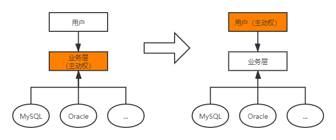

# 一、Spring简介

Spring理念：使现有技术更加容易使用，本身是一个大杂烩。

- SSH：Struct2+Spring+Hibernate
- SSM：SpringMVC+Spring+MyBatis

官网： https://spring.io/projects/spring-framework#overview

官网下载：https://repo.spring.io/release/org/springframework/spring/

Github：https://github.com/spring-projects/spring-framework

[Spring Web MVC](https://mvnrepository.com/artifact/org.springframework/spring-webmvc) **»** [5.2.5.RELEASE](https://mvnrepository.com/artifact/org.springframework/spring-webmvc/5.2.5.RELEASE)

```xml
<!-- https://mvnrepository.com/artifact/org.springframework/spring-webmvc -->
<dependency>
    <groupId>org.springframework</groupId>
    <artifactId>spring-webmvc</artifactId>
    <version>5.2.5.RELEASE</version>
</dependency>

<!-- https://mvnrepository.com/artifact/org.springframework/spring-jdbc -->
<dependency>
    <groupId>org.springframework</groupId>
    <artifactId>spring-jdbc</artifactId>
    <version>5.2.3.RELEASE</version>
</dependency>
```

- Spring是开源的免费的容器。
- Spring是轻量级的，非入侵式的。
- 控制反转（IOC），面向切面编程（AOP）。
- 支持事务处理，对框架整合的支持。

**总结：Spring是一个轻量级的控制反转（IOC）和面向切面编程（AOP）的的框架。**

# 二、IOC理论推导

1. UserDao接口

   ```java
   public interface UserDao {
       void getUser();
   }
   ```

2. UserDaoImp实现类

   ```java
   public class UserDaoImpl implements UserDao{
       public void getUser() {
           System.out.println("默认获取用户的数据！");
       }
   }
   ```

3. UserService业务接口

   ```java
   public interface UserService {
       void getUser();
   }
   ```

4. UserServiceImp业务接口实现类

   ```java
   public class UserServiceImpl implements UserService{
   
       private UserDao userDao;
   
       //以往方式：需求改变，需要在此修改源码
       //private UserDao userDao = new UserDaoImpl();
       //private UserDao userDao = new UserDaoMysqlImpl();
       //private UserDao userDao = new UserDaoOracleImpl();
   
       //注入方式：通过set接口实现
       public void setUserDao(UserDao userDao){
           this.userDao = userDao;
       }
   
       public void getUser() {
           userDao.getUser();
       }
   }
   ```

**存在的问题：用户需求可能影响原来的代码！**

**解决方案：使用一个set接口实现**

```java
    private UserDao userDao;

    //以往方式：需求改变，需要在此修改源码
    //private UserDao userDao = new UserDaoImpl();
    //private UserDao userDao = new UserDaoMysqlImpl();
    //private UserDao userDao = new UserDaoOracleImpl();

    //注入方式：利用set进行动摇实现值得注入
    public void setUserDao(UserDao userDao){
        this.userDao = userDao;
    }
```

- 以往由程序主动创建对象，控制权在程序员手中。
- 使用set后，程序不再有主动性，变成了被动接收对象。

从本质上解决了问题，程序员不再管理对象的创建，系统的耦合度大幅降低，以更加专注于业务的实现，此即IOC原型！



IOC的本质：

控制反转IoC（Inversion of Control）是一种设计思想，DI（依赖注入）是现在IoC的一种方法，。对象的创建由程序控制，在控制反转后将对象的创建转移给第三方（获得依赖对象的方式反转了）

采用XML方式配置Bean的时候，Bean的定义与实现分离；而采用注解方式时二者合为一体，Bean的定义信息以注解形式定义在实现类中，从而达到零配置的目的。

**控制反转是一种通过描述（XML或注解）并通过第三方生产或获取特定对象的方式。在Spring中实现控制反转的是IoC容器，其实现方式是依赖注入（Dependency Injection，DI）。**

# 三、HelloSpring

1. 新建模块HelloSpring

2. 编写实体类Hello（pojo）

   ```java
   package com.shinrin.pojo;
   
   public class Hello {
       private String str;
       public String getStr(){
           return str;
       }
   
       public void setStr(String str){
           this.str = str;
       }
   
       @Override
       public String toString() {
           return "Hello{" +
                   "str='" + str + '\'' +
                   '}';
       }
   }
   ```

3. 配置文件bean.xml

   ```xml
   <?xml version="1.0" encoding="UTF-8"?>
   <beans xmlns="http://www.springframework.org/schema/beans"
          xmlns:xsi="http://www.w3.org/2001/XMLSchema-instance"
          xsi:schemaLocation="http://www.springframework.org/schema/beans
           https://www.springframework.org/schema/beans/spring-beans.xsd">
   
       <!--使用Spring来创建对象（Bean）-->
       <!--
       类型 变量名 = new 类型();
       Hello hello = new Hello();
       id = 变量名
       class = 实体类
       property 设置对象的属性值
       -->
       <bean id="hello" class="com.shinrin.pojo.Hello">
           <property name="str" value="Spring"/>
       </bean>
   </beans>
   ```

4. 测试程序

   ```java
       @Test
       public void test(){
           //获取Spring的上下文对象context
           ApplicationContext context = new ClassPathXmlApplicationContext("beans.xml");
           //对象由Spring管理，使用时通过context.getBean()获取
           Hello hello = (Hello) context.getBean("hello");
           System.out.println(hello.toString());
       }
   ```

***补充：第二章中的问题，使用IOC解决***

配置文件bean.xml

```xml
<?xml version="1.0" encoding="UTF-8"?>
<beans xmlns="http://www.springframework.org/schema/beans"
       xmlns:xsi="http://www.w3.org/2001/XMLSchema-instance"
       xsi:schemaLocation="http://www.springframework.org/schema/beans
        https://www.springframework.org/schema/beans/spring-beans.xsd">

    <bean id="mysqlImpl" class="com.shinrin.dao.UserDaoMysqlImpl"/>
    <bean id="oracleImpl" class="com.shinrin.dao.UserDaoOracleImpl"/>
    <bean id="UserServiceImpl" class="com.shinrin.service.UserServiceImpl">
    <!--
        ref：引用Spring容器中创建好的对象
        value：具体的值，基本数据类型。
    -->
        <property name="userDao" ref="mysqlImpl"/>
    </bean>
</beans>
```

测试程序：

```java
    @Test
    public void test1(){
        //获取ApplicationContext，拿到Spring的容器
        ApplicationContext context = new ClassPathXmlApplicationContext("bean.xml");
        //get
        UserServiceImpl userServiceImpl = (UserServiceImpl) context.getBean("UserServiceImpl");
        userServiceImpl.getUser();
    }
```

# 四、IOC创建对象的方式

1. 使用无参构造（默认）创建对象。

   ```xml
       <bean id="user" class="com.shinrin.pojo.User">
           <!--默认使用无参构造-->
           <property name="name" value="Teemo"/>
       </bean>
   ```

2. 使用有参构造创建对象。

   1. 下标赋值

      ```xml
          <bean id="user" class="com.shinrin.pojo.User">
              <constructor-arg index="0" value="Yasuo"/>
          </bean>
      ```

   2. 类型赋值（不建议使用，）

      ```xml
          <bean id="user" class="com.shinrin.pojo.User">
              <constructor-arg type="java.lang.String" value="Yasuo"/>
          </bean>
      ```

   3. 直接通过参数名赋值

      ```xml
          <bean id="user" class="com.shinrin.pojo.User">
              <constructor-arg name="name" value="Yasuo"/>
          </bean>
      ```

**bean.xml被加载后即实例化对象并保存。**

# 五、Spring设置

别名

```xml
    <!--设置别名，亦可使用别名获取对象-->
    <alias name="user" alias="U_s_e_r"/>
```

bean的配置

```xml
    <!--
    id = 对象名
    class = 类名
    name = 对象别名（可多个，逗号、空格、分号分隔）
    -->
    <bean id="userT" class="com.shinrin.pojo.User" name="user2, u2"/>
```

import

```xml
 	<!--当前文件：applicationContext.xml，应用程序中加载该文件即可-->   
	<!--合并配置文件：用于团队合作开发-->
    <import resource="bean1.xml"/>
    <import resource="bean2.xml"/>
    <import resource="bean3.xml"/>
```

