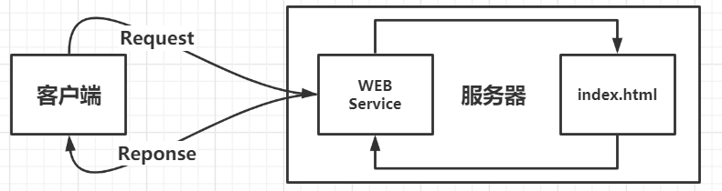
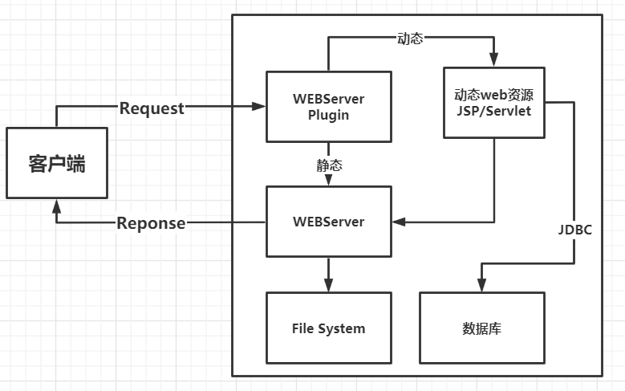
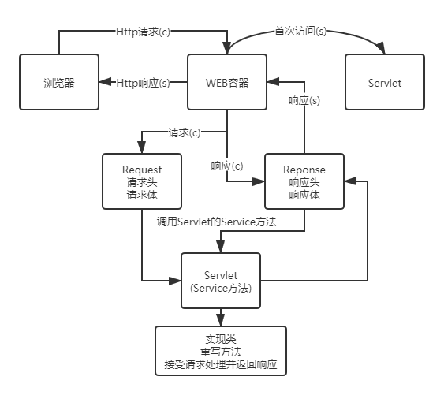
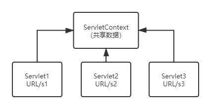
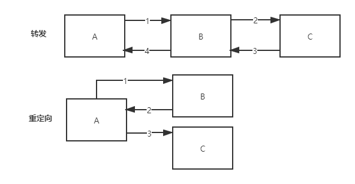

# JavaWEB

## 一、基本概念

### 1.1 前言

web开发：

- web，网页

  - 静态web
    - html，css
    - 数据始终不发生变化
  - 动态web
    - TB，每个网站
    - 数据始终会发生变化，不同用户不同时间
    - 技术栈：Servlet/JSP，ASP，PHP

  在Java中，动态web资源开发技术统称为JavaWEB。

### 1.2 web应用程序

web应用程序：可以提供浏览器访问的程序。

- 多个html可以被外界访问，对外界提供访问。
- 可访问页面或资源，存储在远端服务器上。
- URL
- 统一的web资源放在同一个文件夹下，web应用程序==>Tomcat服务器
- 一个web由多个部分组成（静态web，动态web）
  - html，css，js
  - jsp，servlet
  - Java程序
  - jar包
  - 配置文件（Properties）

web应用程序由服务器向外界提供访问。

### 1.3 静态web



- 静态web的缺点
  - 页面无法更新
    - 轮播图，点击特效：伪动态
    - JavaScript
    - VBScript
  - 无法与数据库交互（数据无法持久化，用户无法交互）

### 1.4 动态web



缺点：

- 动态web资源出错，需要重新编写后台，再次发布。
  - 停机维护。
- 优点
  - web页面可以动态更新
  - 可以与数据库交互（数据持久化：用户信息）

## 二、web服务器

### 2.1 web编程语言

ASP:

- 微软

- HTML中嵌入VB脚本，ASP+COM
- 页面杂乱，维护成本高

PHP：

- 开发速度快，功能强大，跨平台，代码简单
- 无法承载大访问量（局限）

JSP/Servlet：

- Sun公司主推的B/S（浏览器与服务器）架构
- 基于Java语言（较多开源组件）
- 可以承载三高问题
- 语法接近ASP，加强市场强度

### 2.2 web服务器

服务器：被动操作，处理用户请求与响应。

- IIS：微软，windows自带。

- Tomcat：Apache公司，运行JSP页面和Servlet。

### 2.3 Tomcat详解

#### 2.3.1 Windows平台安装与启动

版本环境

- Java版本：1.8.0_261

- Tomcat版本：9.0.39

安装步骤：

1. 配置JAVA_JRE环境变量：
2. 配置CATALINA_HOME环境变量（Tomcat路径）
3. 双击startup.bat ，等待启动成功。
4. 浏览器键入localhost:8080测试。

> 可能存在的问题：Java下没有jre文件夹

解决方案：

1. cmd进入jdk目录
2. bin\jlink.exe --module-path jmods --add-modules java.desktop --output jre

#### 2.3.2 Linux平台安装与启动

打开centos7网络：

1. `vim /etc/sysconfig/network-scripts/ifcfg-ens33`修改 `ONBOOT=yes`
2. `service network restart`
3. 获取IP，远程登录。

安装Java：

1. 解压Jdk压缩包并移动至/usr/loacl/java/目录下
2. 修改环境变量：`vim /etc/profile`

```
export JAVA_HOME=/usr/local/java/jdk1.8.0_261
export CLASSPATH=.:$JAVA_HOME/jre/lib/rt.jar:$JAVA_HOME/lib/dt.jar:$JAVA_HOME/lib/tools.jar
export PATH=$PATH:$JAVA_HOME/bin
```

3. 配置生效：`source /etc/profile`
4. 测试：`java -version`

安装Tomcat：https://mirrors.cnnic.cn/apache/tomcat/

1. 解压Tomcat压缩包并移动至/usr/loacl/tomcat/目录下

2. 新建快捷启动方式：

   ```
   cp /usr/local/tomcat/apache-tomcat-9.0.39/bin/catalina.sh /etc/init.d/tomcat
   ```

3. 修改脚本权限（所有人）：` chmod 755 /etc/init.d/tomcat `

4. 配置脚本：`vim /etc/init.d/tomcat`

   ```
   #chkconfig: 2345 10 90
   #description: tomcat service 
   export JAVA_HOME=/usr/local/java/jdk1.8.0_261
   export CATALINA_HOME=/usr/local/tomcat/apache-tomcat-9.0.39
   ```

5. 设置Tomcat开机启动：` chkconfig tomcat on `

6. 启动\关闭Tomcat：` service tomcat start\stop `

7. 开放8080端口（否则无法访问）： [](https://blog.csdn.net/qq_36473199/article/details/87227661)

8. 测试：服务器ip:8080

#### 2.3.3 Tomcat配置文件

E:\App\Tomcat\apache-tomcat-9.0.39\conf\server.xml

- 配置端口：Connector（默认为8080）

  - tomcat默认端口号：8080
  - maysql：3306
  - http：80
  - https：443

  ```xml
  <Connector port="8080" protocol="HTTP/1.1"
  		connectionTimeout="20000"
  		redirectPort="8443" />
  ```

- 配置主机名称：Host项（默认localhost）和本机hosts文件。

  - 默认主机名：localhost==>127.0.0.1
  - 默认网站应用存放位置：webapps

  ```xml
  <Host name="localhost"  appBase="webapps"
  		unpackWARs="true" autoDeploy="true">
  ```

**【重点】**

网站如何访问？

1. 输入域名，回车
2. 检查本机hosts文件是否存在该域名映射
   1. 存在：返回域名对应的IP，访问该IP
   2. 不存在：去DNS服务器查找，存在则返回IP，不存在则返回未找到。

### 2.4 web发布

- 网站存放在服务器（Tomcat）中指定的web应用的文件夹（webapps）下，即可访问。

网站结构：

```
--webapps:Tomcat服务器的web目录
	-ROOT
	-JonahCoding：网站的目录名
		-WEB-INF
			-classes：java程序
			-lib：web应用依赖的jar包
			-web.xml：网站配置文件
		-index.html：默认首页
		-static
			-css
				-style.css
			-js
			-img
		-......		
```

## 三、Http

### 3.1 HTTP

HTTP（超文本传输协议）是一个简单的请求-响应协议，通常运行在TCP上。

- 文本：html，字符串，...
- 超文本：图片，音乐，视频，定位，地图...
- 端口：80

Https：安全的

- 端口443

### 3.2 Http的发展（面试：区别）

- http1.0
  - HTTP/1.0：客户端与服务端连接后，只能获取一个web资源，即会断开连接。
- http2.0
  - HTTP/1.1：客户端与服务端连接后，可以获取多个资源。

### 3.3 Http请求与响应

#### 3.3.1 请求

- 客户端==>发送请求（Request）==>服务器

```
Request URL: https://www.baidu.com/		请求地址
Request Method: GET		get方法/post方法
Status Code: 200 OK		状态码：200
Remote（远程） Address: 36.152.44.95:443（地址：端口）
```

```
Accept:text/html
Accept-Encoding: gzip, deflate, br
Accept-Language: zh-CN,zh;q=0.9		语言
Cache-Control: max-age=0
Connection: keep-alive
```

1. **请求行**
   - 请求行中的请求方式：GET
   - 请求方式：**Get，Post**，HEAD，DELETE，PUT，TRACT
     - get：请求可携带参数少，大小有限制，在URL地址栏显示数据内容、不安全但高效。
     - post：请求参数无限制，大小无限制，URL不限制数据内容，安全但低效。
2. **消息头**

```
Accept: 告知浏览器，所支持的数据类型
Accept-Encoding: 支持的编码格式GBK/UTF-8
Accept-Language: 语言环境
Cache-Control: 缓存控制
Connection: 告知浏览器，请求完成断开或保持连接
HOST: 主机....../.
```

#### 3.3.2 响应

- 客户端<==发送响应（Reponse）<==服务器

```
Cache-Control: private		缓存控制
Connection: keep-alive		连接（http1.1）
Content-Encoding: gzip		编码
Content-Type: text/html;charset=utf-8	类型
```

1. **响应体**

   ```
   Accept: 告知浏览器，所支持的数据类型
   Accept-Encoding: 支持的编码格式GBK/UTF-8
   Accept-Language: 语言环境
   Cache-Control: 缓存控制
   Connection: 告知浏览器，请求完成断开或保持连接
   HOST: 主机....../.
   Refresh: 告知客户端刷新间隔
   Location: 使网页重新定位
   ```

2. **响应状态码**

   - 200：请求响应成功	200
   - 3xx：请求重定向
     - 重定向：
       - 4xx：找不到资源	404
   - 5xx：服务器diamante错误  500    502(网关错误)

【重点】

## 四、Maven

作用：自动导入配置jar包。

### 4.1 Maven项目架构管理工具

- Maven核心思想：约定大于配置
  - 不违反约束（规则、规范）

### 4.2 安装与配置

- 下载：http://maven.apache.org/download.cgi
  - apache-maven-3.6.3-bin.zip（解压）
  - apache-maven-3.6.3-src.zip

- 配置环境变量：
  - 新建MAVEN_HOME：E:\App\Maven\apache-maven-3.6.3
  - Path：%MAVEN_HOME%\bin
  - 新建M2_HOME：E:\App\Maven\apache-maven-3.6.3\bin

- 测试：`mvn -version`

### 4.3 配置镜像（阿里云）

- 作用：加速下载
- 文件：E:\App\Maven\apache-maven-3.6.3\conf\settings.xml

```xml
<mirrors>
      <mirror>
         <id>nexus-aliyun</id>
         <mirrorOf>*,!jeecg,!jeecg-snapshots</mirrorOf>
         <name>Nexus aliyun</name>
         <url>http://maven.aliyun.com/nexus/content/groups/public</url>
      </mirror> 
</mirrors>
```

### 4.4 本地仓库

- Maven目录下新建文件夹作为本地仓库

```xml
<localRepository>E:\App\Maven\apache-maven-3.6.3\maven-repo</localRepository>
```

### 4.5 IDEA中使用Maven

#### 4.5.1 创建Maven项目：

- 勾选Create from archetype以使用模板（可选）`maven-archetype-webapp`
- 项目名称：
- 项目路径：
- 选择Maven版本：

- Groupid：com.shinrin

- Artifactid：javaweb-01-maven（项目名）

- Verson：1.0-SNAPSHOT

- 配置文件：

- 仓库：

#### 4.5.2 Maven初始化

- 初次打开项目，等待初始化完成（从镜像源下载文件至本地仓库）

#### 4.5.3 IDEA中Maven设置

settings-->Build==>Maven==>Importing==>Automatically download==>Sources（可选）

>创建带模板的Maven项目：`maven-archetype-webapp`  	web应用
>
>默认不存在java源码目录和resources资源目录，新建并Mark Directory as ...（标记文件夹）

模块管理：Project Structure ==> Modules

### 4.6 IDEA中配置Tomcat

Run/Debug Configuretions==》添加配置==》Tomcat（local本地）

重要配置：

1. Name
2. Application server：选择已安装的Tomcat
3. 选择浏览器
4. 选择JDK
5. HTTP端口：8080

警告修复：

- Fix（Deployment选项）选择当前项目
- Application context：不写默认为localhost:8080，填写shinrin则访问localhost:8080/shinrin
  - Application context为**虚拟路径映射**（IDEA默认使用/javaweb_01_maven_war填充）。

### 4.7 Maven侧边栏

- Lifecycle：maven的命令行操作
- Plugins：插件
- Dependencies：jar包，项目依赖

### 4.8 pom.xml文件

pom.xml：Maven的核心配置文件

模板生成项目的pom.xml：

```xml
<?xml version="1.0" encoding="UTF-8"?>
  <!--Maven版本和头文件-->
<project xmlns="http://maven.apache.org/POM/4.0.0" xmlns:xsi="http://www.w3.org/2001/XMLSchema-instance"
  xsi:schemaLocation="http://maven.apache.org/POM/4.0.0 http://maven.apache.org/xsd/maven-4.0.0.xsd">
  <modelVersion>4.0.0</modelVersion>
  <!--配置的GAV-->
  <groupId>com.shinrin</groupId>
  <artifactId>javaweb-01-maven</artifactId>
  <version>1.0-SNAPSHOT</version>
  <!--Packaging：项目打包方式
  jar：java应用
  war：web应用
  -->
  <packaging>war</packaging>
  <!--项目名称-->
  <name>javaweb-01-maven Maven Webapp</name>
  <!-- FIXME change it to the project's website -->
  <url>http://www.example.com</url>
  <!--配置-->
  <properties>
    <!--项目的默认构建编码-->
    <project.build.sourceEncoding>UTF-8</project.build.sourceEncoding>
    <!--编码版本-->
    <maven.compiler.source>1.7</maven.compiler.source>
    <maven.compiler.target>1.7</maven.compiler.target>
  </properties>
  <!--项目依赖-->
  <dependencies>
  <!--具体依赖的jar包-->
    <dependency>
      <groupId>junit</groupId>
      <artifactId>junit</artifactId>
      <version>4.11</version>
      <scope>test</scope>
    </dependency>
  </dependencies>
  <!--项目构建的插件-->
  <build>
    <finalName>javaweb-01-maven</finalName>
    <pluginManagement><!-- lock down plugins versions to avoid using Maven defaults (may be moved to parent pom) -->
      <plugins>
        <plugin>
          <artifactId>maven-clean-plugin</artifactId>
          <version>3.1.0</version>
        </plugin>
        <!-- see http://maven.apache.org/ref/current/maven-core/default-bindings.html#Plugin_bindings_for_war_packaging -->
        <plugin>
          <artifactId>maven-resources-plugin</artifactId>
          <version>3.0.2</version>
        </plugin>
        <plugin>
          <artifactId>maven-compiler-plugin</artifactId>
          <version>3.8.0</version>
        </plugin>
        <plugin>
          <artifactId>maven-surefire-plugin</artifactId>
          <version>2.22.1</version>
        </plugin>
        <plugin>
          <artifactId>maven-war-plugin</artifactId>
          <version>3.2.2</version>
        </plugin>
        <plugin>
          <artifactId>maven-install-plugin</artifactId>
          <version>2.5.2</version>
        </plugin>
        <plugin>
          <artifactId>maven-deploy-plugin</artifactId>
          <version>2.8.2</version>
        </plugin>
      </plugins>
    </pluginManagement>
  </build>
</project>
```

项目为空的pom.xml：

```xml
<dependencies>
    <dependency>
        <groupId>junit</groupId>
        <artifactId>junit</artifactId>
        <version>4.11</version>
        <scope>test</scope>
    </dependency>
    <!-- https://mvnrepository.com/artifact/org.springframework/spring-webmvc -->
    <dependency>
        <groupId>org.springframework</groupId>
        <artifactId>spring-webmvc</artifactId>
        <version>5.2.9.RELEASE</version>
    </dependency>
</dependencies>
```

**从https://mvnrepository.com/获取目标jar包的dependency粘贴到pom.xml，刷新导入。**

> **Maven资源导出问题**（如规定java目录不能导出xml等文件）
>
> **原因：约束大于配置**
>
> **解决方案**：https://www.cnblogs.com/pixy/p/4798089.html

```xml
    <!--解决资源导出问题-->
    <!--忽略对resources和java目录下的xml和properties文件过滤-->
    <build>
        <resources>
            <resource>
                <directory>src/main/resources</directory>
                <excludes>
                    <exclude>**/*.properties</exclude>
                    <exclude>**/*.xml</exclude>
                </excludes>
                <filtering>false</filtering>
            </resource>
            <resource>
                <directory>src/main/java</directory>
                <includes>
                    <include>**/*.properties</include>
                    <include>**/*.xml</include>
                </includes>
                <filtering>false</filtering>
            </resource>
        </resources>
    </build>
```

### 4.9 常见问题

#### 4.9.1 新建项目默认使用C盘的xml文件：

解决方案：IDEA启动页面-Configure-Settings-Build Tools-Maven-设置默认

`E:\App\Maven\apache-maven-3.6.3\conf\settings.xml`

#### 4.9.2 Maven默认web项目（模板创建）中的web-app\WEB-INF\web.xml版本问题

```xml
<!DOCTYPE web-app PUBLIC
 "-//Sun Microsystems, Inc.//DTD Web Application 2.3//EN"
 "http://java.sun.com/dtd/web-app_2_3.dtd" >

<web-app>
  <display-name>Archetype Created Web Application</display-name>
</web-app>
```

解决方案：拷贝Tomcat的xml文件头部内容进行替换。

```xml
<?xml version="1.0" encoding="UTF-8"?>
<web-app xmlns="http://xmlns.jcp.org/xml/ns/javaee"
         xmlns:xsi="http://www.w3.org/2001/XMLSchema-instance"
         xsi:schemaLocation="http://xmlns.jcp.org/xml/ns/javaee
                      http://xmlns.jcp.org/xml/ns/javaee/web-app_3_1.xsd"
         version="3.1"
         metadata-complete="true">

<display-name>Archetype Created Web Application</display-name>
<description>
  Welcome to Tomcat
</description>

</web-app>
```


## 五、Servlet

### 5.1 Servlet简介

- Servlet是Sun公司开发动态web的一门技术
- Sun在API中提供一个接口：Servlet，开发Servlet程序的步骤：
  - 编写类，实现Servlet接口
  - 开发完成的Java类部署到web服务器中

Servlet即是实现了Servlet接口的Java程序。

### 5.2 HelloServlet项目

Servlet接口有两个默认的实现类：

- HttpServlet（继承了GenericServlet）
- GenericServlet（实现了Servlet）

#### 5.2.1 新建Maven项目

1. 构建一个Maven项目（作为父项目），删除src目录。
2. 向pom.xml添加**javax.servlet**和**javax.servlet.jsp**依赖。
3. 新建Maven Module（作为子项目），使用webapp模板，Module名为servlet-01。

#### 5.2.2 关于父子工程的理解

父项目中：

```xml
    <modules>
        <module>servlet-01</module>
    </modules>
```

子项目中：

```xml
    <parent>
        <artifactId>javaweb-01-servlet</artifactId>
        <groupId>com.shinrin</groupId>
        <version>1.0-SNAPSHOT</version>
    </parent>
```

对于父项目中的jar包，子项目可以直接使用

#### 5.2.3 Maven环境优化

1. 替换子项目的web.xml为Tomcat对应版本（最新）。

   ```xml
   <?xml version="1.0" encoding="UTF-8"?>
   
   <web-app xmlns="http://xmlns.jcp.org/xml/ns/javaee"
            xmlns:xsi="http://www.w3.org/2001/XMLSchema-instance"
            xsi:schemaLocation="http://xmlns.jcp.org/xml/ns/javaee
                         http://xmlns.jcp.org/xml/ns/javaee/web-app_3_1.xsd"
            version="3.1"
            metadata-complete="true">
   
     
   </web-app>
   ```

2. 将Maven的结构搭建完整

   - java目录
   - resources目录

#### 5.2.4 编写Servlet程序

1. 编写HelloServlet类
2. 实现Servlet接口：继承HttpServlet

```java
import javax.servlet.http.HttpServletResponse;
import java.io.IOException;
import java.io.PrintWriter;

public class HelloServlet extends HttpServlet {
    @Override
    protected void doGet(HttpServletRequest req, HttpServletResponse resp) throws ServletException, IOException {
        //ServletOutputStream outputStream = resp.getOutputStream();
        PrintWriter writer = resp.getWriter();
        writer.print("Hello Servlet");
    }

    @Override
    protected void doPost(HttpServletRequest req, HttpServletResponse resp) throws ServletException, IOException {
        super.doPost(req, resp);
    }
}
```

#### 5.2.5 编写Servlet的映射

Java程序通过浏览器访问，而浏览器需要连接web服务器，需要向web服务中注册编写的Servlet，并提供浏览器可访问的路径。

..\servlet-01\src\main\webapp\WEB-INF\web.xml

```xml
    <!--注册Servlet-->
    <servlet>
        <servlet-name>hello</servlet-name>
        <servlet-class>com.shinrin.servlet.HelloServlet</servlet-class>
    </servlet>
    <!--请求路径-->
    <servlet-mapping>
        <servlet-name>hello</servlet-name>
        <url-pattern>hello</url-pattern>
    </servlet-mapping>
```

#### 5.2.6 配置Tomcat

无需多言。

### 5.3 Servlet原理

Servlet由Web服务器调用，Servlet在收到浏览器请求后：



### 5.4 Mapping问题

1. 一个Servlet可以指定一个映射路径

```xml
  <servlet-mapping>
    <servlet-name>hello</servlet-name>
    <url-pattern>/hello</url-pattern>
  </servlet-mapping>
```

2. 一个Servlet可以指定多个映射路径

```xml
  <servlet-mapping>
    <servlet-name>hello</servlet-name>
    <url-pattern>/hello1</url-pattern>
  </servlet-mapping>
  <servlet-mapping>
    <servlet-name>hello</servlet-name>
    <url-pattern>/hello2</url-pattern>
  </servlet-mapping>
```

3. 一个Servlet可以指定通用映射路径

```xml
  <servlet-mapping>
    <servlet-name>hello</servlet-name>
    <url-pattern>/hello/*</url-pattern>
  </servlet-mapping>
```

4. 默认请求路径

```xml
  <servlet-mapping>
    <servlet-name>hello</servlet-name>
    <url-pattern>/*</url-pattern>
  </servlet-mapping>
```

5. 指定前缀或后缀

```xml
 <!--
 注：*前不能加项目映射路径
 -->
 <servlet-mapping>
    <servlet-name>hello</servlet-name>
    <url-pattern>*.shinrin</url-pattern>
  </servlet-mapping>
```

6. 优先级问题
   - 指定了固定的映射关系优先级最高

### 5.5 ServletContext

web容器在启动时，会为每个web程序创建一个对应的ServletContext对象，代表web应用。

#### 5.5.1 共享数据（不同的Servlet之间）



放置数据的类：

```java
public class HelloServlet extends HttpServlet {
    @Override
    protected void doGet(HttpServletRequest req, HttpServletResponse resp) throws ServletException, IOException {
        ServletContext context = this.getServletContext();//Servlet上下文
        String username = "阿泽";//数据
        context.setAttribute("username", username);//将一个数据保存在ServletContext中，键为username，值为“阿泽”
    }
	...
}
```

读取数据的类：

```java
public class GetServlet extends HttpServlet {
    @Override
    protected void doGet(HttpServletRequest req, HttpServletResponse resp) throws ServletException, IOException {
        ServletContext context = this.getServletContext();
        String username = (String) context.getAttribute("username");
        resp.setContentType("text/html");
        resp.setCharacterEncoding("UTF-8");
        resp.getWriter().print("名字："+username);
    }
	...
}
```

**注：先存后读，否则结果为null**

#### 5.5.2 获取初始化参数

配置web应用初始化参数：

```xml
  <!--配置web应用初始化参数-->
  <context-param>
    <param-name>url</param-name>
    <param-value>jdbc:mysql://localhost:3306/mybatis</param-value>
  </context-param>
```

读取初始化参数：

```java
public class ServletDemo03 extends HttpServlet {
    @Override
    protected void doGet(HttpServletRequest req, HttpServletResponse resp) throws ServletException, IOException {
        ServletContext context = this.getServletContext();
        String url = context.getInitParameter("url");
        resp.getWriter().print(url);
    }
	...
}
```

#### 5.5.3 请求转发

```java
public class ServletDemo04 extends HttpServlet {
    @Override
    protected void doGet(HttpServletRequest req, HttpServletResponse resp) throws ServletException, IOException {
        ServletContext context = this.getServletContext();
        //RequestDispatcher requestDispatcher = context.getRequestDispatcher("/username");//转发的请求路径
        //requestDispatcher.forward(req,resp);//调用forward实现请求转发(转向/url)
        context.getRequestDispatcher("/url").forward(req,resp);
    }

    @Override
    protected void doPost(HttpServletRequest req, HttpServletResponse resp) throws ServletException, IOException {
        doPost(req, resp);
    }
}
```

#### 5.5.4 读取资源文件

Properties

- Java目录下新建properties
- resources目录下新建properties

都被打包到同一路径下：classes（类路径）

文件流：

**db.properties**

```properties
username=root
password=123456
```

**ServletDemo05.java**

```java
public class ServletDemo05 extends HttpServlet {
    @Override
    protected void doGet(HttpServletRequest req, HttpServletResponse resp) throws ServletException, IOException {
        InputStream is = this.getServletContext().getResourceAsStream("/WEB-INF/classes/db.properties");
        Properties prop = new Properties();
        prop.load(is);
        String user = prop.getProperty("username");
        String pwd = prop.getProperty("password");
        resp.getWriter().print(user+ ":" + pwd);
    }

    @Override
    protected void doPost(HttpServletRequest req, HttpServletResponse resp) throws ServletException, IOException {

    }
}
```

**web.xml**

```xml
  <servlet>
    <servlet-name>getUserPWD</servlet-name>
    <servlet-class>com.shinrin.servlet.ServletDemo05</servlet-class>
  </servlet>
  <servlet-mapping>
    <servlet-name>getUserPWD</servlet-name>
    <url-pattern>/getUserPWD</url-pattern>
  </servlet-mapping>
```

注：配置pom.xml，防止.properties文件被过滤。

### 5.6 HttpServletResponse

web服务器接收到客户端的http请求，针对这个请求，分别创建一个代表请求的HttpServletRequest对象、一个代表响应的HttpServletResponse对象。

- 获取客户端请求的参数：HttpServletRequest
- 向客户端响应信息：HttpServletReponse

#### 5.6.1 简单分类

负责向浏览器发送数据的方法：

```java
    ServletOutputStream getOutputStream() throws IOException;

    PrintWriter getWriter() throws IOException;
```

负责向浏览器发送响应头的方法：

```java
    void setCharacterEncoding(String var1);
    void setContentLength(int var1);
    void setContentLengthLong(long var1);
    void setContentType(String var1);
    void setDateHeader(String var1, long var2);
    void addDateHeader(String var1, long var2);
    void setHeader(String var1, String var2);
    void addHeader(String var1, String var2);
    void setIntHeader(String var1, int var2);
    void addIntHeader(String var1, int var2);
```

响应的状态码：

```
- 200：请求响应成功	200
- 3xx：请求重定向
  - 重定向：
- 4xx：找不到资源	404
- 5xx：服务器diamante错误  500    502(网关错误)
```

#### 5.6.2 常见应用

1. 向浏览器输出消息
2. 下载文件
   1. 获取下载文件的路径
   2. 下载的文件名
   3. 设置使浏览器支持下载需要的文件
   4. 获取下载文件的输入流
   5. 创建缓存区
   6. 获取OutputStream对象
   7. 将FileOutputStream流写入到buffer缓冲区
   8. 使用OutputStream将数据输出到客户端

```java
public class FileServlet extends HttpServlet {
    @Override
    protected void doGet(HttpServletRequest req, HttpServletResponse resp) throws ServletException, IOException {
        //1. 获取下载文件的路径
        String realPath = this.getServletContext().getRealPath("WEB-INF\\classes\\avator.jpg");
        System.out.println("下载文件的路径："+realPath);
        //2. 下载的文件名
        String fileName = realPath.substring(realPath.lastIndexOf("\\") + 1);
        //3. 设置使浏览器支持下载需要的文件（支持中文编码）
        resp.setHeader("Content-Disposition","attachment;filename="+ URLEncoder.encode(fileName,"UTF-8"));
        //4. 获取下载文件的输入流
        FileInputStream in = new FileInputStream(realPath);
        //5. 创建缓存区
        int len = 0;
        byte[] buffer = new byte[1024];
        //6. 获取OutputStream对象
        ServletOutputStream out = resp.getOutputStream();
        //7. 将FileOutputStream流写入到buffer缓冲区，使用OutputStream将数据输出到客户端
        while ((len = in.read(buffer))>0){
            out.write(buffer,0,len);
        }
        out.close();
        in.close();
    }

    @Override
    protected void doPost(HttpServletRequest req, HttpServletResponse resp) throws ServletException, IOException {
    }
}
```

3. 验证码

```java
public class ImageServlet extends HttpServlet {
    @Override
    protected void doGet(HttpServletRequest req, HttpServletResponse resp) throws ServletException, IOException {
        //浏览器3秒刷新一次
        resp.setHeader("refresh","3");
        //在内存中创建图片
        BufferedImage image = new BufferedImage(80, 20, BufferedImage.TYPE_INT_RGB);
        //获取图片
        Graphics2D g = (Graphics2D)image.getGraphics();
        //设置图片的背景颜色
        g.setColor(Color.white);
        g.fillRect(0,0,80,20);
        //给图片写数据
        g.setColor(Color.blue);
        g.setFont(new Font(null,Font.PLAIN,20));
        g.drawString(makeNum(),0,20);
        //请求以图片形式打开
        resp.setContentType("image/jpeg");
        //浏览器不缓存图片
        resp.setDateHeader("expires",-1);
        resp.setHeader("Cache-Control","no-cache");
        resp.setHeader("Pragma","no-cache");
        //图片写给浏览器
        ImageIO.write(image,"jpg",resp.getOutputStream());
    }

    //生成随机数
    private String makeNum(){
        Random random = new Random();
        String num = random.nextInt(99999999)+"";
        StringBuffer sBuf = new StringBuffer();
        for (int i = 0; i < 7-num.length(); i++) {
            sBuf.append("0");
        }
        num = sBuf.toString()+num;
        return num;
    }

    @Override
    protected void doPost(HttpServletRequest req, HttpServletResponse resp) throws ServletException, IOException {

    }
}
```

4. 实现重定向

web资源B收到客户端A的请求后，通知客户端A访问另一个web资源C。

常见场景：

- 用户登录

```java
    void sendRedirect(String var1) throws IOException;
```

实现：

```java
    @Override
    protected void doGet(HttpServletRequest req, HttpServletResponse resp) throws ServletException, IOException {

        //resp.setHeader("Location","/response_war/image");
        //resp.setStatus(HttpServletResponse.SC_MOVED_TEMPORARILY);
        resp.sendRedirect("/response_war/image");//重定向
    }
```

面试题：重定向和转发的区别？

- 相同点：页面都实现跳转
- 不同点：
  - 请求转发，url不会发生变化
  - 重定向，url地址栏会发生变化



**案例**：登录跳转

Request.java

```java
public class RequestTest extends HttpServlet {
    @Override
    protected void doGet(HttpServletRequest req, HttpServletResponse resp) throws ServletException, IOException {
        //处理请求
        String username = req.getParameter("username");
        String password = req.getParameter("password");
        System.out.println(username+":"+password);
        resp.sendRedirect("/response_war/success.jsp");
    }
}
```

index.jsp

```jsp
<html>
<body>
<h2>登录</h2>
<%--提交的路径需要寻找到项目的路径--%>
<%--${pageContext.request.contextPath}代表当前项目的地址--%>

<form action="${pageContext.request.contextPath}/login" method="get">
    用户名：<input type="text" name="username"><br>
    密码：<input type="password" name="password"><br>
    <input type="submit">
</form>

</body>
</html>
```

success.jsp

```jsp
<%@ page contentType="text/html;charset=UTF-8" language="java" %>
<html>
<head>
    <title>Title</title>
</head>
<body>
<h1>登入成功！</h1>
</body>
</html>
```

### 5.7 HttpServletRequest

HttpServletRequest代表客户端的请求，用户通过http协议访问服务器。HTTP中的所有信息封装在HttpServletRequest中。

表单登录：

```java
    @Override
    protected void doPost(HttpServletRequest req, HttpServletResponse resp) throws ServletException, IOException {
        //解决乱码问题
        req.setCharacterEncoding("UTF-8");
        resp.setCharacterEncoding("UTF-8");
        String username = req.getParameter("username");
        String password = req.getParameter("password");
        String[] hobbys = req.getParameterValues("hobby");
        System.out.println("=======================");
        System.out.println(username);
        System.out.println(password);
        System.out.println(Arrays.toString(hobbys));
        System.out.println("=======================");
        //通过请求转发
        req.getRequestDispatcher("/success.jsp").forward(req,resp);
    }
```

index.jsp

```jsp
<html>
<head>
    <title>登录</title>
</head>
<body>
<h1>登录</h1>
<div>
    <%--以post方式提交--%>
    <form action="${pageContext.request.contextPath}/login" method="post">
        用户名：<input type="text" name="username" required><br>
        密码：<input type="password" name="password" required><br>
        爱好：
        <input type="checkbox" name="hobby" value="Girl">Girl
        <input type="checkbox" name="hobby" value="Coding">Coding
        <input type="checkbox" name="hobby" value="Music">Music
        <input type="checkbox" name="hobby" value="Draw">Draw
        <br>
        <input type="submit">
    </form>
</div>
</body>
</html>
```

## 六、Cookie、Session

### 6.1 会话

会话：用户打开浏览器，点击超链接访问多个web资源，关闭浏览器的过程。

有状态会话：客户端再次连接时，服务端知晓客户端信息。

### 6.2 保存会话的两种技术

cookie

- 客户端技术（响应，请求）

session

- 服务器技术，可以保存用户的会话信息。（信息或技术放在session中）

应用：网站第二次登陆无需验证信息。

### 6.3 Cookie

1. 从请求中拿到cookie
2. 服务器响应给客户端cookie

```java
Cookie cookie = cookies[i];//获得cookie
cookie.getName().equals("LastLoginTime");//获取cookie的Key
cookie.getValue();//获取cookie的Value
new Cookie("LastLoginTime",System.currentTimeMillis()+"");//新建一个cookie
cookie.setMaxAge(24*60*60);//设置cookie的有效期
resp.addCookie(cookie);//向客户端返回一个cookie
```

cookie：一般保存在本地用户目录下AppData；

网站cookie：

- 一个Cookie只能保存一个信息。
- 一个web站点可以给浏览器发送多个cookie，最多存放20个cookie。
- cookie大小限制最大为4kb。
- 浏览器cookie上限为300个。

**删除Cookie：**

- 不设置有效期，关闭浏览器，自动失效。
- 设置有效期为0。

```java
cookie.setMaxAge(0);
resp.addCookie(cookie);
```

**编码与解码：**

```java
URLEncoder.encode("森林","UTF-8");
URLDecoder.decode(cookie.getValue(),"UTF-8");
```

### 6.4 Session（重点）

Session：

- 服务器为每个用户（浏览器）创建一个Session对象。
- 每个Session独占一个浏览器，直至浏览器关闭。
- 用户登录后，整个网站都可以访问。

Session与Cookie的区别：

- Cookie将用户数据存储在浏览器（可多个）
- Session将用户数据写到用户独占Session中，服务端保存（重要信息，减少服务器资源浪费）
- Session对象由服务器创建

使用场景：

- 保存用户登录信息
- 购物车信息
- 在整个网站中经常使用的数据

使用Session：

```java
//解决乱码
req.setCharacterEncoding("UTF-8");
resp.setCharacterEncoding("UTF-8");
resp.setContentType("text/html;charset=utf-8");
//新建Session
HttpSession session = req.getSession();
//存入数据
session.setAttribute("name", new Person("shinrin",17));
//获取Session的ID
String id = session.getId();
//判断是否为新创建
if (session.isNew()){
resp.getWriter().write("Session创建成功，ID为"+id);
}else {
resp.getWriter().write("ID为" + id + "的Session已存在于服务器");
}
```

读取Session：

```java
//获取Session
HttpSession session = req.getSession();
Person person = (Person) session.getAttribute("name");
System.out.println(person);
```

手动注销Session：

```java
HttpSession session = req.getSession();
//手动注销Session
session.removeAttribute("name");
session.invalidate();
```

会话自动过期（web.xml）：

```java
<!--设置Session的默认失效时间，以分钟为单位-->
<session-config>
	<session-timeout>15</session-timeout>
</session-config>
```

## 七、JSP

### 7.1 JSP简介 

Java Server Pages：Java服务端页面，同Servlet，用于动态web技术。

特点：

- 类似HTML
- 与HTML的区别
  - HTML只能为用户提供静态的数据
  - JSP页面中可以嵌入Java代码，为用户提供动态数据。

### 7.2 JSP原理

JSP如何执行？

服务器内部工作：

> tomcat下存在一个work目录。
>
> IDEA使用Tomcat会在IDEA的tomcat中产出一个work目录。

浏览器向服务器发送请求，实质是在访问Servlet。

JSP最终会转换为一个Java类。

```java
//初始化
public void _jspInit() {}
//销毁
public void _jspDestroy() {}
//JSPService
public void _jspService(.http.HttpServletRequest request, HttpServletResponse response);
```

1. 判断请求
2. 内置对象

```java
final javax.servlet.jsp.PageContext pageContext;	//页面上下文
javax.servlet.http.HttpSession session = null;		//session
final javax.servlet.ServletContext application;		//appliationcontext
final javax.servlet.ServletConfig config;			//config
javax.servlet.jsp.JspWriter out = null;				//out
final java.lang.Object page = this;					//page：当前
HttpServletRequest request							//请求
HttpServletRequest request							//响应
```

3. 输出页面前增加的代码

```java
response.setContentType("text/html; charset=UTF-8");//设置响应的页面类型
pageContext = _jspxFactory.getPageContext(this, request, response,
											null, false, 8192, true);
_jspx_page_context = pageContext;
application = pageContext.getServletContext();
config = pageContext.getServletConfig();
out = pageContext.getOut();
_jspx_out = out;
```

原理：

- java代码不变

- html转为java代码，如下：

  ```java
  out.write("<html>\r\n");
  ```

### 7.3 JSP基础语法

JSP是java技术的一种应用，支持所有Java语法，并拥有一些扩充语法。


